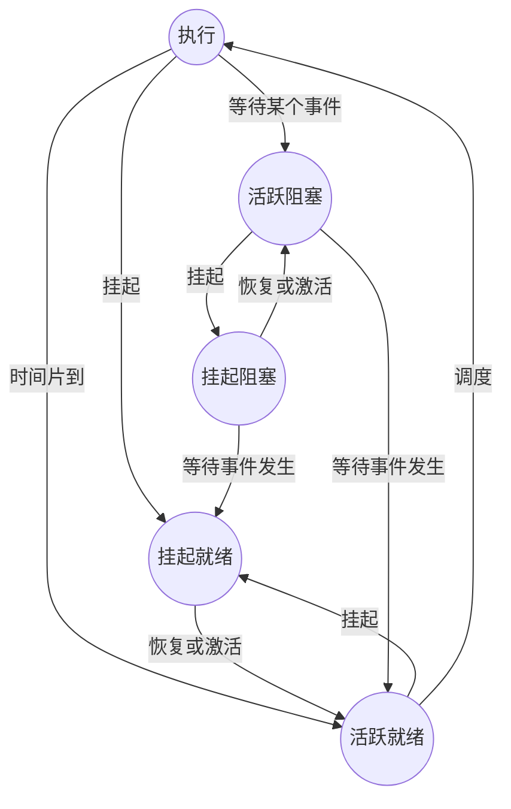

# 软考考点突破

## 计算机硬件基础知识

### 数据的表示

- 数制转换
- 原码、反码、补码、移码（补码的符号位取反）

### 计算机系统的组成与体系结构

#### 计算机体系结构分类

Flynn分类法：指令流、数据流和多倍性

|     体系结构类型     |                     结构                     |               关键特性               |                  代表                  |
| :------------------: | :------------------------------------------: | :----------------------------------: | :------------------------------------: |
| 单指令流单数据流SISD | 控制部分：一个，处理器：一个，主存模块：一个 |                                      |              单处理器系统              |
| 单指令流多数据流SIMD | 控制部分：一个，处理器：多个，主存模块：多个 |  各处理器以异步的形式执行同一条指令  | 并行处理机，阵列处理机，超级向量处理机 |
| 多指令流单数据流MISD | 控制部分：多个，处理器：多个，主存模块：多个 |                不实际                |                理论模型                |
| 多指令流多数据流MIMD | 控制部分：多个，处理器：多个，主存模块：多个 | 实现作业、任务、指令等各级别全面并行 |         多处理机系统，多计算机         |

#### 计算机的硬件组成

> 运算器、控制器、存储器、输入设备、输出设备

- 运算器 + 控制器 = 中央处理器（CPU）
- ALU（算术/逻辑单元） + 寄存 + 多路转换器 + 数据总线 = 运算器
- 程序计数器（PC） + 指令寄存器 + 指令译码器 + 状态/条件寄存器 + 时序发生器 + 微操作信号发生器 = 控制器

#### 指令系统基础

- 指令的基本格式 = 操作码 + 地址码
- 操作码可以分为规整型（定长编码）和非规整型（变长编码）
- 操作数或提供操作数地址的方式称为寻址方式和编址方式
- 操作数可以存在寄存器（用寄存器名操作）、主存储器（指出存储单元地址）、堆栈
- 操作数在主存储器的寻址方式：隐含寻址方式、立即寻址方式、直接寻址方式、间接寻址方式、寄存器寻址方式和寄存器间接寻址方式、相对寻址方式、基址寻址方式、变址寻址方式

#### 流水线

例如：若指令流水线把一条指令分为取指、分析和执行三部分，且三部分的时间分别是取指2ns,分析2ns,执行1ns

最长的是2ns,因此100条指令全部执行完毕需要的时间就是：
$$
（2ns+2ns+1ns） +（100-1）* 2ns=203ns
$$

- 流水线的吞吐率 = 任务数/完成时间

- 加速比 = 不采用流水线的执行时间/采用流水线的执行时间
- 影响流水线的因素：转移指令造成无法确定下一条指令的地址，共享资源访问的冲突，响应中断

### 存储系统

#### Cache

Cache的访问命中率为h（通常1-h就是Cache的失效率），而Cache的访问周期时间是t1，主存储器的访问周期时间是t2，则整个系统的平均访存时间就应该是：
$$
t3 = h * t1 + (1-h) * t2
$$

##### Cache存储器的映射机制

- 直接映射：多对一的映射关系，但一个主存块只能够复制到Cache的一个特定位置上去。Cache的行号i和主存的块号j有函数关系：i=j%m（其中m为Cache总行数）。

- 全相联映射：主存中一个块的地址与块的内容一起存于Cache的行中。

- 组相联映射：Cache中的块再分成组。然后通过直接映射方式决定组号，再通过相联映射的方式决定Cache中的块号。

##### Cache淘汰算法

随机淘汰、先进先出（FIFO）淘汰（淘汰最早调入Cache的数据）、最近最少使用（LRU）淘汰法

##### Cache存储器的写操作

写直达（写Cache时，同时写主存）、写回（写Cache时不马上写主存，而是等其淘汰时回写）、标记法

#### 主存（内存）

##### 主存储器的种类

- RAM:随机存储器，可读写，断电后数据无法保存，只能暂存数据。
- SRAM:静态随机存储器，在不断电时信息能够一直保持。
- DRAM:动态随机存储器，需要定时刷新以维持信息不丢失。
- ROM:只读存储器，出厂前用掩膜技术写入，常用于存放BIOS和微程序控制。
- PROM:可编程ROM,只能够一次写入，需用特殊电子设备进行写入。
- EPROM:可擦除的PROM,用紫外线照射15~20分钟可擦去所有信息，可写入多次。
- E2PROM:电可擦除ERPOM,可以写入，但速度慢。
- 闪速存储器：现在U盘使用的种类，可以快速写入。

### 可靠性与系统性能评测

#### 可靠性计算

##### 串联系统

系统的可靠性：
$$
R_{\text{series}} = R_1 \times R_2 \times \cdots \times R_n
$$
系统的失败率：
$$
λ = λ_1 + λ_2 + ... + λ_n
$$

##### 并联系统

系统的可靠性：
$$
R_{\text{parallel}} = 1 - (1 - R_1)(1 - R_2) \cdots (1 - R_n)
$$
系统的失败率：
$$
\lambda_{\text{parallel}} = \frac{1}{\sum_{i=1}^{n} \frac{1}{\lambda_i}}
$$

##### 模冗余系统

m模冗余系统由m个（m=2n+1为奇数）相同的子系统和一个表决器组成，经过表决器表决后，m个子系统中占多数相同结果的输出可作为系统的输出。在m个子系统中，只有n+1个或n+1个以上的子系统能正常工作，系统就能正常工作并输出正确结果。假设表决器是完全可靠的，每个子系统的可靠性为R0,则m模冗余系统的可靠性为：
$$
R=∑_{k=n+1}^{m}​(_k^m​)R_0^k​(1−R_0​)^{m−k}
$$

#### 系统性能评价

##### 常用方法

- 时钟频率
- 指令执行速度
- 等效指令法
- 数据处理速率法
- 核心程序法

##### 校验码

- 海明码距

- 海明校验码

- CRC校验码

## 操作系统基础知识

### 进程管理

#### 进程状态转换图

五态模型：执行状态（运行状态）、活跃就绪状态、活跃阻塞状态、挂起就绪状态、挂起阻塞状态。其中前三种状态组成了三态模型。

- 执行状态：指进程占有处理机正在CPU上执行的状态。在单CPU系统中，每一时刻只有一个进程处于执行状态。
- 活跃就绪状态：指进程分配到除处理机以外的必需的资源（已经具备了执行的条件）的状态。进程被创建后处于就绪状态，处于就绪状态的进程可以有多个。
- 活跃阻塞状态：指进程因等待某个事件的发生而放弃处理机进入等待状态。系统中处于这种状态的进程可以有多个。
- 挂起就绪状态：指进程被移至磁盘镜像区中，此时进程只缺处理机资源。
- 挂起阻塞状态：指进程被移至磁盘镜像区中，此时进程除了缺处理机资源，还缺其它资源。

#### 信号量与PV操作

#### 死锁问题

死锁的四个必要条件：

- 互斥条件：即一个资源每次只能被一个进程使用，在操作系统中这是真实存在的情况。
- 保持和等待条件：有一个进程已获得了一些资源，但因请求其他资源被阻塞时，对已获得的资源保持不放。
- 不剥夺条件：有些系统资源是不可剥夺的，当某个进程已获得这种资源后，系统不能强行收回，只能由进程使用完时自己释放。
- 环路等待条件：若干个进程形成环形链，每个都占用对方要申请的下一个资源。

处理死锁的策略：

- 死锁的预防。
- 死锁的避免：银行家算法
- 死锁的检测。
- 死锁的解除。

### 存储管理

#### 页式存储组织

进程的虚拟空间划分为若干个长度相等的页。

#### 段式存储组织

程序由若干个具有逻辑意义的段（如主程序、子程序、数据段等）组成。

#### 段页式存储组织

程序按逻辑单位分成基本独立的段，再把每段分成固定大小的页。内存则等分成与上述页大小相等的页。程序对内存的调入或调出是按页进行的。但它又可按段实现共享和保护。

#### 页面置换算法

- 随机算法（RAND）：随机淘汰。
- 先进先出算法（FIFO）：选择最早调入（也是驻留时间最长）的页。
- 最近最少使用算法（LRU）：选择离当前时刻最近的一段时间内使用得最少的页。

### 磁盘管理

#### 计算公式

计算磁道数 = (外半径 - 内半径) × 道密度 × 记录面数

非格式化容量 = 位密度 × π × 最内圈直径 × 总磁道数

格式化容量 = 每道扇区数 × 扇区容量 × 总磁道数

平均数据传输速率 = 每道扇区数 × 扇区容量 × 盘片转数

存取时间 = 寻道时间 + 等待时间

#### 磁盘调度算法

- 先来先服务（FCFS）
- 最短寻道时间优先（SSTF）
- 扫描算法（SCAN）
- 循环扫描（CSCAN）

### 设备管理

#### 数据传输控制方式

- 程序控制方式
- 程序中断方式
- DMA方式
- 通道方式
- I/O处理机

#### 虚设备与 SPOOLING 技术

SPOOLING（Simultaneous Peripheral Operation On Line）的意思是外部设备同时联机操作，又称为假脱机输入输出操作，采用一组程序或进程模拟一台 I/O 处理器。

### 文件管理

#### 树型目录结构

#### 位示图

#### 索引文件

## 程序语言和语言处理程序基础知识

### 汇编、编译、解释系统基础

#### 编译过程

- 词法分析：从左到右逐字符读入源程序，根据语言的词法规则识别出单词符号。
- 语法分析：在词法分析的基础上将单词符号序列分解成各类，诸如"程序"、"语句"、"表达式"等语法单位
- 语义分析：审查源程序有无语义错误，为代码生成阶段收集类型信息。
- 中间代码生成：在语法分析过程中，随着分析的进展，一条产生式获得匹配或用于归约时，根据这条产生式所对应的语义子程序进行翻译的方法称为语法制导翻译。通过翻译后，将生成中间代码。
- 代码优化：代码优化是对程序进行等价变换，使其生成更有效（运行时间更短、占用空间更小）的目标代码。
- 目标代码生成：目标代码生成是把经过语法分析或优化后的中间代码作为输入，将其转换成特定机器的机器语言或汇编语言代码作为输出，这样的转换程序称为代码生成器。

## 数据结构与算法基础

### 数据结构基础与线性表

- 数组
- 线性表
  - 顺序表
  - 链表
  - 队列
  - 栈
  - 字符串

- 树与二叉树

- 图：邻接矩阵、邻接表存储
  - 有向图：一个图中的每条边都是有方向的，则称为有向图。在有向图中，<Vi,Vj>表示一条有向边，Vi 是始点（起点），Vj 是终点。
  - 无向图：一个图中的每条边都是无方向的，则称为无向图。无向图的边是顶点的无序对，通常使用（Vi,Vj）来表示一条边。
  - 无向完全图：限定任何一条边的两个顶点都不相同，则有n个顶点的无向图至多有n（n-1）/2条边，这样的无向图称为无向完全图。
  - 有向完全图：恰好有n（n-1）条边的有向图称为有向完全图。
  - 连通图：图中任意两个顶点间都是连通的，则称该图为连通图。

### 算法基础

- 算法特性：有穷性、确定性、输入、输出、可行性

- 算法复杂度

- 排序：插入、希尔、选择、堆、归并、冒泡、快排、桶排序、基数排序
- 查找：二分查找

## 数据库系统基础知识

### 数据库模式

- 外模式：对应于用户级数据库。外模式（子模式、用户模式）用以描述用户看到或使用的那部分数据的逻辑结构，用户根据外模式用数据操作语句或应用程序去操作数据库中的数据。
- 概念模式：概念模式（模式、逻辑模式）用以描述整个数据库中数据库的逻辑结构，描述现实世界中的实体及其性质与联系，定义记录、数据项、数据的完整性约束条件及记录之间的联系，是数据项值的框架。
- 内模式：数据物理结构和存储方式的描述，是数据在数据库内部的表示方式。一个数据库只有一个内模式。

### 数据模型，ER图，规范化

### 数据操作（创建、增删改查、销毁、权限）

### 数据库语言

### 数据库管理系统的功能和特征

#### 事务

- 原子性（Atomicity）：数据库的逻辑工作单位
- 一致性（Consistency）：使数据库从一个一致性状态变到另一个一致性状态
- 隔离性（Isolation）：不能被其他事务干扰
- 持续性（永久性）（Durability）：一旦提交，改变就是永久性的

#### 数据不一致问题

- 丢失更新
- "脏"数据的读出
- 不可重复读问题

### 数据库的控制功能

### 数据仓库和分布式数据库基础知识

## 网络基础知识

### 开放系统互联参考模型（Open System Interconnection/Reference Model,OSI/RM）

物理层、数据链路层、网络层、传输层、会话层、表示层和应用层

### TCP/IP协议族

### IP地址与子网划分

### 网络规划与设计

### 网络应用

## 软件工程基础知识

## 面向对象基础知识

## 信息安全知识

## 多媒体基础知识

## 知识产权与标准化基础知识

## 数据流图技术

## UML建模技术

## 数据结构与算法设计

## 面向对象程序设计

## 参考资料

《软件设计师考试考点突破、案例分析、实战一本通》