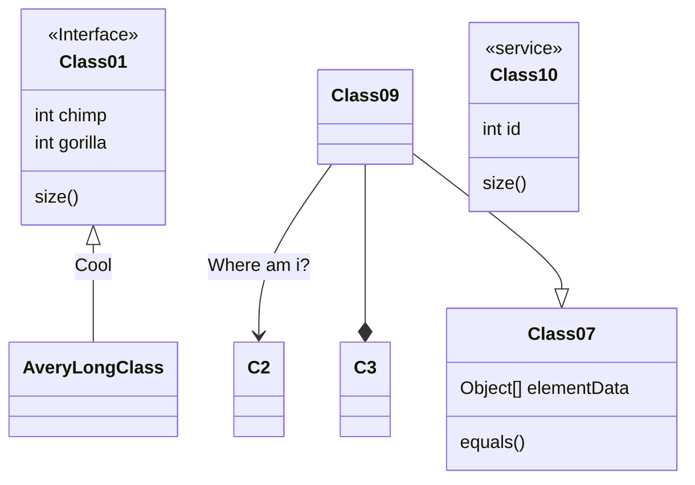
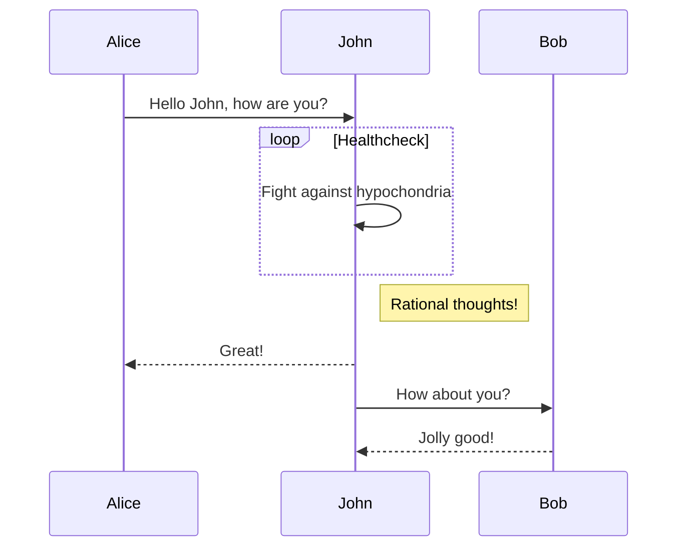
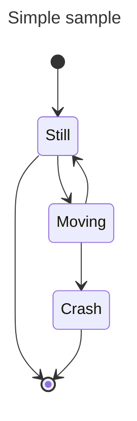
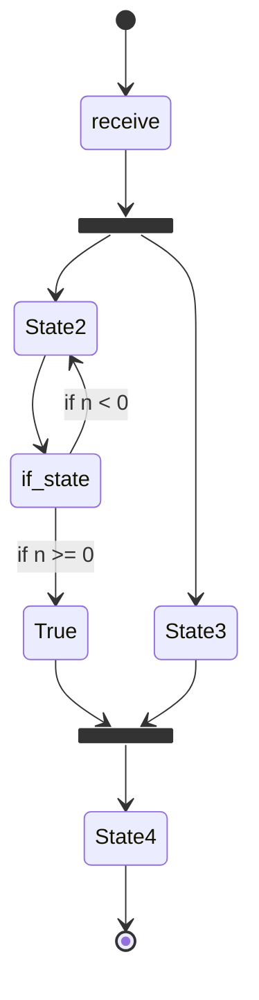

# 面向对象

## UML

### 关系

UML 关系主要有：依赖、关联、聚合、组合、实现、继承。

### 类图

### 用例图

[用例图UML建模](https://www.cnblogs.com/lcword/p/10472040.html#:~:text=UML建模——用例图) 通常包含三个元素：参与者、通信连接（或者关联）和实际的用例，使用 [PlantUML Web Server](https://www.plantuml.com/plantuml) 进行绘图。

- 参与者通常用一个简笔画的人来表示，代表用户或者外部设备，以及使用当前系统的其他系统。
- 通信连接用参与者和用例之间的一条线来表示，代表两者之间存在某种形式的通信。
- 用例用一个椭圆形来表示，再配上适当的描述，代表参与者在系统上执行的各种活动。

### 序列图

### 状态图

### 活动图

## 设计模式

|      | 创建型                                   | 结构型                                                       | 行为型                                                       |
| ---- | ---------------------------------------- | ------------------------------------------------------------ | ------------------------------------------------------------ |
| 类   | 工厂方法                                 | 适配器                                                       | 解释器 模板方法                                         |
| 对象 | 抽象工厂 生成器 原型 单例 | 适配器 桥接 组合 装饰 外观 享元 代理 | 责任链 命令 解释器 迭代器 中介者 备忘录 观察者 状态 策略 模板方法 访问者 |

## reference

[时序图 | Mermaid 中文网 (nodejs.cn)](https://mermaid.nodejs.cn/syntax/sequenceDiagram.html)

[PlantUML_Language_Reference_Guide](https://pdf.plantuml.net/1.2019.9/PlantUML_Language_Reference_Guide_zh.pdf#:~:text=另外,你还能用<- 和<--,这不影响绘图,但可以提高可读性。.)
