# 面向对象

## UML

### 关系

UML 关系主要有：依赖、关联、聚合、组合、实现、继承。

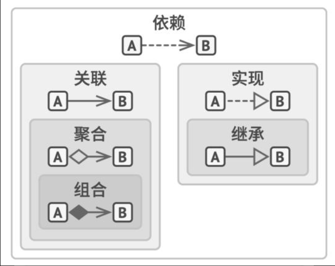

### 类图

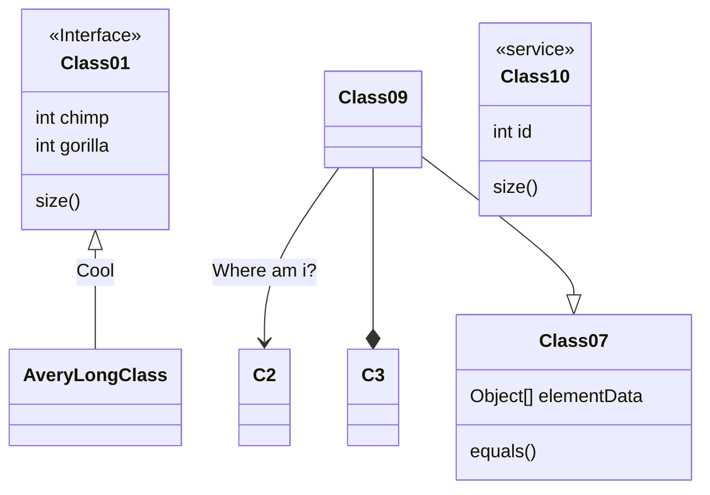
```mermaid
classDiagram
Class01 <|-- AveryLongClass : Cool
<<Interface>> Class01
Class09 --> C2 : Where am i?
Class09 --* C3
Class09 --|> Class07
Class07 : equals()
Class07 : Object[] elementData
Class01 : size()
Class01 : int chimp
Class01 : int gorilla
class Class10 {
  <<service>>
  int id
  size()
}
```

### 用例图

[用例图UML建模](https://www.cnblogs.com/lcword/p/10472040.html#:~:text=UML建模——用例图) 通常包含三个元素：参与者、通信连接（或者关联）和实际的用例，使用 [PlantUML Web Server](https://www.plantuml.com/plantuml) 进行绘图。

- 参与者通常用一个简笔画的人来表示，代表用户或者外部设备，以及使用当前系统的其他系统。
- 通信连接用参与者和用例之间的一条线来表示，代表两者之间存在某种形式的通信。
- 用例用一个椭圆形来表示，再配上适当的描述，代表参与者在系统上执行的各种活动。

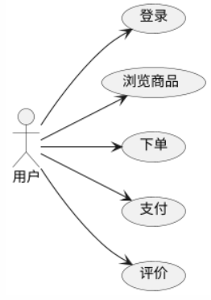

### 序列图

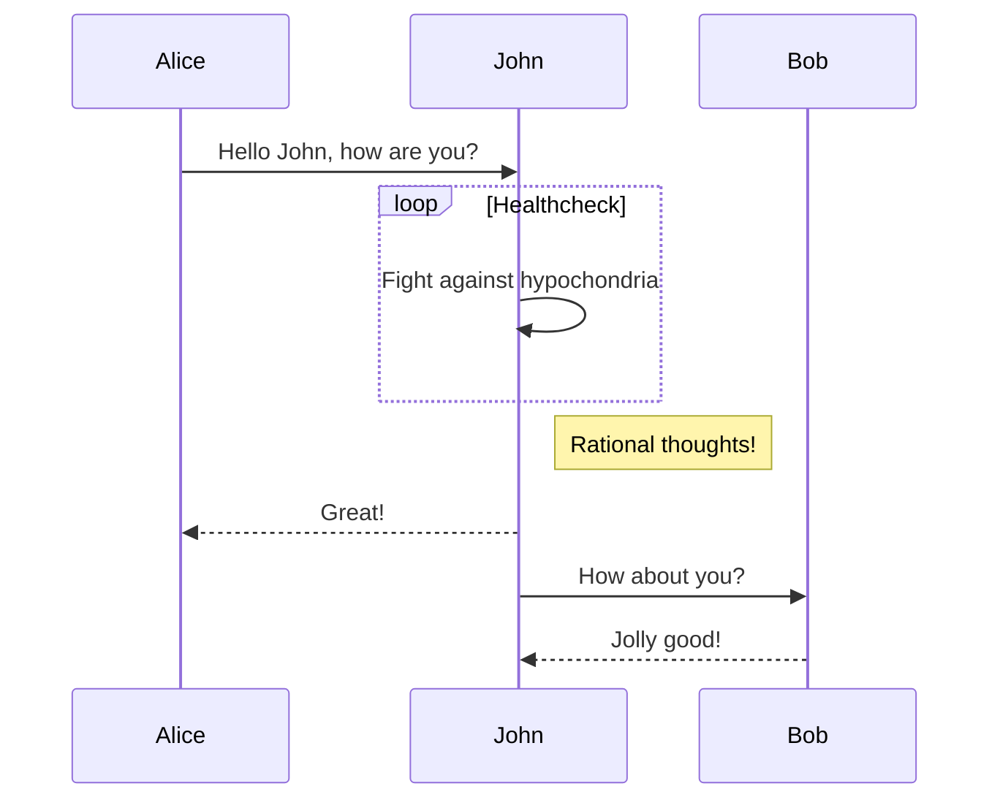
```mermaid
sequenceDiagram
Alice->>John: Hello John, how are you?
loop Healthcheck
    John->>John: Fight against hypochondria
end
Note right of John: Rational thoughts!
John-->>Alice: Great!
John->>Bob: How about you?
Bob-->>John: Jolly good!
```

### 状态图

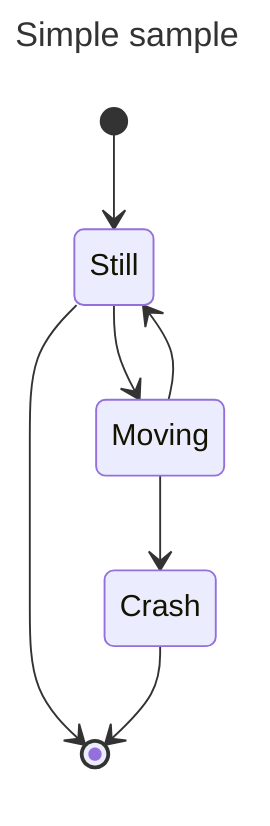
```mermaid
---
title: Simple sample
---
stateDiagram-v2
    [*] --> Still
    Still --> [*]

    Still --> Moving
    Moving --> Still
    Moving --> Crash
    Crash --> [*]

```

### 活动图

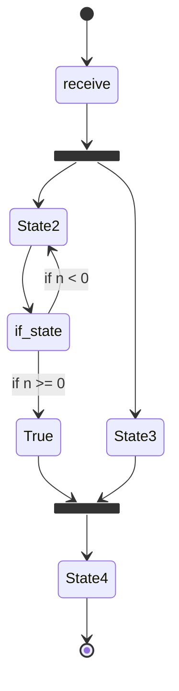
```mermaid
   stateDiagram-v2
    state fork_state <<fork>>
      [*] --> receive
      receive --> fork_state
      fork_state --> State2
      State2 --> if_state
      	if_state --> State2: if n < 0
      	if_state --> True : if n >= 0
      fork_state --> State3

      state join_state <<join>>
      True --> join_state
      State3 --> join_state
      join_state --> State4
      State4 --> [*]

```

## 设计模式

|      | 创建型                                                 | 结构型                                                       | 行为型                                                       |
| ---- | ------------------------------------------------------ | ------------------------------------------------------------ | ------------------------------------------------------------ |
| 类   | 工厂方法                                               | 适配器                                                       | 解释器<br />模板方法                                         |
| 对象 | 简单工厂<br />抽象工厂<br />生成器<br />原型<br />单例 | 适配器<br />桥接<br />组合<br />装饰<br />外观<br />享元<br />代理 | 责任链<br />命令<br />解释器<br />迭代器<br />中介者<br />备忘录<br />观察者<br />状态<br />策略<br />模板方法<br />访问者 |

### 创建型

#### 1 单例模式

##### Mermaid 类图

以下是使用 Mermaid 绘制的单例模式的类图：

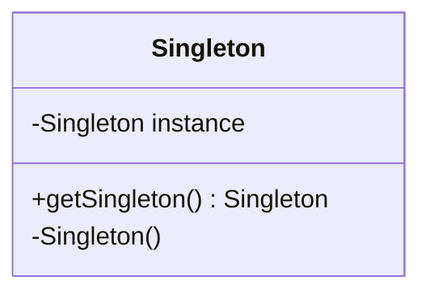
```mermaid
classDiagram
    class Singleton {
        -Singleton instance
        +getSingleton() Singleton
        -Singleton()
    }
```

##### C++ 代码示例

以下是单例模式的 C++ 实现示例，其中包括了线程安全的懒汉式单例模式：

```cpp
#include <iostream>
#include <mutex>

class Singleton {
private:
    Singleton() {} // 私有构造函数
    ~Singleton() {} // 私有析构函数
    Singleton(const Singleton&) = delete; // 禁用拷贝构造函数
    Singleton& operator=(const Singleton&) = delete; // 禁用赋值操作符

public:
    // 获取单例对象的静态方法
    static Singleton& getSingleton() {
        static Singleton instance; // 局部静态变量
        return instance;
    }

    void doSomething() {
        std::cout << "Doing something" << std::endl;
    }
};

int main() {
    // 获取单例对象的引用
    Singleton& instance = Singleton::getSingleton();
    instance.doSomething();
    return 0;
}
```

在这个示例中，`Singleton` 类有一个私有的构造函数和析构函数，以及禁用的拷贝构造函数和赋值操作符，确保了对象不能被外部复制或赋值。`getSingleton` 方法提供了一个全局访问点，用于获取类的唯一实例。由于使用了局部静态变量，这种实现方式在 C++11 标准下是线程安全的，并且延迟了实例的创建，直到第一次调用 `getSingleton` 方法时才初始化实例。

这种实现方式被称为 Meyer's Singleton，是实现单例模式的一种推荐方式，因为它简单、线程安全，并且没有性能开销。

#### 2 简单工厂模式（Simple Factory Pattern）

简单工厂模式（Simple Factory Pattern）是一种创建型设计模式，它通过一个工厂类来创建对象，而无需客户端直接实例化对象。

##### UML图（Mermaid语法）

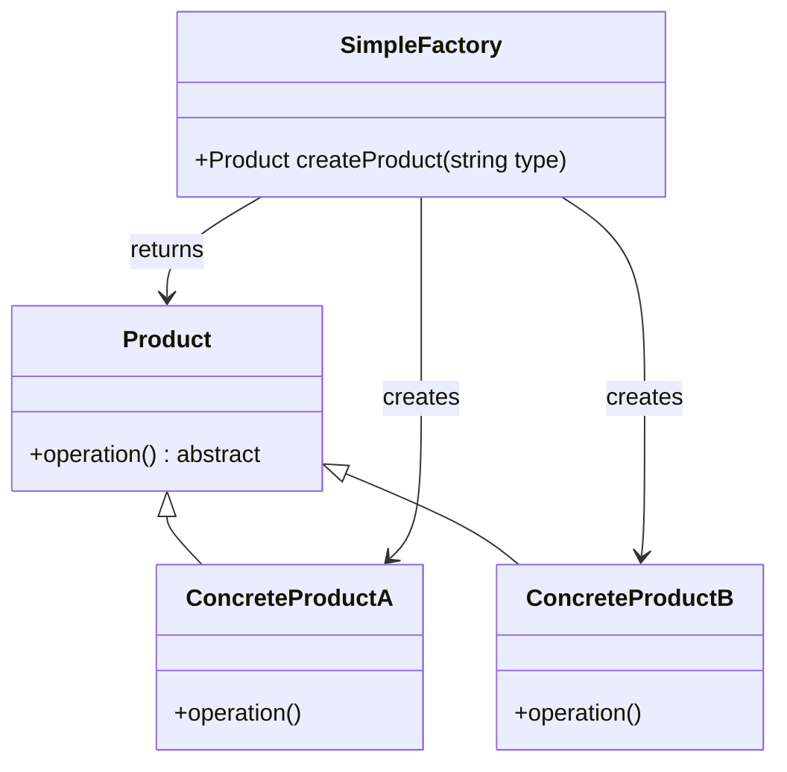
```mermaid
classDiagram
    Product <|-- ConcreteProductA
    Product <|-- ConcreteProductB
    class SimpleFactory {
        +Product createProduct(string type)
    }
    class Product {
        +operation() abstract
    }
    class ConcreteProductA {
        +operation()
    }
    class ConcreteProductB {
        +operation()
    }
    SimpleFactory --> Product : returns
    SimpleFactory --> ConcreteProductA : creates
    SimpleFactory --> ConcreteProductB : creates
```

##### C++代码示例

```cpp
#include <iostream>
#include <memory>
#include <string>
#include <unordered_map>

// 抽象产品类
class Product {
public:
    virtual ~Product() = default;
    virtual void operation() const = 0;
};

// 具体产品A类
class ConcreteProductA : public Product {
public:
    void operation() const override {
        std::cout << "ConcreteProductA operation" << std::endl;
    }
};

// 具体产品B类
class ConcreteProductB : public Product {
public:
    void operation() const override {
        std::cout << "ConcreteProductB operation" << std::endl;
    }
};

// 简单工厂类
class SimpleFactory {
public:
    std::unique_ptr<Product> createProduct(const std::string& type) const {
        auto it = productMap.find(type);
        if (it != productMap.end()) {
            return it->second();
        } else {
            throw std::runtime_error("Unknown product type");
        }
    }

private:
    std::unordered_map<std::string, std::function<std::unique_ptr<Product>()>> productMap = {
        {"A", []() { return std::make_unique<ConcreteProductA>(); }},
        {"B", []() { return std::make_unique<ConcreteProductB>(); }}
    };
};

int main() {
    SimpleFactory factory;

    try {
        auto productA = factory.createProduct("A");
        productA->operation();

        auto productB = factory.createProduct("B");
        productB->operation();
    } catch (const std::exception& e) {
        std::cerr << "Error: " << e.what() << std::endl;
    }

    return 0;
}
```

##### 代码说明

1. **Product**：抽象产品类，声明了一个纯虚函数`operation`，具体产品类将实现它。
2. **ConcreteProductA** 和 **ConcreteProductB**：具体产品类，分别实现了`operation`方法。
3. **SimpleFactory**：简单工厂类，包含一个`productMap`来存储产品类型的映射，使用`std::function`和`std::unique_ptr`来动态创建产品对象。
4. **main**：测试代码，通过工厂类创建产品对象并调用它们的`operation`方法。

在这个示例中，客户端代码（`main`函数）通过简单工厂类`SimpleFactory`来创建产品对象，而无需知道具体产品类的实现细节。这有助于降低客户端代码与具体产品类之间的耦合度。

#### 3 工厂方法模式

工厂方法模式是一种创建型设计模式，它定义了一个创建对象的接口，但由子类决定要实例化的类是哪一个。这种模式的关键在于，它允许系统在不修改工厂角色的情况下引进新产品。以下是工厂方法模式的Mermaid类图和C++代码示例。

##### Mermaid类图
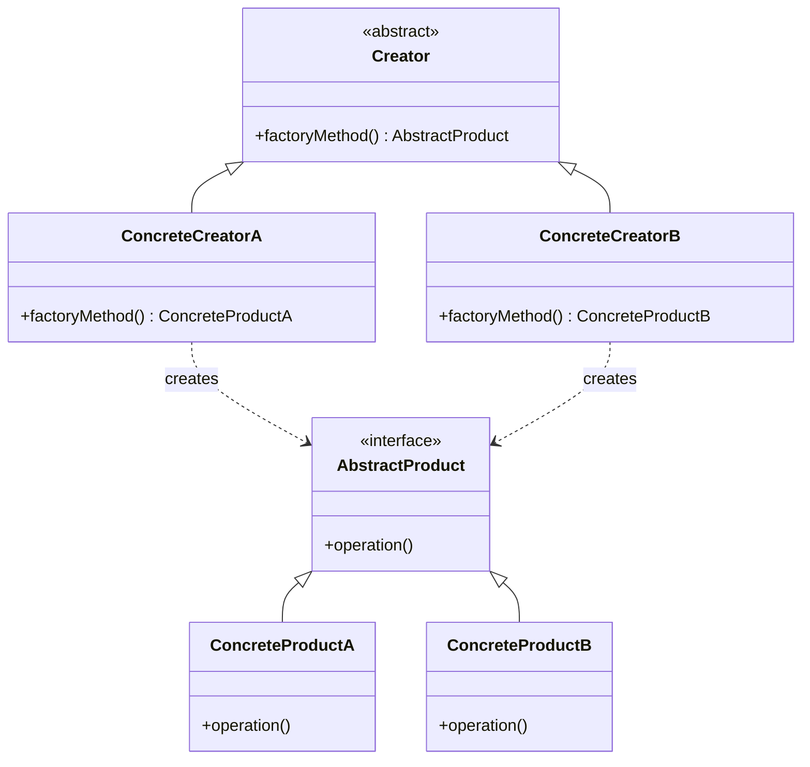
```mermaid
classDiagram
    class AbstractProduct {
        <<interface>>
        +operation()
    }
    class ConcreteProductA {
        +operation()
    }
    class ConcreteProductB {
        +operation()
    }
    class Creator {
        <<abstract>>
        +factoryMethod() AbstractProduct
    }
    class ConcreteCreatorA {
        +factoryMethod() ConcreteProductA
    }
    class ConcreteCreatorB {
        +factoryMethod() ConcreteProductB
    }
    AbstractProduct <|-- ConcreteProductA
    AbstractProduct <|-- ConcreteProductB
    Creator <|-- ConcreteCreatorA
    Creator <|-- ConcreteCreatorB
    ConcreteCreatorA ..> AbstractProduct : creates
    ConcreteCreatorB ..> AbstractProduct : creates
```

##### C++代码示例
以下是一个简单的工厂方法模式的C++实现，其中包括了抽象产品、具体产品、抽象工厂和具体工厂的代码。

```cpp
#include <iostream>
#include <memory>

// 抽象产品
class Product {
public:
    virtual ~Product() {}
    virtual void Use() = 0;
};

// 具体产品A
class ConcreteProductA : public Product {
public:
    void Use() override {
        std::cout << "Using product A" << std::endl;
    }
};

// 具体产品B
class ConcreteProductB : public Product {
public:
    void Use() override {
        std::cout << "Using product B" << std::endl;
    }
};

// 抽象工厂
class Factory {
public:
    virtual ~Factory() {}
    virtual std::unique_ptr<Product> CreateProduct() = 0;
};

// 具体工厂A
class ConcreteFactoryA : public Factory {
public:
    std::unique_ptr<Product> CreateProduct() override {
        return std::make_unique<ConcreteProductA>();
    }
};

// 具体工厂B
class ConcreteFactoryB : public Factory {
public:
    std::unique_ptr<Product> CreateProduct() override {
        return std::make_unique<ConcreteProductB>();
    }
};

int main() {
    // 客户端代码
    std::unique_ptr<Factory> factoryA = std::make_unique<ConcreteFactoryA>();
    factoryA->CreateProduct()->Use(); // 使用产品A

    std::unique_ptr<Factory> factoryB = std::make_unique<ConcreteFactoryB>();
    factoryB->CreateProduct()->Use(); // 使用产品B

    return 0;
}
```

在这个例子中，`Product`是抽象产品，`ConcreteProductA`和`ConcreteProductB`是具体产品。`Factory`是抽象工厂，`ConcreteFactoryA`和`ConcreteFactoryB`是具体工厂。客户端代码通过具体工厂创建具体产品，并使用它们。这种模式允许在不修改客户端代码的情况下引入新产品，只需添加相应的具体产品和工厂类即可。

#### 4 抽象工厂模式（Abstract Factory Pattern）

抽象工厂模式（Abstract Factory Pattern）是一种创建型设计模式，它提供了一种方式，允许通过用户选择一系列相关或相互依赖的对象，而无需指定它们具体的类。这种模式通常用于系统的产品结构非常稳定，但因产品的创建而被频繁使用的场景。

##### Mermaid类图
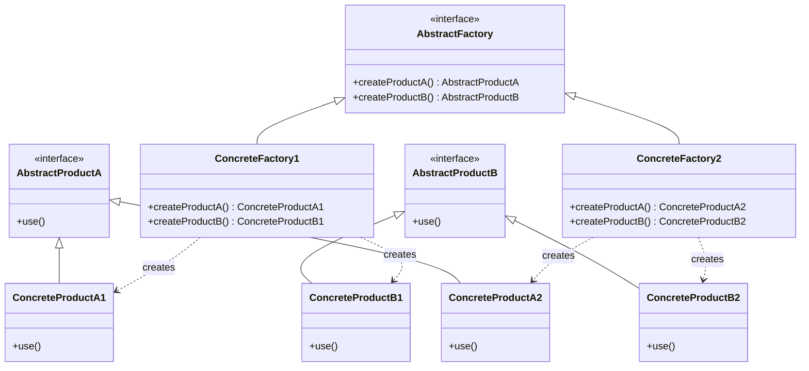
```mermaid
classDiagram
    class AbstractProductA {
        <<interface>>
        +use()
    }
    class AbstractProductB {
        <<interface>>
        +use()
    }
    class ConcreteProductA1 {
        +use()
    }
    class ConcreteProductB1 {
        +use()
    }
    class ConcreteProductA2 {
        +use()
    }
    class ConcreteProductB2 {
        +use()
    }
    class AbstractFactory {
        <<interface>>
        +createProductA() AbstractProductA
        +createProductB() AbstractProductB
    }
    class ConcreteFactory1 {
        +createProductA() ConcreteProductA1
        +createProductB() ConcreteProductB1
    }
    class ConcreteFactory2 {
        +createProductA() ConcreteProductA2
        +createProductB() ConcreteProductB2
    }
    AbstractProductA <|-- ConcreteProductA1
    AbstractProductA <|-- ConcreteProductA2
    AbstractProductB <|-- ConcreteProductB1
    AbstractProductB <|-- ConcreteProductB2
    AbstractFactory <|-- ConcreteFactory1
    AbstractFactory <|-- ConcreteFactory2
    ConcreteFactory1 ..> ConcreteProductA1 : creates
    ConcreteFactory1 ..> ConcreteProductB1 : creates
    ConcreteFactory2 ..> ConcreteProductA2 : creates
    ConcreteFactory2 ..> ConcreteProductB2 : creates
```

##### C++代码示例
以下是一个抽象工厂模式的C++实现，其中包括了抽象产品、具体产品和抽象工厂以及具体工厂的代码。

```cpp
#include <iostream>
#include <memory>

// 抽象产品A
class AbstractProductA {
public:
    virtual ~AbstractProductA() {}
    virtual void Use() const = 0;
};

// 抽象产品B
class AbstractProductB {
public:
    virtual ~AbstractProductB() {}
    virtual void Use() const = 0;
};

// 具体产品A1
class ConcreteProductA1 : public AbstractProductA {
public:
    void Use() const override {
        std::cout << "Using Product A1" << std::endl;
    }
};

// 具体产品B1
class ConcreteProductB1 : public AbstractProductB {
public:
    void Use() const override {
        std::cout << "Using Product B1" << std::endl;
    }
};

// 具体产品A2
class ConcreteProductA2 : public AbstractProductA {
public:
    void Use() const override {
        std::cout << "Using Product A2" << std::endl;
    }
};

// 具体产品B2
class ConcreteProductB2 : public AbstractProductB {
public:
    void Use() const override {
        std::cout << "Using Product B2" << std::endl;
    }
};

// 抽象工厂
class AbstractFactory {
public:
    virtual ~AbstractFactory() {}
    virtual std::unique_ptr<AbstractProductA> CreateProductA() = 0;
    virtual std::unique_ptr<AbstractProductB> CreateProductB() = 0;
};

// 具体工厂1
class ConcreteFactory1 : public AbstractFactory {
public:
    std::unique_ptr<AbstractProductA> CreateProductA() override {
        return std::make_unique<ConcreteProductA1>();
    }
    std::unique_ptr<AbstractProductB> CreateProductB() override {
        return std::make_unique<ConcreteProductB1>();
    }
};

// 具体工厂2
class ConcreteFactory2 : public AbstractFactory {
public:
    std::unique_ptr<AbstractProductA> CreateProductA() override {
        return std::make_unique<ConcreteProductA2>();
    }
    std::unique_ptr<AbstractProductB> CreateProductB() override {
        return std::make_unique<ConcreteProductB2>();
    }
};

int main() {
    // 客户端代码
    std::unique_ptr<AbstractFactory> factory1 = std::make_unique<ConcreteFactory1>();
    factory1->CreateProductA()->Use(); // 使用产品A1
    factory1->CreateProductB()->Use(); // 使用产品B1

    std::unique_ptr<AbstractFactory> factory2 = std::make_unique<ConcreteFactory2>();
    factory2->CreateProductA()->Use(); // 使用产品A2
    factory2->CreateProductB()->Use(); // 使用产品B2

    return 0;
}
```

在这个例子中，`AbstractProductA`和`AbstractProductB`是抽象产品，`ConcreteProductA1`、`ConcreteProductB1`、`ConcreteProductA2`和`ConcreteProductB2`是具体产品。`AbstractFactory`是抽象工厂，`ConcreteFactory1`和`ConcreteFactory2`是具体工厂。客户端代码通过具体工厂创建一系列相关产品，并使用它们。这种模式允许在不修改客户端代码的情况下引入新的产品系列，只需添加相应的具体产品和工厂类即可。

#### 5 建造者模式（Builder Pattern）

建造者模式（Builder Pattern）是一种创建型设计模式，它将一个复杂对象的构建与其表示分离，使得同样的构建过程可以创建不同的表示。这种模式通常用于创建一些复杂的对象，这些对象的创建过程可能涉及到多个步骤，并且这些步骤可能会变化。

##### Mermaid类图
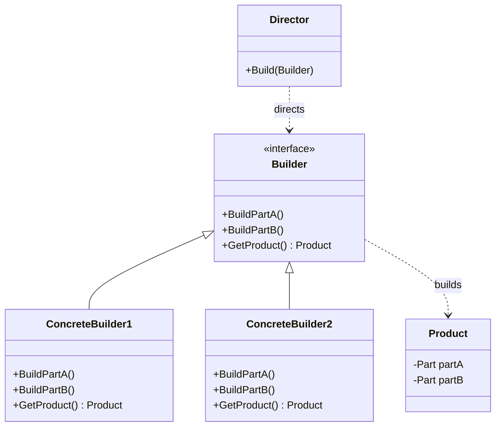
```mermaid
classDiagram
    class Builder {
        <<interface>>
        +BuildPartA()
        +BuildPartB()
        +GetProduct() Product
    }
    class ConcreteBuilder1 {
        +BuildPartA()
        +BuildPartB()
        +GetProduct() Product
    }
    class ConcreteBuilder2 {
        +BuildPartA()
        +BuildPartB()
        +GetProduct() Product
    }
    class Director {
        +Build(Builder)
    }
    class Product {
        -Part partA
        -Part partB
    }
    Builder <|-- ConcreteBuilder1
    Builder <|-- ConcreteBuilder2
    Director ..> Builder : directs
    Builder ..> Product : builds
```

##### C++代码示例
以下是一个建造者模式的C++实现，其中包括了抽象建造者、具体建造者、导演类和产品类的代码。

```cpp
#include <iostream>
#include <memory>

// 产品类
class Product {
public:
    void Add(std::string part) {
        parts.push_back(part);
    }

    void Show() {
        std::cout << "Product Parts: ";
        for (const auto& part : parts) {
            std::cout << part << " ";
        }
        std::cout << std::endl;
    }

private:
    std::vector<std::string> parts;
};

// 抽象建造者
class Builder {
public:
    virtual ~Builder() {}
    virtual void BuildPartA() = 0;
    virtual void BuildPartB() = 0;
    virtual std::shared_ptr<Product> GetProduct() = 0;
};

// 具体建造者1
class ConcreteBuilder1 : public Builder {
private:
    std::shared_ptr<Product> product = std::make_shared<Product>();

public:
    void BuildPartA() override {
        product->Add("PartA1");
    }

    void BuildPartB() override {
        product->Add("PartB1");
    }

    std::shared_ptr<Product> GetProduct() override {
        return product;
    }
};

// 具体建造者2
class ConcreteBuilder2 : public Builder {
private:
    std::shared_ptr<Product> product = std::make_shared<Product>();

public:
    void BuildPartA() override {
        product->Add("PartA2");
    }

    void BuildPartB() override {
        product->Add("PartB2");
    }

    std::shared_ptr<Product> GetProduct() override {
        return product;
    }
};

// 导演类
class Director {
public:
    void Construct(Builder* builder) {
        builder->BuildPartA();
        builder->BuildPartB();
    }
};

int main() {
    // 客户端代码
    Director director;
    Builder* builder1 = new ConcreteBuilder1();
    director.Construct(builder1);
    builder1->GetProduct()->Show();

    Builder* builder2 = new ConcreteBuilder2();
    director.Construct(builder2);
    builder2->GetProduct()->Show();

    delete builder1;
    delete builder2;

    return 0;
}
```

在这个例子中，`Product`是产品类，`Builder`是抽象建造者，它定义了构建产品的接口。`ConcreteBuilder1`和`ConcreteBuilder2`是具体建造者，它们实现了建造产品的步骤。`Director`是导演类，它负责指挥建造过程。客户端代码通过导演类和建造者来构建产品，并展示产品信息。

请注意，由于C++的多态特性，这里使用了虚函数和动态多态来实现建造者模式。此外，这里使用了智能指针来管理对象的生命周期，以避免内存泄漏。

### 结构型

#### 6 适配器

在设计模式中，适配器模式是一种常用的结构型模式，用于使原本不兼容的接口能够一起工作。以下是适配器模式的Mermaid类图和C++代码示例。

##### Mermaid类图
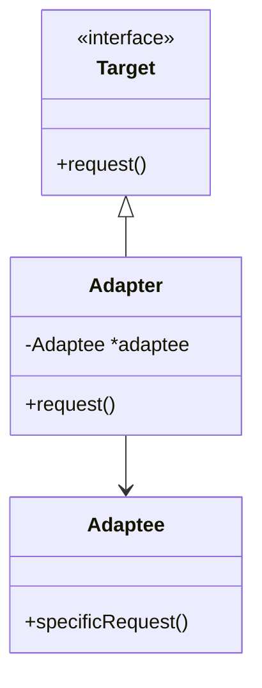
```mermaid
classDiagram
    class Target {
        <<interface>>
        +request()
    }
    class Adaptee {
        +specificRequest()
    }
    class Adapter {
        -Adaptee *adaptee
        +request()
    }
    Target <|-- Adapter
    Adapter --> Adaptee
```

##### C++代码示例
以下是一个简单的适配器模式的C++实现，其中`Target`是客户端期望的接口，`Adaptee`是需要适配的类，`Adapter`是适配器类，它实现了`Target`接口，并在内部持有一个`Adaptee`对象，在`request`方法中将调用转发给`Adaptee`的`specificRequest`方法。

```cpp
#include <iostream>

// 目标接口
class Target {
public:
    virtual void request() = 0;
};

// 适配者类
class Adaptee {
public:
    void specificRequest() {
        std::cout << "Adaptee's specific request" << std::endl;
    }
};

// 适配器类
class Adapter : public Target {
private:
    Adaptee *adaptee;
public:
    Adapter(Adaptee *a) : adaptee(a) {}
    void request() override {
        std::cout << "Adapter's request" << std::endl;
        adaptee->specificRequest();
    }
};

int main() {
    Adaptee adaptee;
    Adapter adapter(&adaptee);
    adapter.request();
    return 0;
}
```

在这个示例中，`Target`定义了客户端期望的接口，`Adaptee`提供了一个特定的请求方法`specificRequest`，但是它与`Target`接口不兼容。`Adapter`类继承自`Target`并持有`Adaptee`的实例，通过`request`方法将`Adaptee`的接口适配为`Target`接口的形式。这样，客户端代码就可以通过`Adapter`类来使用`Adaptee`的功能了。

以上代码示例和Mermaid类图展示了适配器模式的基本结构和实现方式。这种模式在处理接口兼容性问题时非常有用，允许开发者在不修改现有代码的情况下重用旧的类或接口。

#### 7 桥接

桥接模式（Bridge Pattern）是一种结构型设计模式，它将抽象部分与它的实现部分分离，使它们可以独立地变化。这种模式主要用于解决那些在多个维度上可能发生变化的问题，使得在任何一个维度上的变化都不会影响到另一个维度。

##### Mermaid 类图

以下是使用 Mermaid 绘制的桥接模式的类图：

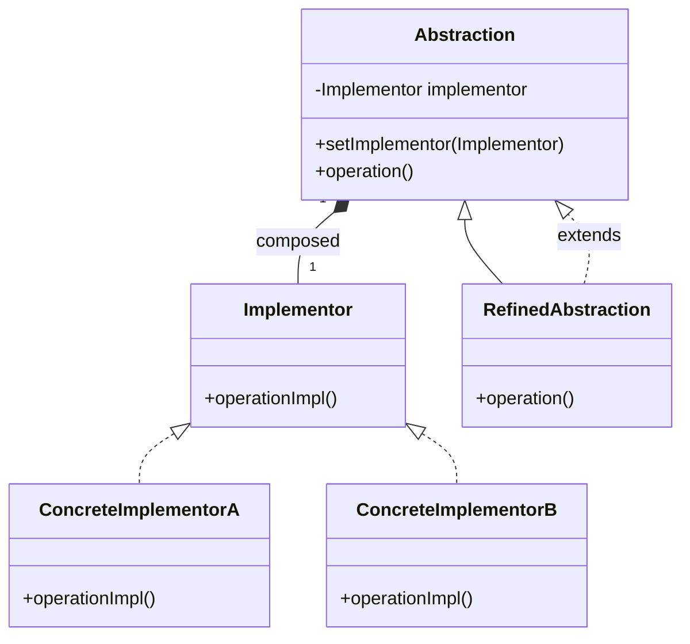
```mermaid
classDiagram
    class Abstraction {
        -Implementor implementor
        +setImplementor(Implementor)
        +operation()
    }
    class Implementor {
        +operationImpl()
    }
    class RefinedAbstraction {
        +operation()
    }
    class ConcreteImplementorA {
        +operationImpl()
    }
    class ConcreteImplementorB {
        +operationImpl()
    }
    Abstraction <|-- RefinedAbstraction
    Implementor <|.. ConcreteImplementorA
    Implementor <|.. ConcreteImplementorB
    Abstraction "1" *-- "1" Implementor : composed
    RefinedAbstraction ..|> Abstraction : extends
```

##### C++ 代码示例

以下是桥接模式的 C++ 实现示例：

```cpp
#include <iostream>

// 实现化角色接口
class Implementor {
public:
    virtual ~Implementor() {}
    virtual void operationImpl() = 0;
};

// 具体实现化角色A
class ConcreteImplementorA : public Implementor {
public:
    void operationImpl() override {
        std::cout << "ConcreteImplementorA 的 operationImpl()" << std::endl;
    }
};

// 具体实现化角色B
class ConcreteImplementorB : public Implementor {
public:
    void operationImpl() override {
        std::cout << "ConcreteImplementorB 的 operationImpl()" << std::endl;
    }
};

// 抽象化角色
class Abstraction {
protected:
    Implementor* implementor;
public:
    Abstraction(Implementor* impl) : implementor(impl) {}
    virtual ~Abstraction() {}
    virtual void operation() {
        implementor->operationImpl();
    }
    void setImplementor(Implementor* impl) {
        implementor = impl;
    }
};

// 具体抽象化角色
class RefinedAbstraction : public Abstraction {
public:
    RefinedAbstraction(Implementor* impl) : Abstraction(impl) {}
    void operation() override {
        std::cout << "RefinedAbstraction 调用 operation..." << std::endl;
        Abstraction::operation();
    }
};

int main() {
    Implementor* implA = new ConcreteImplementorA();
    Implementor* implB = new ConcreteImplementorB();

    Abstraction* absA = new RefinedAbstraction(implA);
    Abstraction* absB = new RefinedAbstraction(implB);

    absA->operation();
    absB->operation();

    // 动态改变实现
    absA->setImplementor(implB);
    absA->operation();

    delete implA;
    delete implB;
    delete absA;
    delete absB;

    return 0;
}
```

在这个示例中：

- `Implementor` 是实现化角色的接口，定义了实现化角色需要实现的方法 `operationImpl()`。
- `ConcreteImplementorA` 和 `ConcreteImplementorB` 是具体实现化角色，实现了 `operationImpl()` 方法。
- `Abstraction` 是抽象化角色，持有一个 `Implementor` 类型的成员变量，并定义了 `operation()` 方法，该方法委托给实现化角色。
- `RefinedAbstraction` 是具体抽象化角色，继承自 `Abstraction` 并可以扩展 `operation()` 方法。
- 在 `main()` 函数中，我们创建了不同的实现化角色和抽象化角色的实例，并展示了如何动态地改变实现化角色。

#### 8 组合

组合模式（Composite Pattern）是一种结构型设计模式，它允许你将对象组合成树状结构来表现“整体/部分”层次关系。组合模式使得客户端可以统一地对待单个对象和组合对象。

##### Mermaid 类图

以下是使用 Mermaid 绘制的组合模式的类图：

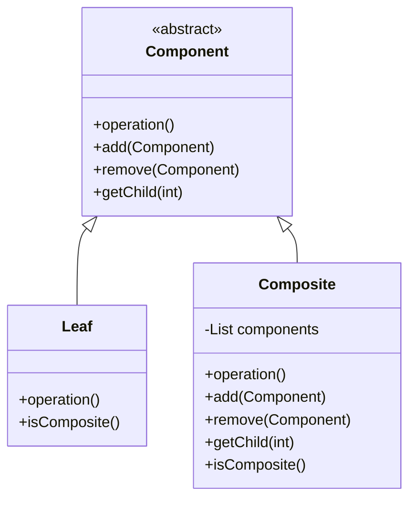
```mermaid
classDiagram
    class Component {
        <<abstract>>
        +operation()
        +add(Component)
        +remove(Component)
        +getChild(int)
    }
    class Leaf {
        +operation()
        +isComposite()
    }
    class Composite {
        -List components
        +operation()
        +add(Component)
        +remove(Component)
        +getChild(int)
        +isComposite()
    }
    Component <|-- Leaf
    Component <|-- Composite
```

##### C++ 代码示例

以下是组合模式的 C++ 实现示例：

```cpp
#include <iostream>
#include <vector>
#include <memory>

// 抽象组件类
class Component {
public:
    virtual ~Component() {}
    virtual void operation() = 0;
    virtual void add(std::shared_ptr<Component> component) = 0;
    virtual void remove(std::shared_ptr<Component> component) = 0;
    virtual std::shared_ptr<Component> getChild(int index) = 0;
};

// 叶子组件类
class Leaf : public Component {
public:
    void operation() override {
        std::cout << "Leaf is doing something" << std::endl;
    }

    void add(std::shared_ptr<Component> component) override {
        std::cout << "Leaf cannot add a component" << std::endl;
    }

    void remove(std::shared_ptr<Component> component) override {
        std::cout << "Leaf cannot remove a component" << std::endl;
    }

    std::shared_ptr<Component> getChild(int index) override {
        std::cout << "Leaf does not have children" << std::endl;
        return nullptr;
    }
};

// 复合组件类
class Composite : public Component {
private:
    std::vector<std::shared_ptr<Component>> children;
public:
    void operation() override {
        std::cout << "Composite is doing something" << std::endl;
    }

    void add(std::shared_ptr<Component> component) override {
        children.push_back(component);
    }

    void remove(std::shared_ptr<Component> component) override {
        children.erase(std::remove(children.begin(), children.end(), component), children.end());
    }

    std::shared_ptr<Component> getChild(int index) override {
        if (index < 0 || index >= static_cast<int>(children.size())) {
            std::cout << "Index is out of bounds" << std::endl;
            return nullptr;
        }
        return children[index];
    }
};

int main() {
    std::shared_ptr<Composite> root = std::make_shared<Composite>();
    std::shared_ptr<Composite> branch1 = std::make_shared<Composite>();
    std::shared_ptr<Composite> branch2 = std::make_shared<Composite>();
    std::shared_ptr<Leaf> leaf1 = std::make_shared<Leaf>();
    std::shared_ptr<Leaf> leaf2 = std::make_shared<Leaf>();

    root->add(branch1);
    root->add(branch2);
    branch1->add(leaf1);
    branch2->add(leaf2);

    // 客户端代码调用
    root->operation();
    root->getChild(0)->operation();
    root->getChild(0)->getChild(0)->operation();

    return 0;
}
```

在这个示例中：

- `Component` 是抽象组件类，定义了 `operation()`、`add()`、`remove()` 和 `getChild()` 方法。
- `Leaf` 是叶子组件类，实现了 `operation()` 方法，并且不实现 `add()`、`remove()` 和 `getChild()` 方法，因为叶子节点没有子节点。
- `Composite` 是复合组件类，实现了 `operation()` 方法，并且可以管理子组件，包括添加、移除和获取子组件。
- 在 `main()` 函数中，我们创建了一个树状结构，其中 `root` 是根节点，`branch1` 和 `branch2` 是分支节点，`leaf1` 和 `leaf2` 是叶子节点。然后，我们展示了如何调用 `operation()` 方法，以及如何通过树状结构访问子组件。

#### 9 装饰

##### Mermaid 类图

以下是使用 Mermaid 绘制的装饰模式的类图：

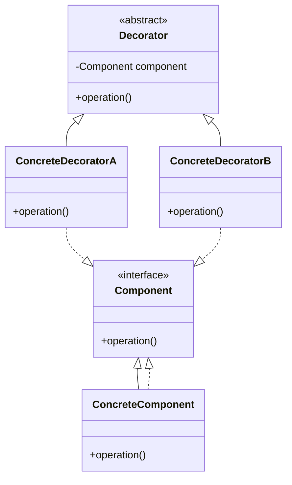
```mermaid
classDiagram
    class Component {
        <<interface>>
        +operation()
    }
    class ConcreteComponent {
        +operation()
    }
    class Decorator {
        <<abstract>>
        -Component component
        +operation()
    }
    class ConcreteDecoratorA {
        +operation()
    }
    class ConcreteDecoratorB {
        +operation()
    }
    Component <|-- ConcreteComponent
    Decorator <|-- ConcreteDecoratorA
    Decorator <|-- ConcreteDecoratorB
    ConcreteComponent ..|> Component
    ConcreteDecoratorA ..|> Component
    ConcreteDecoratorB ..|> Component
```

##### C++ 代码示例

以下是装饰模式的 C++ 实现示例：

```cpp
#include <iostream>
#include <string>

// 抽象构件角色
class Component {
public:
    virtual ~Component() {}
    virtual std::string operation() const = 0;
};

// 具体构件角色
class ConcreteComponent : public Component {
public:
    std::string operation() const override {
        return "ConcreteComponent";
    }
};

// 装饰角色
class Decorator : public Component {
protected:
    Component* component;
public:
    Decorator(Component* component) : component(component) {}
    std::string operation() const override {
        return component->operation();
    }
};

// 具体装饰角色
class ConcreteDecoratorA : public Decorator {
public:
    ConcreteDecoratorA(Component* component) : Decorator(component) {}
    std::string operation() const override {
        return "ConcreteDecoratorA(" + Decorator::operation() + ")";
    }
};

// 具体装饰角色
class ConcreteDecoratorB : public Decorator {
public:
    ConcreteDecoratorB(Component* component) : Decorator(component) {}
    std::string operation() const override {
        return "ConcreteDecoratorB(" + Decorator::operation() + ")";
    }
};

// 客户端代码
void ClientCode(Component* component) {
    std::cout << "RESULT: " << component->operation() << std::endl;
}

int main() {
    Component* simple = new ConcreteComponent();
    std::cout << "Client: I've got a simple component:\n";
    ClientCode(simple);
    std::cout << "\n\n";

    Component* decorator1 = new ConcreteDecoratorA(simple);
    Component* decorator2 = new ConcreteDecoratorB(decorator1);
    std::cout << "Client: Now I've got a decorated component:\n";
    ClientCode(decorator2);
    std::cout << "\n";

    delete simple;
    delete decorator1;
    delete decorator2;
    return 0;
}
```

在这个示例中：

- `Component` 是抽象构件角色，定义了对象的接口。
- `ConcreteComponent` 是具体构件角色，实现了 `Component` 接口。
- `Decorator` 是装饰角色，持有一个 `Component` 类型的成员变量，并实现了 `Component` 接口。
- `ConcreteDecoratorA` 和 `ConcreteDecoratorB` 是具体装饰角色，它们继承自 `Decorator` 并重写了 `operation` 方法。
- `ClientCode` 函数展示了如何使用 `Component` 接口来操作对象，这使得客户端代码可以透明地使用装饰前后的对象。

这个模式的关键优势在于可以在运行时动态地添加功能，而不需要修改原有的类结构，从而提供了更大的灵活性和可扩展性。

#### 10 外观

##### Mermaid 类图

以下是使用 Mermaid 绘制的外观模式的类图：

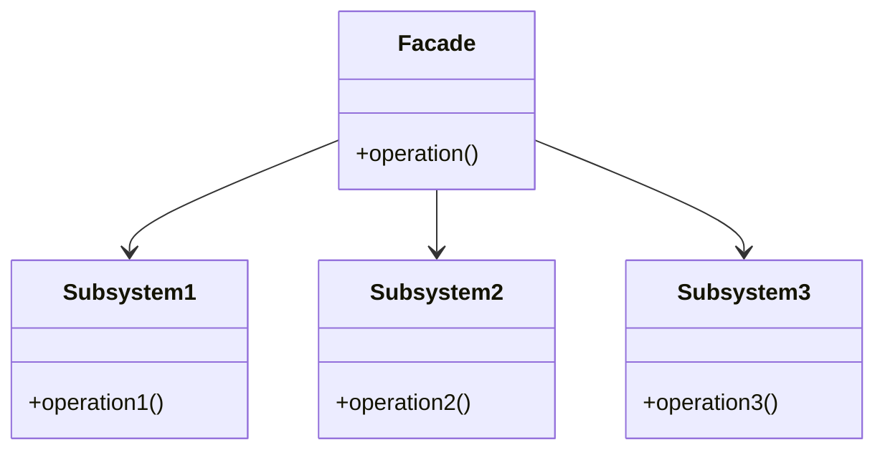
```mermaid
classDiagram
    class Facade {
        +operation()
    }
    class Subsystem1 {
        +operation1()
    }
    class Subsystem2 {
        +operation2()
    }
    class Subsystem3 {
        +operation3()
    }
    Facade --> Subsystem1
    Facade --> Subsystem2
    Facade --> Subsystem3
```

##### C++ 代码示例

以下是外观模式的 C++ 实现示例：

```cpp
#include <iostream>
#include <string>

// 子系统类1
class Subsystem1 {
public:
    void operation1() const {
        std::cout << "Subsystem1: Ready!" << std::endl;
    }
};

// 子系统类2
class Subsystem2 {
public:
    void operation2() const {
        std::cout << "Subsystem2: Get ready!" << std::endl;
    }
};

// 子系统类3
class Subsystem3 {
public:
    void operation3() const {
        std::cout << "Subsystem3: Fire!" << std::endl;
    }
};

// 外观类
class Facade {
private:
    Subsystem1 subsystem1_;
    Subsystem2 subsystem2_;
    Subsystem3 subsystem3_;
public:
    void operation() {
        std::cout << "Facade initializes subsystems:" << std::endl;
        subsystem1_.operation1();
        subsystem2_.operation2();
        std::cout << "Facade orders subsystems to perform the action:" << std::endl;
        subsystem1_.operation1();
        subsystem3_.operation3();
    }
};

// 客户端代码
void ClientCode() {
    Facade facade;
    std::cout << facade.operation();
}

int main() {
    ClientCode();
    return 0;
}
```

在这个示例中：

- `Subsystem1`、`Subsystem2` 和 `Subsystem3` 是子系统类，它们实现了各自的操作。
- `Facade` 是外观类，它提供了一个简化的接口 `operation()`，客户端可以通过这个接口来访问子系统的功能，而不需要直接与子系统交互。
- `ClientCode` 函数展示了如何使用外观类来简化客户端代码，客户端只需要调用外观类的 `operation()` 方法即可完成一系列操作。

这个模式的主要优点是简化了客户端与复杂子系统之间的交互，隐藏了子系统的复杂性，使得客户端代码更加简洁和易于维护。

#### 11 享元

##### Mermaid 类图

以下是使用 Mermaid 绘制的享元模式的类图：

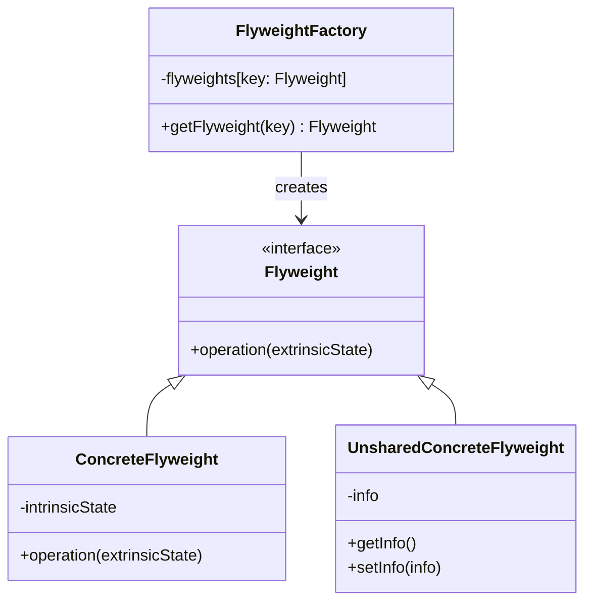
```mermaid
classDiagram
    class Flyweight {
        <<interface>>
        +operation(extrinsicState)
    }
    class ConcreteFlyweight {
        -intrinsicState
        +operation(extrinsicState)
    }
    class UnsharedConcreteFlyweight {
        -info
        +getInfo()
        +setInfo(info)
    }
    class FlyweightFactory {
        -flyweights[key: Flyweight]
        +getFlyweight(key) Flyweight
    }
    Flyweight <|-- ConcreteFlyweight
    Flyweight <|-- UnsharedConcreteFlyweight
    FlyweightFactory --> Flyweight : creates
```

##### C++ 代码示例

以下是享元模式的 C++ 实现示例：

```cpp
#include <iostream>
#include <map>
#include <memory>
#include <string>

// 抽象享元角色
class IFlyweight {
public:
    virtual ~IFlyweight() {}
    virtual void operation(const std::string& extrinsicState) const = 0;
};

// 具体享元角色
class ConcreteFlyweight : public IFlyweight {
private:
    std::string intrinsicState; // 内部状态
public:
    ConcreteFlyweight(const std::string& state) : intrinsicState(state) {}
    void operation(const std::string& extrinsicState) const override {
        std::cout << "ConcreteFlyweight: Internal State = " << intrinsicState
                  << ", Extrinsic State = " << extrinsicState << std::endl;
    }
};

// 非享元角色
class UnsharedConcreteFlyweight {
private:
    std::string info;
public:
    UnsharedConcreteFlyweight(const std::string& info) : info(info) {}
    std::string getInfo() const {
        return info;
    }
};

// 享元工厂角色
class FlyweightFactory {
private:
    std::map<std::string, std::shared_ptr<IFlyweight>> flyweights;
public:
    std::shared_ptr<IFlyweight> getFlyweight(const std::string& key) {
        if (flyweights.find(key) == flyweights.end()) {
            flyweights[key] = std::make_shared<ConcreteFlyweight>(key);
        }
        return flyweights[key];
    }
};

int main() {
    FlyweightFactory factory;
    std::shared_ptr<IFlyweight> flyweight1 = factory.getFlyweight("A");
    flyweight1->operation("operation1");
    std::shared_ptr<IFlyweight> flyweight2 = factory.getFlyweight("B");
    flyweight2->operation("operation2");
    std::shared_ptr<IFlyweight> flyweight3 = factory.getFlyweight("A");
    flyweight3->operation("operation3");
    return 0;
}
```

在这个例子中，我们创建了一个名为 `IFlyweight` 的抽象享元类，它具有一个名为 `operation` 的虚拟方法。然后，我们创建了一个名为 `ConcreteFlyweight` 的具体享元类，它继承自 `IFlyweight` 类。`ConcreteFlyweight` 类包含一个名为 `intrinsicState_` 的内部状态，它在构造函数中初始化。

还创建了一个名为 `FlyweightFactory` 的享元工厂类，它负责创建和管理享元对象。`getFlyweight` 方法接受一个键作为参数，并返回一个与该键关联的享元对象。如果该键的享元对象尚不存在，工厂将创建一个新的 `ConcreteFlyweight` 实例，并将它加入到维护队列中。

在 `main` 函数中，我们演示了如何使用享元工厂来获取享元对象，并通过设置外部状态来操作享元对象。这样，多个带有不同外部状态的对象就可以共享同一个具有固定内部状态的具体享元对象，从而节约内存。

#### 12 代理

##### Mermaid 类图

以下是使用 Mermaid 绘制的代理模式的类图：

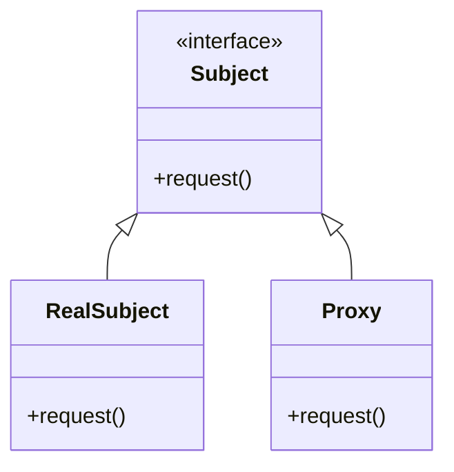
```mermaid
classDiagram
    class Subject {
        <<interface>>
        +request()
    }
    class RealSubject {
        +request()
    }
    class Proxy {
        +request()
    }
    Subject <|-- RealSubject
    Subject <|-- Proxy
```

##### C++ 代码示例

以下是代理模式的 C++ 实现示例，其中包括了抽象主题、真实主题和代理类：

```cpp
#include <iostream>

// 抽象主题
class Subject {
public:
    virtual ~Subject() {}
    virtual void request() const = 0;
};

// 真实主题
class RealSubject : public Subject {
public:
    void request() const override {
        std::cout << "RealSubject: Handling request.\n";
    }
};

// 代理类
class Proxy : public Subject {
private:
    RealSubject* realSubject_;
    bool CheckAccess() const {
        std::cout << "Proxy: Checking access prior to firing a real request.\n";
        return true;
    }
    void LogAccess() const {
        std::cout << "Proxy: Logging the time of request.\n";
    }
public:
    Proxy() : realSubject_(nullptr) {}
    ~Proxy() {
        delete realSubject_;
    }
    void request() const override {
        if (CheckAccess()) {
            if (realSubject_ == nullptr) {
                realSubject_ = new RealSubject();
            }
            LogAccess();
            realSubject_->request();
        }
    }
};

int main() {
    Proxy proxy;
    proxy.request();
    return 0;
}
```

在这个示例中，`Subject` 是一个抽象主题接口，它声明了 `request` 方法。`RealSubject` 是实现 `Subject` 接口的真实主题类，它包含了实际的业务逻辑。`Proxy` 类也实现了 `Subject` 接口，并包含了对 `RealSubject` 的引用。在 `Proxy` 的 `request` 方法中，我们首先检查访问权限，然后记录访问时间，并最终调用 `RealSubject` 的 `request` 方法来处理请求。

这个代理模式的实现允许我们在不修改 `RealSubject` 的情况下，通过 `Proxy` 类来控制对 `RealSubject` 的访问，并添加额外的功能，如访问控制和日志记录。

### 行为型

#### 13 责任链

责任链模式是一种行为设计模式，它允许多个对象依次处理请求，直到其中一个对象处理该请求为止。这种模式可以减少请求发送者和接收者之间的耦合。

##### Mermaid 表示责任链模式的类图

Mermaid 是一种基于文本的图表工具，可以用来表示责任链模式的类图。以下是一个简单的 Mermaid 类图示例：

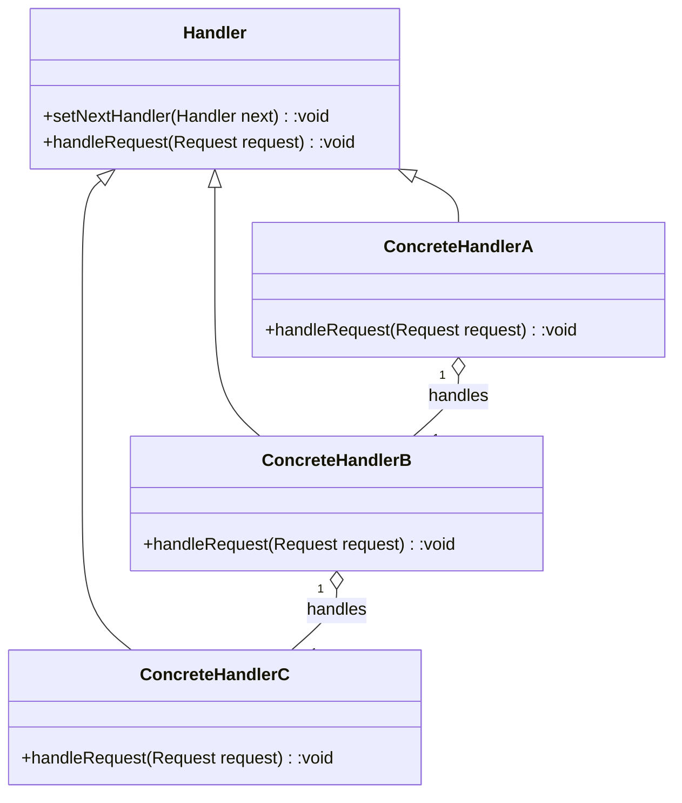
```mermaid
classDiagram
    class Handler {
      +setNextHandler(Handler next):void
      +handleRequest(Request request):void
    }
    class ConcreteHandlerA {
      +handleRequest(Request request):void
    }
    class ConcreteHandlerB {
      +handleRequest(Request request):void
    }
    class ConcreteHandlerC {
      +handleRequest(Request request):void
    }
    Handler <|-- ConcreteHandlerA
    Handler <|-- ConcreteHandlerB
    Handler <|-- ConcreteHandlerC
    ConcreteHandlerA "1" o-- "1" ConcreteHandlerB : handles
    ConcreteHandlerB "1" o-- "1" ConcreteHandlerC : handles
```

在这个类图中，`Handler` 是一个抽象类，定义了 `setNextHandler` 和 `handleRequest` 方法。`ConcreteHandlerA`、`ConcreteHandlerB` 和 `ConcreteHandlerC` 是具体的处理者类，它们实现了 `Handler` 接口，并定义了如何处理请求或者将请求传递给链中的下一个处理者。

##### C++ 实现责任链模式

下面是一个简单的责任链模式的 C++ 实现示例：

```cpp
#include <iostream>
#include <memory>

// 抽象处理者
class Handler {
public:
    virtual ~Handler() {}
    virtual void handleRequest(int request) = 0;
    void setNextHandler(std::shared_ptr<Handler> next) {
        nextHandler_ = next;
    }
protected:
    std::shared_ptr<Handler> nextHandler_;
};

// 具体处理者A
class ConcreteHandlerA : public Handler {
public:
    void handleRequest(int request) override {
        if (request >= 0 && request < 10) {
            std::cout << "ConcreteHandlerA: handling request " << request << std::endl;
        } else if (nextHandler_) {
            nextHandler_->handleRequest(request);
        }
    }
};

// 具体处理者B
class ConcreteHandlerB : public Handler {
public:
    void handleRequest(int request) override {
        if (request >= 10 && request < 20) {
            std::cout << "ConcreteHandlerB: handling request " << request << std::endl;
        } else if (nextHandler_) {
            nextHandler_->handleRequest(request);
        }
    }
};

// 具体处理者C
class ConcreteHandlerC : public Handler {
public:
    void handleRequest(int request) override {
        if (request >= 20 && request < 30) {
            std::cout << "ConcreteHandlerC: handling request " << request << std::endl;
        } else {
            std::cout << "Request " << request << " was not handled." << std::endl;
        }
    }
};

int main() {
    auto handler1 = std::make_shared<ConcreteHandlerA>();
    auto handler2 = std::make_shared<ConcreteHandlerB>();
    auto handler3 = std::make_shared<ConcreteHandlerC>();

    handler1->setNextHandler(handler2);
    handler2->setNextHandler(handler3);

    handler1->handleRequest(5);
    handler1->handleRequest(15);
    handler1->handleRequest(25);
}
```

在这个实现中，我们定义了一个 `Handler` 抽象类，它有一个 `handleRequest` 方法和一个 `setNextHandler` 方法来设置链中的下一个处理者。`ConcreteHandlerA`、`ConcreteHandlerB` 和 `ConcreteHandlerC` 是具体的处理者类，它们实现了 `handleRequest` 方法。在 `main` 函数中，我们创建了这些处理者的实例，并将它们链接在一起形成了一个责任链。然后，我们通过链头的处理者发送了几个请求，这些请求将被链中的相应处理者处理。

#### 14 命令

命令模式是一种行为设计模式，它将请求封装成对象，从而允许用户使用不同的请求、队列或日志请求来参数化其他对象。命令模式也支持可撤销的操作。

##### Mermaid 表示命令模式的类图

以下是使用 Mermaid 表示命令模式的类图：

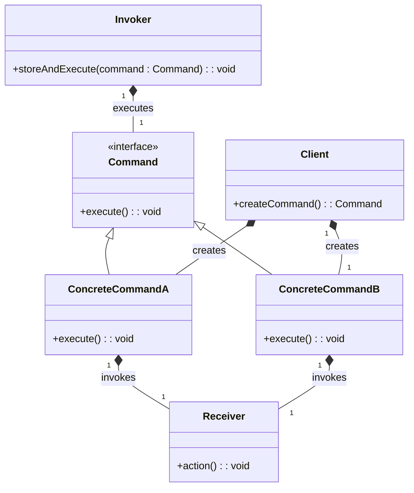
```mermaid
classDiagram
    class Command {
      <<interface>>
      +execute() : void
    }
    class ConcreteCommandA {
      +execute() : void
    }
    class ConcreteCommandB {
      +execute() : void
    }
    class Receiver {
      +action() : void
    }
    class Invoker {
      +storeAndExecute(command : Command) : void
    }
    class Client {
      +createCommand() : Command
    }

    Command <|-- ConcreteCommandA
    Command <|-- ConcreteCommandB
    ConcreteCommandA "1" *-- "1" Receiver : invokes
    ConcreteCommandB "1" *-- "1" Receiver : invokes
    Invoker "1" *-- "1" Command : executes
    Client "1" *-- "1" ConcreteCommandA : creates
    Client "1" *-- "1" ConcreteCommandB : creates
```

在这个类图中，`Command` 是一个接口，定义了 `execute` 方法。`ConcreteCommandA` 和 `ConcreteCommandB` 是具体的命令类，实现了 `Command` 接口。`Receiver` 是接收者类，包含了具体的业务逻辑。`Invoker` 是调用者类，负责调用命令对象。`Client` 是创建命令的类。

##### C++ 实现命令模式

以下是命令模式在 C++ 中的一个简单实现示例：

```cpp
#include <iostream>
#include <memory>
#include <vector>

// 抽象命令类
class Command {
public:
    virtual ~Command() {}
    virtual void execute() = 0;
};

// 具体命令类A
class ConcreteCommandA : public Command {
private:
    int value;
public:
    ConcreteCommandA(int value) : value(value) {}
    void execute() override {
        std::cout << "ConcreteCommandA with value " << value << std::endl;
    }
};

// 具体命令类B
class ConcreteCommandB : public Command {
private:
    std::string text;
public:
    ConcreteCommandB(const std::string& text) : text(text) {}
    void execute() override {
        std::cout << "ConcreteCommandB with text '" << text << "'" << std::endl;
    }
};

// 接收者类
class Receiver {
public:
    void action(int value) {
        std::cout << "Receiver action with value " << value << std::endl;
    }
    void action(const std::string& text) {
        std::cout << "Receiver action with text '" << text << "'" << std::endl;
    }
};

// 调用者类
class Invoker {
private:
    std::vector<Command*> commands;
public:
    void storeAndExecute(Command* command) {
        commands.push_back(command);
        command->execute();
        commands.clear();
    }
};

// 客户端类
class Client {
public:
    Command* createCommandA(int value) {
        return new ConcreteCommandA(value);
    }
    Command* createCommandB(const std::string& text) {
        return new ConcreteCommandB(text);
    }
};

int main() {
    Client client;
    Receiver receiver;
    Invoker invoker;

    Command* commandA = client.createCommandA(10);
    Command* commandB = client.createCommandB("Hello World");

    invoker.storeAndExecute(commandA);
    invoker.storeAndExecute(commandB);

    return 0;
}
```

在这个实现中，我们定义了一个 `Command` 抽象类，它有一个 `execute` 方法。`ConcreteCommandA` 和 `ConcreteCommandB` 是具体的命令类，实现了 `Command` 接口。`Receiver` 是接收者类，包含了具体的业务逻辑。`Invoker` 是调用者类，负责调用命令对象。`Client` 是创建命令的类。在 `main` 函数中，我们创建了命令对象，并通过调用者执行这些命令。

#### 15 解释器

解释器模式是一种行为设计模式，它允许你编写一个解释器来解释语言中的句子。这种模式通常用于解析简单的语言或构建简单的脚本解释器。

##### Mermaid 表示解释器模式的类图

以下是使用 Mermaid 表示解释器模式的类图：

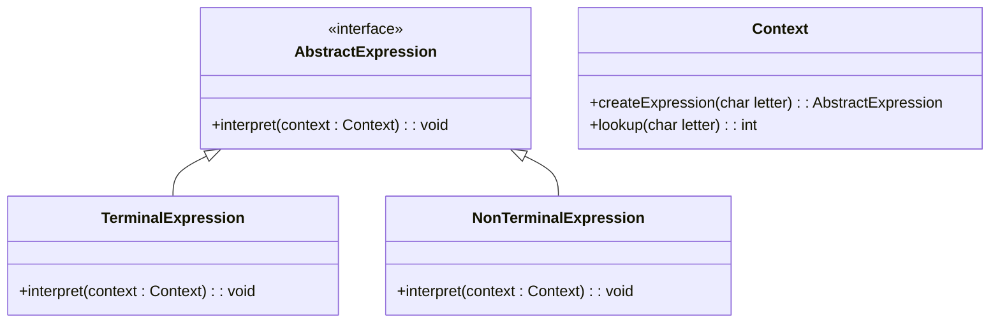
```mermaid
classDiagram
    class AbstractExpression {
      <<interface>>
      +interpret(context : Context) : void
    }
    class TerminalExpression {
      +interpret(context : Context) : void
    }
    class NonTerminalExpression {
      +interpret(context : Context) : void
    }
    class Context {
      +createExpression(char letter) : AbstractExpression
      +lookup(char letter) : int
    }
    
    AbstractExpression <|-- TerminalExpression
    AbstractExpression <|-- NonTerminalExpression
```

在这个类图中，`AbstractExpression` 是一个接口，定义了 `interpret` 方法。`TerminalExpression` 和 `NonTerminalExpression` 是具体的表达式类，实现了 `interpret` 方法。`Context` 类用于存储解释器需要的上下文信息，如变量值等。

##### C++ 实现解释器模式

以下是解释器模式在 C++ 中的一个简单实现示例：

```cpp
#include <iostream>
#include <map>
#include <memory>
#include <stdexcept>

// 上下文环境
class Context {
private:
    std::map<char, int> variables;
public:
    void defineVariable(char name, int value) {
        variables[name] = value;
    }

    int lookup(char name) {
        auto it = variables.find(name);
        if (it == variables.end()) {
            throw std::runtime_error("Variable not found");
        }
        return it->second;
    }
};

// 抽象表达式
class AbstractExpression {
public:
    virtual ~AbstractExpression() {}
    virtual int interpret(Context &context) = 0;
};

// 终结符表达式
class TerminalExpression : public AbstractExpression {
private:
    char variable;
public:
    TerminalExpression(char variable) : variable(variable) {}
    int interpret(Context &context) override {
        return context.lookup(variable);
    }
};

// 非终结符表达式
class NonTerminalExpression : public AbstractExpression {
private:
    std::unique_ptr<AbstractExpression> expression;
public:
    NonTerminalExpression(std::unique_ptr<AbstractExpression> expression)
        : expression(std::move(expression)) {}
    int interpret(Context &context) override {
        return expression->interpret(context);
    }
};

// 客户端代码
int main() {
    Context context;
    context.defineVariable('A', 10);
    context.defineVariable('B', 20);

    std::unique_ptr<AbstractExpression> expression1 = std::make_unique<TerminalExpression>('A');
    std::unique_ptr<AbstractExpression> expression2 = std::make_unique<TerminalExpression>('B');
    std::unique_ptr<AbstractExpression> expression3 = std::make_unique<NonTerminalExpression>(std::move(expression1));

    std::cout << "Interpreting expression 1: " << expression1->interpret(context) << std::endl;
    std::cout << "Interpreting expression 2: " << expression2->interpret(context) << std::endl;
    std::cout << "Interpreting expression 3: " << expression3->interpret(context) << std::endl;

    return 0;
}
```

在这个实现中，我们定义了一个 `Context` 类来存储变量和它们的值。`AbstractExpression` 是一个抽象类，定义了 `interpret` 方法。`TerminalExpression` 和 `NonTerminalExpression` 是具体的表达式类，实现了 `interpret` 方法。在 `main` 函数中，我们创建了上下文环境，定义了变量，并创建了表达式对象。然后，我们解释并执行这些表达式。

请注意，这个示例是一个非常简化的解释器模式实现。在实际应用中，解释器模式可能涉及更复杂的语法和语义规则，以及更复杂的解析和执行逻辑。

#### 16 迭代器

迭代器模式是一种行为设计模式，它提供一种方法来顺序访问一个聚合对象中的各个元素，而不暴露其内部的表示。迭代器模式通常用于集合类，如列表、树和图。

##### Mermaid 表示迭代器模式的类图

以下是使用 Mermaid 表示迭代器模式的类图：

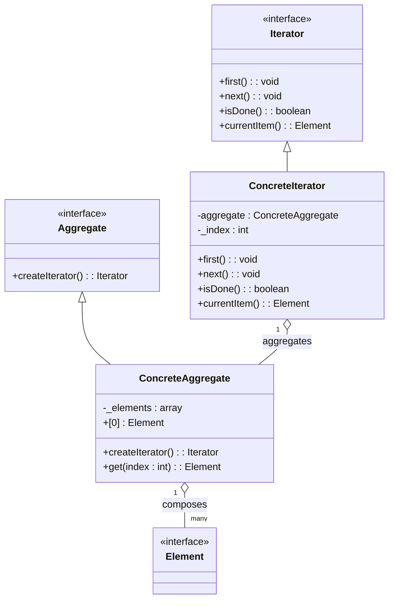
```mermaid
classDiagram
    class Aggregate {
      <<interface>>
      +createIterator() : Iterator
    }
    class ConcreteAggregate {
      -_elements : array
      +[0] : Element
      +createIterator() : Iterator
      +get(index : int) : Element
    }
    class Iterator {
      <<interface>>
      +first() : void
      +next() : void
      +isDone() : boolean
      +currentItem() : Element
    }
    class ConcreteIterator {
      -aggregate : ConcreteAggregate
      -_index : int
      +first() : void
      +next() : void
      +isDone() : boolean
      +currentItem() : Element
    }
    class Element {
      <<interface>>
    }

    Aggregate <|-- ConcreteAggregate
    Iterator <|-- ConcreteIterator
    ConcreteAggregate "1" o-- "many" Element : composes
    ConcreteIterator "1" o-- "1" ConcreteAggregate : aggregates
```

在这个类图中，`Aggregate` 是一个接口，定义了 `createIterator` 方法来获取迭代器。`ConcreteAggregate` 是具体的聚合类，实现了 `Aggregate` 接口，并存储了元素集合。`Iterator` 是迭代器接口，定义了遍历元素的方法。`ConcreteIterator` 是具体的迭代器类，实现了 `Iterator` 接口。`Element` 是元素接口，表示聚合中的单个元素。

##### C++ 实现迭代器模式

以下是迭代器模式在 C++ 中的一个简单实现示例：

```cpp
#include <iostream>
#include <vector>
#include <memory>
#include <iterator>

// 元素接口
class Element {
public:
    virtual ~Element() {}
    virtual std::string toString() const = 0;
};

// 具体的元素类
class ConcreteElement : public Element {
private:
    std::string value;
public:
    ConcreteElement(const std::string& value) : value(value) {}
    std::string toString() const override {
        return value;
    }
};

// 聚合接口
class Aggregate {
public:
    virtual ~Aggregate() {}
    virtual std::shared_ptr<Iterator> createIterator() = 0;
    virtual void addElement(std::shared_ptr<Element> element) = 0;
    virtual std::shared_ptr<Element> getIteratorElement(int index) = 0;
};

// 具体的聚合类
class ConcreteAggregate : public Aggregate {
private:
    std::vector<std::shared_ptr<Element>> elements;
public:
    void addElement(std::shared_ptr<Element> element) override {
        elements.push_back(element);
    }

    std::shared_ptr<Element> getIteratorElement(int index) override {
        if (index < 0 || index >= elements.size()) return nullptr;
        return elements[index];
    }

    std::shared_ptr<Iterator> createIterator() override {
        return std::make_shared<ConcreteIterator>(this);
    }
};

// 迭代器接口
class Iterator {
public:
    virtual ~Iterator() {}
    virtual void first() = 0;
    virtual void next() = 0;
    virtual bool isDone() = 0;
    virtual std::shared_ptr<Element> current() = 0;
};

// 具体的迭代器类
class ConcreteIterator : public Iterator {
private:
    std::shared_ptr<ConcreteAggregate> aggregate;
    int index;
public:
    ConcreteIterator(std::shared_ptr<ConcreteAggregate> aggregate) : aggregate(aggregate), index(0) {}

    void first() override {
        index = 0;
    }

    void next() override {
        index++;
    }

    bool isDone() override {
        return index >= aggregate->elements.size();
    }

    std::shared_ptr<Element> current() override {
        if (this->isDone()) return nullptr;
        return aggregate->getIteratorElement(index);
    }
};

int main() {
    auto aggregate = std::make_shared<ConcreteAggregate>();
    aggregate->addElement(std::make_shared<ConcreteElement>("Element 1"));
    aggregate->addElement(std::make_shared<ConcreteElement>("Element 2"));
    aggregate->addElement(std::make_shared<ConcreteElement>("Element 3"));

    auto iterator = aggregate->createIterator();
    iterator->first();
    while (!iterator->isDone()) {
        auto element = iterator->current();
        std::cout << element->toString() << std::endl;
        iterator->next();
    }

    return 0;
}
```

在这个实现中，我们定义了一个 `Element` 接口，它有一个 `toString` 方法。`ConcreteElement` 是具体的元素类，实现了 `Element` 接口。`Aggregate` 是聚合接口，定义了 `createIterator`、`addElement` 和 `getIteratorElement` 方法。`ConcreteAggregate` 是具体的聚合类，实现了 `Aggregate` 接口，并存储了元素集合。`Iterator` 是迭代器接口，定义了遍历元素的方法。`ConcreteIterator` 是具体的迭代器类，实现了 `Iterator` 接口。在 `main` 函数中，我们创建了聚合对象，添加了元素，并使用迭代器遍历这些元素。

#### 17 中介者

##### Mermaid 表示中介者模式的类图

以下是使用 Mermaid 表示中介者模式的类图：

```mermaid
classDiagram
    class Mediator {
      <<interface>>
      +sendMessage(colleague : Colleague, message : string) : void
    }
    class Colleague {
      +send(message : string) : void
      +receive(message : string) : void
      +setMediator(mediator : Mediator) : void
    }
    class ConcreteMediator {
      +sendMessage(colleague : Colleague, message : string) : void
    }
    class ConcreteColleagueA {
      +send(message : string) : void
      +receive(message : string) : void
    }
    class ConcreteColleagueB {
      +send(message : string) : void
      +receive(message : string) : void
    }

    Mediator <|.. ConcreteMediator
    Colleague <|.. ConcreteColleagueA
    Colleague <|.. ConcreteColleagueB
    ConcreteMediator "1" o-- "many" Colleague : colleagues
```

在这个类图中，`Mediator` 是中介者接口，定义了 `sendMessage` 方法。`Colleague` 是同事类接口，定义了 `send`、`receive` 和 `setMediator` 方法。`ConcreteMediator` 是具体的中介者类，实现了 `Mediator` 接口。`ConcreteColleagueA` 和 `ConcreteColleagueB` 是具体的同事类，实现了 `Colleague` 接口。

##### C++ 实现中介者模式

以下是中介者模式在 C++ 中的一个简单实现示例：

```cpp
#include <iostream>
#include <string>
#include <vector>

// 抽象中介者
class Mediator {
public:
    virtual void sendMessage(const std::string& message, Colleague* colleague) = 0;
};

// 抽象同事类
class Colleague {
protected:
    Mediator* mediator_;
public:
    Colleague(Mediator* mediator) : mediator_(mediator) {}
    virtual void send(const std::string& message) {
        if (mediator_) mediator_->sendMessage(message, this);
    }
    virtual void receive(const std::string& message) = 0;
};

// 具体中介者
class ConcreteMediator : public Mediator {
private:
    Colleague* colleagueA_;
    Colleague* colleagueB_;
public:
    ConcreteMediator(Colleague* a, Colleague* b) : colleagueA_(a), colleagueB_(b) {
        a->setMediator(this);
        b->setMediator(this);
    }
    void sendMessage(const std::string& message, Colleague* colleague) override {
        if (colleague == colleagueA_) {
            colleagueB_->receive(message);
        } else if (colleague == colleagueB_) {
            colleagueA_->receive(message);
        }
    }
};

// 具体同事类A
class ConcreteColleagueA : public Colleague {
public:
    ConcreteColleagueA(Mediator* mediator) : Colleague(mediator) {}
    void receive(const std::string& message) override {
        std::cout << "Colleague A received message: " << message << std::endl;
    }
};

// 具体同事类B
class ConcreteColleagueB : public Colleague {
public:
    ConcreteColleagueB(Mediator* mediator) : Colleague(mediator) {}
    void receive(const std::string& message) override {
        std::cout << "Colleague B received message: " << message << std::endl;
    }
};

int main() {
    // 创建具体中介者
    ConcreteMediator mediator(new ConcreteColleagueA(nullptr), new ConcreteColleagueB(nullptr));
    
    // 创建具体同事类，并设置中介者
    ConcreteColleagueA* colleagueA = dynamic_cast<ConcreteColleagueA*>(mediator.colleagueA_);
    ConcreteColleagueB* colleagueB = dynamic_cast<ConcreteColleagueB*>(mediator.colleagueB_);
    
    // 发送消息
    colleagueA->send("Hello from A to B");
    colleagueB->send("Hello from B to A");

    return 0;
}
```

在这个实现中，我们定义了一个 `Mediator` 抽象中介者类，它有一个 `sendMessage` 方法。`Colleague` 是抽象同事类，它有一个 `send` 方法来发送消息给中介者，以及一个 `receive` 方法来接收消息。`ConcreteMediator` 是具体的中介者类，实现了 `Mediator` 接口，并协调同事类之间的交互。`ConcreteColleagueA` 和 `ConcreteColleagueB` 是具体的同事类，实现了 `Colleague` 接口，并定义了如何接收消息。在 `main` 函数中，我们创建了中介者和同事类的实例，并通过中介者发送和接收消息。

#### 18 备忘录

##### Mermaid 表示备忘录模式的类图

备忘录模式是一种行为设计模式，它允许在不暴露对象内部细节的情况下，捕获和恢复对象的状态。

以下是使用 Mermaid 表示备忘录模式的类图：

```mermaid
classDiagram
    class Originator {
      -_state : string
      +createMemento() : Memento
      +setMemento(memento : Memento) : void
      +getState() : string
    }
    class Memento {
      <<interface>>
      +getState() : string
      +setState(state : string) : void
    }
    class ConcreteMemento {
      -_state : string
      +getState() : string
      +setState(state : string) : void
    }
    class Caretaker {
      -_memento : Memento
      +saveMemento(memento : Memento) : void
      +getMemento() : Memento
    }

    Originator "1" o-- "1" ConcreteMemento : creates
    Caretaker "1" o-- "1" Memento : holds
```

在这个类图中，`Originator` 是原始对象，它维护着需要备份的状态。`createMemento` 方法用于创建备忘录，`setMemento` 方法用于恢复状态。`Memento` 是备忘录接口，定义了获取和设置状态的方法。`ConcreteMemento` 是具体的备忘录类，实现了 `Memento` 接口。`Caretaker` 是负责人类，负责保存和提供备忘录对象。

##### C++ 实现备忘录模式

以下是备忘录模式在 C++ 中的一个简单实现示例：

```cpp
#include <iostream>
#include <string>
#include <memory>

// 备忘录接口
class Memento {
public:
    virtual ~Memento() {}
    virtual std::string getState() const = 0;
    virtual void setState(const std::string& state) = 0;
};

// 原始对象类
class Originator {
private:
    std::string _state;
public:
    std::string getState() const {
        return _state;
    }
    
    void setState(const std::string& state) {
        _state = state;
    }
    
    // 创建备忘录
    std::shared_ptr<Memento> createMemento() {
        return std::make_shared<ConcreteMemento>(_state);
    }
    
    // 恢复状态
    void setMemento(const std::shared_ptr<Memento>& memento) {
        _state = memento->getState();
    }
};

// 具体的备忘录类
class ConcreteMemento : public Memento {
private:
    std::string _state;
public:
    ConcreteMemento(const std::string& state) : _state(state) {}
    
    std::string getState() const override {
        return _state;
    }
    
    void setState(const std::string& state) override {
        _state = state;
    }
};

// 负责人类
class Caretaker {
private:
    std::shared_ptr<Memento> _memento;
public:
    void saveMemento(const std::shared_ptr<Memento>& memento) {
        _memento = memento;
    }
    
    std::shared_ptr<Memento> getMemento() const {
        return _memento;
    }
};

int main() {
    Originator originator;
    Caretaker caretaker;
    
    // 设置原始对象的状态并保存备忘录
    originator.setState("State 1");
    caretaker.saveMemento(originator.createMemento());
    
    // 修改原始对象的状态
    originator.setState("State 2");
    
    // 恢复原始对象的状态
    originator.setMemento(caretaker.getMemento());
    
    std::cout << "Restored state: " << originator.getState() << std::endl;
    
    return 0;
}
```

在这个实现中，我们定义了一个 `Memento` 备忘录接口，它有两个方法：`getState` 和 `setState`。`Originator` 是原始对象类，它维护着需要备份的状态，并提供了创建备忘录和恢复状态的方法。`ConcreteMemento` 是具体的备忘录类，实现了 `Memento` 接口。`Caretaker` 是负责人类，负责保存和提供备忘录对象。在 `main` 函数中，我们创建了原始对象和负责人对象，设置原始对象的状态，保存备忘录，修改原始对象的状态，然后恢复原始对象的状态。

#### 19 观察者

##### Mermaid 表示观察者模式的类图

观察者模式是一种行为设计模式，它定义了对象之间的一种一对多的依赖关系，当一个对象的状态发生改变时，所有依赖于它的对象都会得到通知并自动更新。

以下是使用 Mermaid 表示观察者模式的类图：

```mermaid
classDiagram
    class Subject {
      <<interface>>
      +attach(observer : Observer) : void
      +detach(observer : Observer) : void
      +notify() : void
    }
    class ConcreteSubject {
      -_observers : list
      +attach(observer : Observer) : void
      +detach(observer : Observer) : void
      +notify() : void
      +getState() : int
      +setState(state : int) : void
    }
    class Observer {
      <<interface>>
      +update(subject : Subject) : void
    }
    class ConcreteObserverA {
      +update(subject : Subject) : void
    }
    class ConcreteObserverB {
      +update(subject : Subject) : void
    }

    Subject <|-- ConcreteSubject
    Observer <|-- ConcreteObserverA
    Observer <|-- ConcreteObserverB
    ConcreteSubject "1" o-- "many" Observer : observers
```

在这个类图中，`Subject` 是主题接口，定义了添加、移除和通知观察者的方法。`ConcreteSubject` 是具体的主题类，实现了 `Subject` 接口，并维护了观察者列表。`Observer` 是观察者接口，定义了更新方法。`ConcreteObserverA` 和 `ConcreteObserverB` 是具体的观察者类，实现了 `Observer` 接口。

##### C++ 实现观察者模式

以下是观察者模式在 C++ 中的一个简单实现示例：

```cpp
#include <iostream>
#include <list>
#include <memory>

// 观察者接口
class Observer {
public:
    virtual ~Observer() {}
    virtual void update(const std::shared_ptr<Subject>& subject) = 0;
};

// 具体观察者
class ConcreteObserverA : public Observer {
public:
    void update(const std::shared_ptr<Subject>& subject) override {
        std::cout << "ConcreteObserverA: Reacting to the event" << std::endl;
    }
};

class ConcreteObserverB : public Observer {
public:
    void update(const std::shared_ptr<Subject>& subject) override {
        std::cout << "ConcreteObserverB: Reacting to the event" << std::endl;
    }
};

// 主题接口
class Subject {
public:
    virtual ~Subject() {}
    virtual void attach(std::shared_ptr<Observer> observer) = 0;
    virtual void detach(std::shared_ptr<Observer> observer) = 0;
    virtual void notify() = 0;
};

// 具体主题
class ConcreteSubject : public Subject {
private:
    int _state;
    std::list<std::shared_ptr<Observer>> _observers;
public:
    void attach(std::shared_ptr<Observer> observer) override {
        _observers.push_back(observer);
    }
    
    void detach(std::shared_ptr<Observer> observer) override {
        _observers.remove(observer);
    }
    
    void notify() override {
        for (const auto& observer : _observers) {
            observer->update(shared_from_this());
        }
    }
    
    void setState(int state) {
        _state = state;
        notify();
    }
    
    int getState() const {
        return _state;
    }
};

// 让 ConcreteSubject 能被观察者回调
namespace std {
    template <>
    class shared_ptr<ConcreteSubject> {
    public:
        static std::shared_ptr<ConcreteSubject> get(std::shared_ptr<ConcreteSubject> const& p) {
            return p;
        }
    };
}

int main() {
    auto subject = std::make_shared<ConcreteSubject>();
    auto observerA = std::make_shared<ConcreteObserverA>();
    auto observerB = std::make_shared<ConcreteObserverB>();

    subject->attach(observerA);
    subject->attach(observerB);

    subject->setState(1); // This will notify both observers

    subject->detach(observerA);

    subject->setState(2); // This will notify only observerB

    return 0;
}
```

在这个实现中，我们定义了一个 `Observer` 观察者接口，它有一个 `update` 方法。`ConcreteObserverA` 和 `ConcreteObserverB` 是具体的观察者类，实现了 `Observer` 接口。`Subject` 是主题接口，定义了添加、移除和通知观察者的方法。`ConcreteSubject` 是具体的主题类，实现了 `Subject` 接口，并维护了观察者列表。在 `main` 函数中，我们创建了主题和观察者对象，将观察者附加到主题上，然后改变了主题的状态，这将通知所有注册的观察者。

#### 20 状态

##### Mermaid 表示状态模式的类图

状态模式是一种行为设计模式，它允许一个对象在其内部状态发生改变时改变它的行为，看起来好像修改了其类。

以下是使用 Mermaid 表示状态模式的类图：

```mermaid
classDiagram
    class Context {
      -contextState : State
      +setState(state : State) : void
      +getState() : State
      +request1() : void
      +request2() : void
    }
    class State {
      <<interface>>
      +handle1(context : Context) : void
      +handle2(context : Context) : void
    }
    class ConcreteStateA {
      +handle1(context : Context) : void
      +handle2(context : Context) : void
    }
    class ConcreteStateB {
      +handle1(context : Context) : void
      +handle2(context : Context) : void
    }

    Context "1" o-- "1" State : has a >
    State <|-- ConcreteStateA
    State <|-- ConcreteStateB
```

在这个类图中，`Context` 是上下文类，它维护了一个指向当前状态对象的引用。`State` 是状态接口，定义了所有具体状态类必须实现的方法。`ConcreteStateA` 和 `ConcreteStateB` 是具体的状态类，实现了 `State` 接口。

##### C++ 实现状态模式

以下是状态模式在 C++ 中的一个简单实现示例：

```cpp
#include <iostream>
#include <memory>

// 状态接口
class State {
public:
    virtual ~State() {}
    virtual void handle1(std::shared_ptr<Context> context) = 0;
    virtual void handle2(std::shared_ptr<Context> context) = 0;
};

// 具体状态A
class ConcreteStateA : public State {
public:
    void handle1(std::shared_ptr<Context> context) override {
        std::cout << "ConcreteStateA handles request1" << std::endl;
        context->setState(std::make_shared<ConcreteStateB>());
    }
    void handle2(std::shared_ptr<Context> context) override {
        std::cout << "ConcreteStateA handles request2" << std::endl;
    }
};

// 具体状态B
class ConcreteStateB : public State {
public:
    void handle1(std::shared_ptr<Context> context) override {
        std::cout << "ConcreteStateB handles request1" << std::endl;
        context->setState(std::make_shared<ConcreteStateA>());
    }
    void handle2(std::shared_ptr<Context> context) override {
        std::cout << "ConcreteStateB handles request2" << std::endl;
    }
};

// 上下文类
class Context {
private:
    std::shared_ptr<State> state_;
public:
    void setState(std::shared_ptr<State> state) {
        state_ = state;
    }
    std::shared_ptr<State> getState() {
        return state_;
    }
    void request1() {
        state_->handle1(shared_from_this());
    }
    void request2() {
        state_->handle2(shared_from_this());
    }
};

// 让 Context 能被自己内部的成员函数共享
namespace std {
    template<>
    class shared_ptr<Context> {
    public:
        static std::shared_ptr<Context> get(std::shared_ptr<Context> const& p) {
            return p;
        }
    };
}

int main() {
    auto context = std::make_shared<Context>();
    context->setState(std::make_shared<ConcreteStateA>());
    context->request1(); // State A changes to State B
    context->request2();
    context->request1(); // State B changes to State A
    context->request2();

    return 0;
}
```

在这个实现中，我们定义了一个 `State` 接口，它有两个方法：`handle1` 和 `handle2`。`ConcreteStateA` 和 `ConcreteStateB` 是具体的状态类，实现了 `State` 接口，并定义了在状态改变时的行为。`Context` 是上下文类，它维护了一个状态对象，并提供了 `request1` 和 `request2` 方法来改变状态。在 `main` 函数中，我们创建了上下文对象，并在不同状态下请求处理，状态对象根据请求改变上下文的状态。

#### 21 策略

##### Mermaid 表示策略模式的类图

策略模式是一种行为设计模式，它定义了一系列算法，并将每个算法封装起来，使它们可以互换使用，算法的变化不会影响使用算法的客户。

以下是使用 Mermaid 表示策略模式的类图：

```mermaid
classDiagram
    class Context {
      -strategy : Strategy
      +setStrategy(strategy : Strategy) : void
      +executeStrategy() : void
    }
    class Strategy {
      <<interface>>
      +algorithm() : void
    }
    class ConcreteStrategyA {
      +algorithm() : void
    }
    class ConcreteStrategyB {
      +algorithm() : void
    }
    class ConcreteStrategyC {
      +algorithm() : void
    }

    Context "1" o-- "1" Strategy : uses a >
    Strategy <|-- ConcreteStrategyA
    Strategy <|-- ConcreteStrategyB
    Strategy <|-- ConcreteStrategyC
```

在这个类图中，`Context` 是上下文类，它维护了一个策略对象的引用。`Strategy` 是策略接口，定义了所有具体策略类必须实现的算法方法。`ConcreteStrategyA`、`ConcreteStrategyB` 和 `ConcreteStrategyC` 是具体策略类，实现了 `Strategy` 接口。

##### C++ 实现策略模式

以下是策略模式在 C++ 中的一个简单实现示例：

```cpp
#include <iostream>
#include <memory>

// 策略接口
class Strategy {
public:
    virtual ~Strategy() {}
    virtual void algorithm() const = 0;
};

// 具体策略A
class ConcreteStrategyA : public Strategy {
public:
    void algorithm() const override {
        std::cout << "Applying strategy A" << std::endl;
    }
};

// 具体策略B
class ConcreteStrategyB : public Strategy {
public:
    void algorithm() const override {
        std::cout << "Applying strategy B" << std::endl;
    }
};

// 具体策略C
class ConcreteStrategyC : public Strategy {
public:
    void algorithm() const override {
        std::cout << "Applying strategy C" << std::endl;
    }
};

// 上下文类
class Context {
private:
    std::shared_ptr<Strategy> strategy_;
public:
    Context() = default;

    void setStrategy(const std::shared_ptr<Strategy>& strategy) {
        strategy_ = strategy;
    }

    void executeStrategy() const {
        strategy_->algorithm();
    }
};

int main() {
    Context context;
    std::shared_ptr<Strategy> strategyA = std::make_shared<ConcreteStrategyA>();
    std::shared_ptr<Strategy> strategyB = std::make_shared<ConcreteStrategyB>();
    std::shared_ptr<Strategy> strategyC = std::make_shared<ConcreteStrategyC>();

    context.setStrategy(strategyA);
    context.executeStrategy();

    context.setStrategy(strategyB);
    context.executeStrategy();

    context.setStrategy(strategyC);
    context.executeStrategy();

    return 0;
}
```

在这个实现中，我们定义了一个 `Strategy` 接口，它有一个 `algorithm` 方法。`ConcreteStrategyA`、`ConcreteStrategyB` 和 `ConcreteStrategyC` 是具体策略类，实现了 `Strategy` 接口，并定义了各自的算法。`Context` 是上下文类，它维护了一个策略对象的引用，并提供了 `setStrategy` 和 `executeStrategy` 方法来设置和执行策略。在 `main` 函数中，我们创建了上下文对象和策略对象，通过上下文对象切换不同的策略并执行它们。

#### 22 模板方法

##### Mermaid 表示模板方法模式的类图

模板方法模式是一种行为设计模式，它在父类中定义了一个算法的框架，允许子类在不改变算法结构的情况下重写算法的某些步骤。

以下是使用 Mermaid 表示模板方法模式的类图：

```mermaid
classDiagram
    class AbstractClass {
      <<abstract>>
      +templateMethod() : void
      +baseOperation1() : void
    }
    class ConcreteClassA {
      +baseOperation2() : void
      +baseOperation3() : void
    }
    class ConcreteClassB {
      +baseOperation2() : void
      +baseOperation3() : void
    }

    AbstractClass <|-- ConcreteClassA
    AbstractClass <|-- ConcreteClassB
    AbstractClass ..> ConcreteClassA : templateMethod()
    AbstractClass ..> ConcreteClassB : templateMethod()
```

在这个类图中，`AbstractClass` 是抽象类，它定义了模板方法和一系列基本操作。`ConcreteClassA` 和 `ConcreteClassB` 是具体实现类，它们继承自 `AbstractClass` 并实现了特定的基本操作。

##### C++ 实现模板方法模式

以下是模板方法模式在 C++ 中的一个简单实现示例：

```cpp
#include <iostream>

// 抽象类
class AbstractClass {
public:
    // 模板方法
    void templateMethod() {
        baseOperation1();
        baseOperation2();
        baseOperation3();
        std::cout << "AbstractClass: The algorithm is finished." << std::endl;
    }

    // 基本操作1
    void baseOperation1() {
        std::cout << "AbstractClass: Base operation 1 is executed." << std::endl;
    }

    // 基本操作2和3声明为纯虚函数，由子类实现
    virtual void baseOperation2() = 0;
    virtual void baseOperation3() = 0;

    virtual ~AbstractClass() = default;
};

// 具体实现类A
class ConcreteClassA : public AbstractClass {
public:
    void baseOperation2() override {
        std::cout << "ConcreteClassA: Implements base operation 2." << std::endl;
    }

    void baseOperation3() override {
        std::cout << "ConcreteClassA: Implements base operation 3." << std::endl;
    }
};

// 具体实现类B
class ConcreteClassB : public AbstractClass {
public:
    void baseOperation2() override {
        std::cout << "ConcreteClassB: Implements base operation 2." << std::endl;
    }

    void baseOperation3() override {
        std::cout << "ConcreteClassB: Implements base operation 3." << std::endl;
    }
};

int main() {
    ConcreteClassA classA;
    classA.templateMethod();

    ConcreteClassB classB;
    classB.templateMethod();

    return 0;
}
```

在这个实现中，我们定义了一个 `AbstractClass` 抽象类，它包含了模板方法 `templateMethod` 和两个纯虚函数 `baseOperation2` 和 `baseOperation3`。`ConcreteClassA` 和 `ConcreteClassB` 是具体实现类，它们实现了 `baseOperation2` 和 `baseOperation3` 方法。在 `main` 函数中，我们创建了 `ConcreteClassA` 和 `ConcreteClassB` 的实例，并调用了它们的 `templateMethod` 方法，这将按照定义的算法框架执行操作。

#### 23 访问者

##### Mermaid 表示访问者模式的类图

访问者模式是一种行为设计模式，它允许你将算法与对象结构分离，将处理从对象中抽象出来，并在不改变对象结构的情况下，为对象添加新的操作。

以下是使用 Mermaid 表示访问者模式的类图：

```mermaid
classDiagram
    class ObjectStructure {
      +attach(o : Element) : void
      +detach(o : Element) : void
      +accept(visitor : Visitor) : void
    }
    class Element {
      <<interface>>
      +accept(visitor : Visitor) : void
    }
    class ConcreteElementA {
      +accept(visitor : Visitor) : void
    }
    class ConcreteElementB {
      +accept(visitor : Visitor) : void
    }
    class Visitor {
      <<interface>>
      +visit(elementA : ConcreteElementA) : void
      +visit(elementB : ConcreteElementB) : void
    }
    class ConcreteVisitorA {
      +visit(elementA : ConcreteElementA) : void
      +visit(elementB : ConcreteElementB) : void
    }
    class ConcreteVisitorB {
      +visit(elementA : ConcreteElementA) : void
      +visit(elementB : ConcreteElementB) : void
    }

    ObjectStructure "1" o-- "many" Element : contains
    Element <|.. ConcreteElementA
    Element <|.. ConcreteElementB
    Visitor <|.. ConcreteVisitorA
    Visitor <|.. ConcreteVisitorB
    ConcreteElementA "1" o-- "1" ConcreteVisitorA : visits
    ConcreteElementB "1" o-- "1" ConcreteVisitorA : visits
    ConcreteElementA "1" o-- "1" ConcreteVisitorB : visits
    ConcreteElementB "1" o-- "1" ConcreteVisitorB : visits
```

在这个类图中，`ObjectStructure` 是对象结构，可以是组合结构，可以附加和分离元素。`Element` 是元素接口，定义了 `accept` 方法。`ConcreteElementA` 和 `ConcreteElementB` 是具体元素类，实现了 `Element` 接口。`Visitor` 是访问者接口，定义了访问具体元素的方法。`ConcreteVisitorA` 和 `ConcreteVisitorB` 是具体访问者类，实现了 `Visitor` 接口。

##### C++ 实现访问者模式

以下是访问者模式在 C++ 中的一个简单实现示例：

```cpp
#include <iostream>
#include <vector>
#include <memory>

// 元素接口
class Element {
public:
    virtual ~Element() {}
    virtual void accept(class Visitor* visitor) = 0;
};

// 具体元素A
class ConcreteElementA : public Element {
public:
    void accept(class Visitor* visitor) override {
        visitor->visit(this);
    }

    void operation() {
        std::cout << "ConcreteElementA operation" << std::endl;
    }
};

// 具体元素B
class ConcreteElementB : public Element {
public:
    void accept(class Visitor* visitor) override {
        visitor->visit(this);
    }

    void operation() {
        std::cout << "ConcreteElementB operation" << std::endl;
    }
};

// 访问者接口
class Visitor {
public:
    virtual ~Visitor() {}
    virtual void visit(ConcreteElementA* element) = 0;
    virtual void visit(ConcreteElementB* element) = 0;
};

// 具体访问者A
class ConcreteVisitorA : public Visitor {
public:
    void visit(ConcreteElementA* element) override {
        std::cout << "ConcreteVisitorA visits ConcreteElementA" << std::endl;
        element->operation();
    }

    void visit(ConcreteElementB* element) override {
        std::cout << "ConcreteVisitorA visits ConcreteElementB" << std::endl;
        element->operation();
    }
};

// 具体访问者B
class ConcreteVisitorB : public Visitor {
public:
    void visit(ConcreteElementA* element) override {
        std::cout << "ConcreteVisitorB visits ConcreteElementA" << std::endl;
        element->operation();
    }

    void visit(ConcreteElementB* element) override {
        std::cout << "ConcreteVisitorB visits ConcreteElementB" << std::endl;
        element->operation();
    }
};

// 对象结构
class ObjectStructure {
private:
    std::vector<std::unique_ptr<Element>> elements;
public:
    void attach(std::unique_ptr<Element> element) {
        elements.push_back(std::move(element));
    }

    void detach(Element* element) {
        elements.erase(std::remove_if(elements.begin(), elements.end(),
                                      [=](const std::unique_ptr<Element>& e) { return e.get() == element; }),
                      elements.end());
    }

    void accept(Visitor* visitor) {
        for (auto& element : elements) {
            element->accept(visitor);
        }
    }
};

int main() {
    auto os = std::make_unique<ObjectStructure>();

    os->attach(std::make_unique<ConcreteElementA>());
    os->attach(std::make_unique<ConcreteElementB>());

    ConcreteVisitorA visitorA;
    ConcreteVisitorB visitorB;

    os->accept(&visitorA);
    std::cout << std::endl;
    os->accept(&visitorB);

    return 0;
}
```

在这个实现中，我们定义了一个 `Element` 接口，它有一个 `accept` 方法。`ConcreteElementA` 和 `ConcreteElementB` 是具体元素类，实现了 `Element` 接口。`Visitor` 是访问者接口，定义了访问具体元素的方法。`ConcreteVisitorA` 和 `ConcreteVisitorB` 是具体访问者类，实现了 `Visitor` 接口。`ObjectStructure` 是对象结构，它维护了一个元素列表，并提供了 `attach`、`detach` 和 `accept` 方法。在 `main` 函数中，我们创建了对象结构和元素对象，将元素附加到对象结构上，然后使用不同的访问者访问这些元素。

## reference

[时序图 | Mermaid 中文网 (nodejs.cn)](https://mermaid.nodejs.cn/syntax/sequenceDiagram.html)

[PlantUML_Language_Reference_Guide](https://pdf.plantuml.net/1.2019.9/PlantUML_Language_Reference_Guide_zh.pdf#:~:text=另外,你还能用<- 和<--,这不影响绘图,但可以提高可读性。.)
