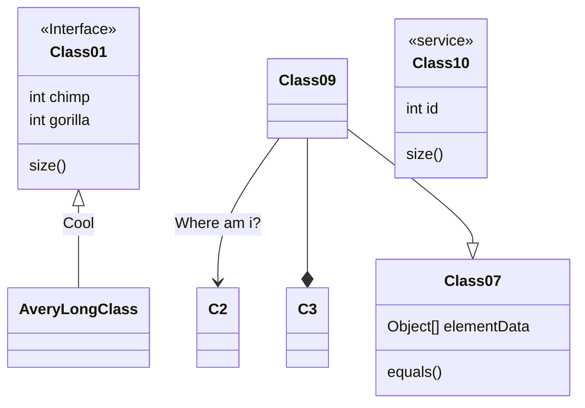
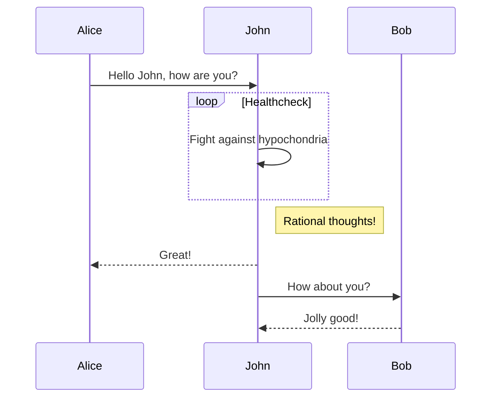
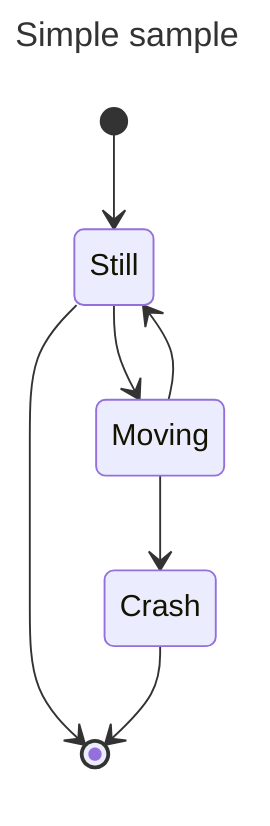
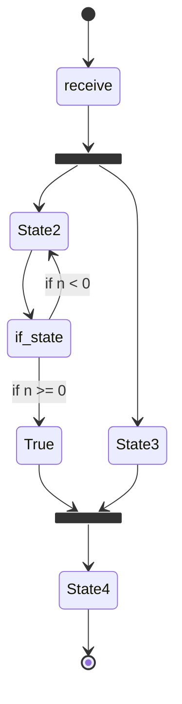
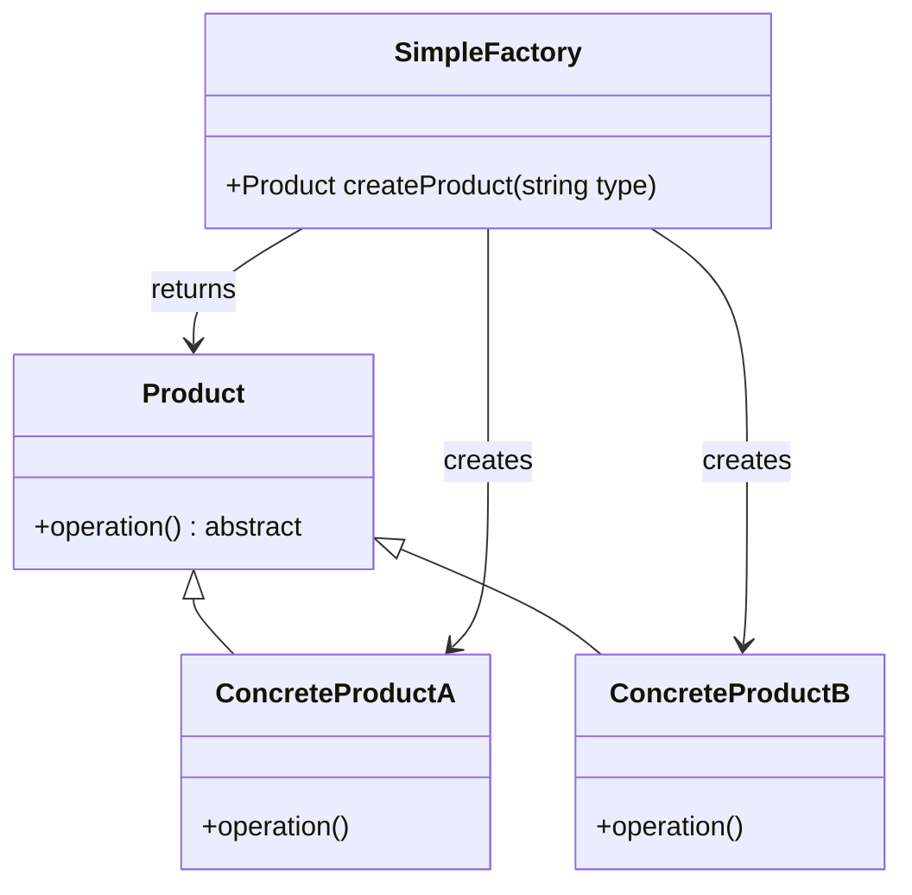
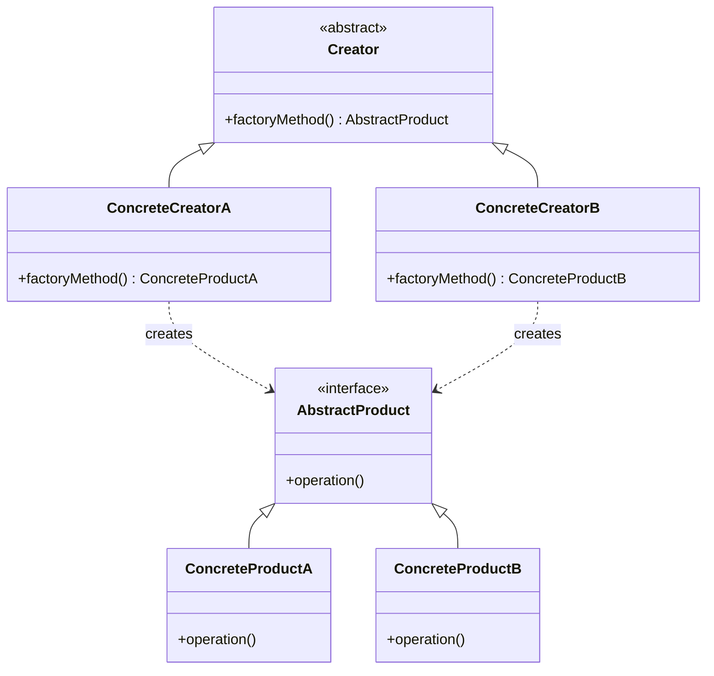
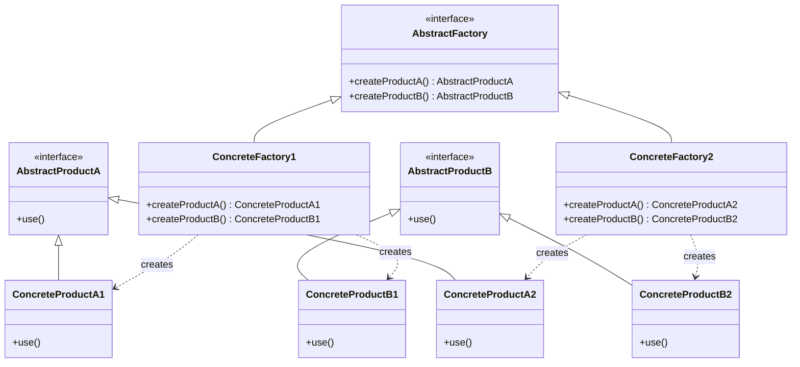
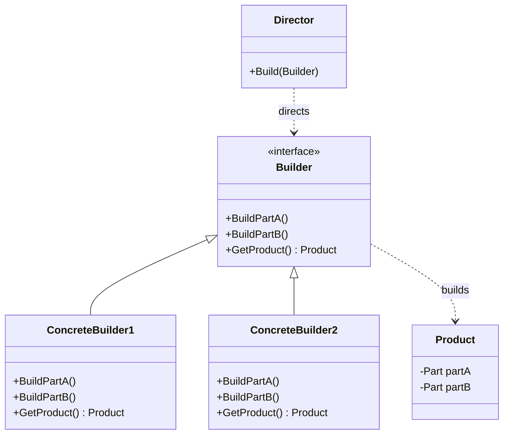

# 面向对象

## UML

### 关系

UML 关系主要有：依赖、关联、聚合、组合、实现、继承。


### 类图



### 用例图

[用例图UML建模](https://www.cnblogs.com/lcword/p/10472040.html#:~:text=UML建模——用例图) 通常包含三个元素：参与者、通信连接（或者关联）和实际的用例，使用 [PlantUML Web Server](https://www.plantuml.com/plantuml) 进行绘图。

- 参与者通常用一个简笔画的人来表示，代表用户或者外部设备，以及使用当前系统的其他系统。
- 通信连接用参与者和用例之间的一条线来表示，代表两者之间存在某种形式的通信。
- 用例用一个椭圆形来表示，再配上适当的描述，代表参与者在系统上执行的各种活动。


### 序列图



### 状态图



### 活动图



## 设计模式

|      | 创建型                                   | 结构型                                                       | 行为型                                                       |
| ---- | ---------------------------------------- | ------------------------------------------------------------ | ------------------------------------------------------------ |
| 类   | 工厂方法                                 | 适配器                                                       | 解释器<br />模板方法                                         |
| 对象 | 抽象工厂<br />生成器<br />原型<br />单例 | 适配器<br />桥接<br />组合<br />装饰<br />外观<br />享元<br />代理 | 责任链<br />命令<br />解释器<br />迭代器<br />中介者<br />备忘录<br />观察者<br />状态<br />策略<br />模板方法<br />访问者 |

### 创建型

#### 简单工厂模式（Simple Factory Pattern）

简单工厂模式（Simple Factory Pattern）是一种创建型设计模式，它通过一个工厂类来创建对象，而无需客户端直接实例化对象。

##### UML图（Mermaid语法）



##### C++代码示例

```cpp
#include <iostream>
#include <memory>
#include <string>
#include <unordered_map>

// 抽象产品类
class Product {
public:
    virtual ~Product() = default;
    virtual void operation() const = 0;
};

// 具体产品A类
class ConcreteProductA : public Product {
public:
    void operation() const override {
        std::cout << "ConcreteProductA operation" << std::endl;
    }
};

// 具体产品B类
class ConcreteProductB : public Product {
public:
    void operation() const override {
        std::cout << "ConcreteProductB operation" << std::endl;
    }
};

// 简单工厂类
class SimpleFactory {
public:
    std::unique_ptr<Product> createProduct(const std::string& type) const {
        auto it = productMap.find(type);
        if (it != productMap.end()) {
            return it->second();
        } else {
            throw std::runtime_error("Unknown product type");
        }
    }

private:
    std::unordered_map<std::string, std::function<std::unique_ptr<Product>()>> productMap = {
        {"A", []() { return std::make_unique<ConcreteProductA>(); }},
        {"B", []() { return std::make_unique<ConcreteProductB>(); }}
    };
};

int main() {
    SimpleFactory factory;

    try {
        auto productA = factory.createProduct("A");
        productA->operation();

        auto productB = factory.createProduct("B");
        productB->operation();
    } catch (const std::exception& e) {
        std::cerr << "Error: " << e.what() << std::endl;
    }

    return 0;
}
```

##### 代码说明

1. **Product**：抽象产品类，声明了一个纯虚函数`operation`，具体产品类将实现它。
2. **ConcreteProductA** 和 **ConcreteProductB**：具体产品类，分别实现了`operation`方法。
3. **SimpleFactory**：简单工厂类，包含一个`productMap`来存储产品类型的映射，使用`std::function`和`std::unique_ptr`来动态创建产品对象。
4. **main**：测试代码，通过工厂类创建产品对象并调用它们的`operation`方法。

在这个示例中，客户端代码（`main`函数）通过简单工厂类`SimpleFactory`来创建产品对象，而无需知道具体产品类的实现细节。这有助于降低客户端代码与具体产品类之间的耦合度。

#### 工厂方法模式

工厂方法模式是一种创建型设计模式，它定义了一个创建对象的接口，但由子类决定要实例化的类是哪一个。这种模式的关键在于，它允许系统在不修改工厂角色的情况下引进新产品。以下是工厂方法模式的Mermaid类图和C++代码示例。

##### Mermaid类图


##### C++代码示例
以下是一个简单的工厂方法模式的C++实现，其中包括了抽象产品、具体产品、抽象工厂和具体工厂的代码。

```cpp
#include <iostream>
#include <memory>

// 抽象产品
class Product {
public:
    virtual ~Product() {}
    virtual void Use() = 0;
};

// 具体产品A
class ConcreteProductA : public Product {
public:
    void Use() override {
        std::cout << "Using product A" << std::endl;
    }
};

// 具体产品B
class ConcreteProductB : public Product {
public:
    void Use() override {
        std::cout << "Using product B" << std::endl;
    }
};

// 抽象工厂
class Factory {
public:
    virtual ~Factory() {}
    virtual std::unique_ptr<Product> CreateProduct() = 0;
};

// 具体工厂A
class ConcreteFactoryA : public Factory {
public:
    std::unique_ptr<Product> CreateProduct() override {
        return std::make_unique<ConcreteProductA>();
    }
};

// 具体工厂B
class ConcreteFactoryB : public Factory {
public:
    std::unique_ptr<Product> CreateProduct() override {
        return std::make_unique<ConcreteProductB>();
    }
};

int main() {
    // 客户端代码
    std::unique_ptr<Factory> factoryA = std::make_unique<ConcreteFactoryA>();
    factoryA->CreateProduct()->Use(); // 使用产品A

    std::unique_ptr<Factory> factoryB = std::make_unique<ConcreteFactoryB>();
    factoryB->CreateProduct()->Use(); // 使用产品B

    return 0;
}
```

在这个例子中，`Product`是抽象产品，`ConcreteProductA`和`ConcreteProductB`是具体产品。`Factory`是抽象工厂，`ConcreteFactoryA`和`ConcreteFactoryB`是具体工厂。客户端代码通过具体工厂创建具体产品，并使用它们。这种模式允许在不修改客户端代码的情况下引入新产品，只需添加相应的具体产品和工厂类即可。

#### 抽象工厂模式（Abstract Factory Pattern）

抽象工厂模式（Abstract Factory Pattern）是一种创建型设计模式，它提供了一种方式，允许通过用户选择一系列相关或相互依赖的对象，而无需指定它们具体的类。这种模式通常用于系统的产品结构非常稳定，但因产品的创建而被频繁使用的场景。

##### Mermaid类图


##### C++代码示例
以下是一个抽象工厂模式的C++实现，其中包括了抽象产品、具体产品和抽象工厂以及具体工厂的代码。

```cpp
#include <iostream>
#include <memory>

// 抽象产品A
class AbstractProductA {
public:
    virtual ~AbstractProductA() {}
    virtual void Use() const = 0;
};

// 抽象产品B
class AbstractProductB {
public:
    virtual ~AbstractProductB() {}
    virtual void Use() const = 0;
};

// 具体产品A1
class ConcreteProductA1 : public AbstractProductA {
public:
    void Use() const override {
        std::cout << "Using Product A1" << std::endl;
    }
};

// 具体产品B1
class ConcreteProductB1 : public AbstractProductB {
public:
    void Use() const override {
        std::cout << "Using Product B1" << std::endl;
    }
};

// 具体产品A2
class ConcreteProductA2 : public AbstractProductA {
public:
    void Use() const override {
        std::cout << "Using Product A2" << std::endl;
    }
};

// 具体产品B2
class ConcreteProductB2 : public AbstractProductB {
public:
    void Use() const override {
        std::cout << "Using Product B2" << std::endl;
    }
};

// 抽象工厂
class AbstractFactory {
public:
    virtual ~AbstractFactory() {}
    virtual std::unique_ptr<AbstractProductA> CreateProductA() = 0;
    virtual std::unique_ptr<AbstractProductB> CreateProductB() = 0;
};

// 具体工厂1
class ConcreteFactory1 : public AbstractFactory {
public:
    std::unique_ptr<AbstractProductA> CreateProductA() override {
        return std::make_unique<ConcreteProductA1>();
    }
    std::unique_ptr<AbstractProductB> CreateProductB() override {
        return std::make_unique<ConcreteProductB1>();
    }
};

// 具体工厂2
class ConcreteFactory2 : public AbstractFactory {
public:
    std::unique_ptr<AbstractProductA> CreateProductA() override {
        return std::make_unique<ConcreteProductA2>();
    }
    std::unique_ptr<AbstractProductB> CreateProductB() override {
        return std::make_unique<ConcreteProductB2>();
    }
};

int main() {
    // 客户端代码
    std::unique_ptr<AbstractFactory> factory1 = std::make_unique<ConcreteFactory1>();
    factory1->CreateProductA()->Use(); // 使用产品A1
    factory1->CreateProductB()->Use(); // 使用产品B1

    std::unique_ptr<AbstractFactory> factory2 = std::make_unique<ConcreteFactory2>();
    factory2->CreateProductA()->Use(); // 使用产品A2
    factory2->CreateProductB()->Use(); // 使用产品B2

    return 0;
}
```

在这个例子中，`AbstractProductA`和`AbstractProductB`是抽象产品，`ConcreteProductA1`、`ConcreteProductB1`、`ConcreteProductA2`和`ConcreteProductB2`是具体产品。`AbstractFactory`是抽象工厂，`ConcreteFactory1`和`ConcreteFactory2`是具体工厂。客户端代码通过具体工厂创建一系列相关产品，并使用它们。这种模式允许在不修改客户端代码的情况下引入新的产品系列，只需添加相应的具体产品和工厂类即可。

#### 建造者模式（Builder Pattern）

建造者模式（Builder Pattern）是一种创建型设计模式，它将一个复杂对象的构建与其表示分离，使得同样的构建过程可以创建不同的表示。这种模式通常用于创建一些复杂的对象，这些对象的创建过程可能涉及到多个步骤，并且这些步骤可能会变化。

##### Mermaid类图


##### C++代码示例
以下是一个建造者模式的C++实现，其中包括了抽象建造者、具体建造者、导演类和产品类的代码。

```cpp
#include <iostream>
#include <memory>

// 产品类
class Product {
public:
    void Add(std::string part) {
        parts.push_back(part);
    }

    void Show() {
        std::cout << "Product Parts: ";
        for (const auto& part : parts) {
            std::cout << part << " ";
        }
        std::cout << std::endl;
    }

private:
    std::vector<std::string> parts;
};

// 抽象建造者
class Builder {
public:
    virtual ~Builder() {}
    virtual void BuildPartA() = 0;
    virtual void BuildPartB() = 0;
    virtual std::shared_ptr<Product> GetProduct() = 0;
};

// 具体建造者1
class ConcreteBuilder1 : public Builder {
private:
    std::shared_ptr<Product> product = std::make_shared<Product>();

public:
    void BuildPartA() override {
        product->Add("PartA1");
    }

    void BuildPartB() override {
        product->Add("PartB1");
    }

    std::shared_ptr<Product> GetProduct() override {
        return product;
    }
};

// 具体建造者2
class ConcreteBuilder2 : public Builder {
private:
    std::shared_ptr<Product> product = std::make_shared<Product>();

public:
    void BuildPartA() override {
        product->Add("PartA2");
    }

    void BuildPartB() override {
        product->Add("PartB2");
    }

    std::shared_ptr<Product> GetProduct() override {
        return product;
    }
};

// 导演类
class Director {
public:
    void Construct(Builder* builder) {
        builder->BuildPartA();
        builder->BuildPartB();
    }
};

int main() {
    // 客户端代码
    Director director;
    Builder* builder1 = new ConcreteBuilder1();
    director.Construct(builder1);
    builder1->GetProduct()->Show();

    Builder* builder2 = new ConcreteBuilder2();
    director.Construct(builder2);
    builder2->GetProduct()->Show();

    delete builder1;
    delete builder2;

    return 0;
}
```

在这个例子中，`Product`是产品类，`Builder`是抽象建造者，它定义了构建产品的接口。`ConcreteBuilder1`和`ConcreteBuilder2`是具体建造者，它们实现了建造产品的步骤。`Director`是导演类，它负责指挥建造过程。客户端代码通过导演类和建造者来构建产品，并展示产品信息。

请注意，由于C++的多态特性，这里使用了虚函数和动态多态来实现建造者模式。此外，这里使用了智能指针来管理对象的生命周期，以避免内存泄漏。

## reference

[时序图 | Mermaid 中文网 (nodejs.cn)](https://mermaid.nodejs.cn/syntax/sequenceDiagram.html)

[PlantUML_Language_Reference_Guide](https://pdf.plantuml.net/1.2019.9/PlantUML_Language_Reference_Guide_zh.pdf#:~:text=另外,你还能用<- 和<--,这不影响绘图,但可以提高可读性。.)
