# 面向对象

## UML

### 关系

UML 关系主要有：依赖、关联、聚合、组合、实现、继承。


### 类图

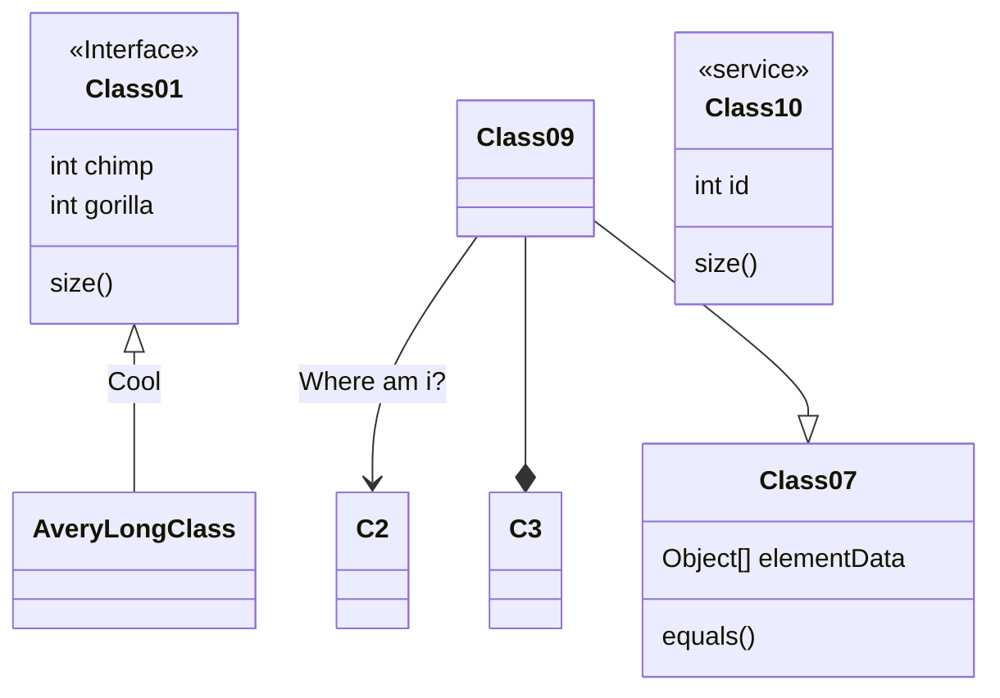

### 用例图

[用例图UML建模](https://www.cnblogs.com/lcword/p/10472040.html#:~:text=UML建模——用例图) 通常包含三个元素：参与者、通信连接（或者关联）和实际的用例，使用 [PlantUML Web Server](https://www.plantuml.com/plantuml) 进行绘图。

- 参与者通常用一个简笔画的人来表示，代表用户或者外部设备，以及使用当前系统的其他系统。
- 通信连接用参与者和用例之间的一条线来表示，代表两者之间存在某种形式的通信。
- 用例用一个椭圆形来表示，再配上适当的描述，代表参与者在系统上执行的各种活动。


### 序列图

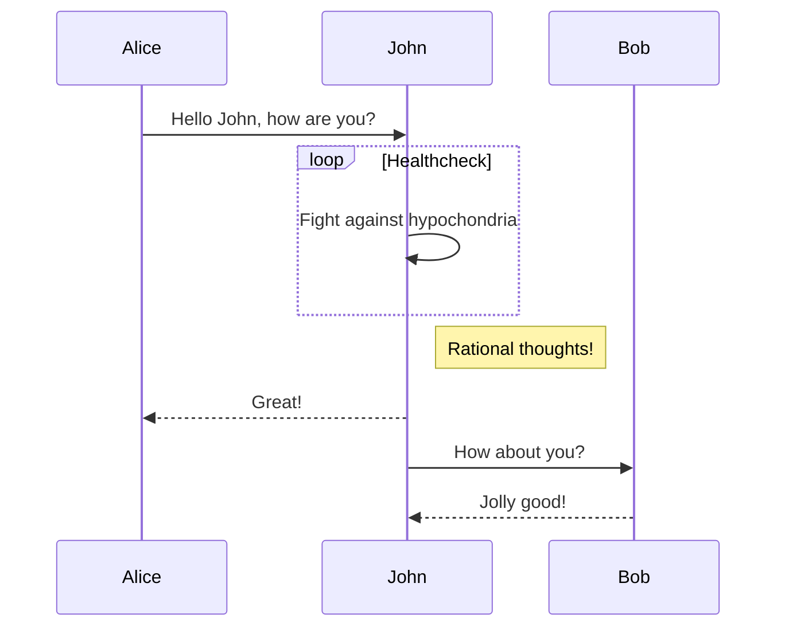

### 状态图

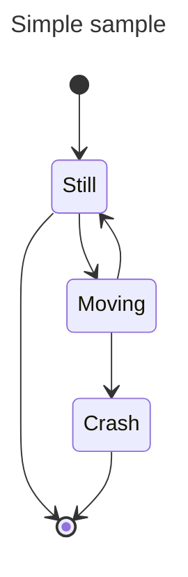

### 活动图

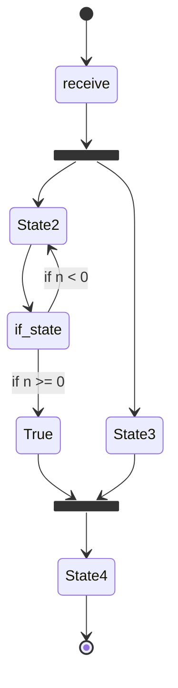

## 设计模式

|      | 创建型                                                 | 结构型                                                       | 行为型                                                       |
| ---- | ------------------------------------------------------ | ------------------------------------------------------------ | ------------------------------------------------------------ |
| 类   | 工厂方法                                               | 适配器                                                       | 解释器<br />模板方法                                         |
| 对象 | 简单工厂<br />抽象工厂<br />生成器<br />原型<br />单例 | 适配器<br />桥接<br />组合<br />装饰<br />外观<br />享元<br />代理 | 责任链<br />命令<br />解释器<br />迭代器<br />中介者<br />备忘录<br />观察者<br />状态<br />策略<br />模板方法<br />访问者 |

### 创建型

#### 1 单例模式

##### Mermaid 类图

以下是使用 Mermaid 绘制的单例模式的类图：

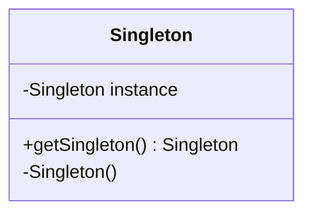

##### C++ 代码示例

以下是单例模式的 C++ 实现示例，其中包括了线程安全的懒汉式单例模式：

```cpp
#include <iostream>
#include <mutex>

class Singleton {
private:
    Singleton() {} // 私有构造函数
    ~Singleton() {} // 私有析构函数
    Singleton(const Singleton&) = delete; // 禁用拷贝构造函数
    Singleton& operator=(const Singleton&) = delete; // 禁用赋值操作符

public:
    // 获取单例对象的静态方法
    static Singleton& getSingleton() {
        static Singleton instance; // 局部静态变量
        return instance;
    }

    void doSomething() {
        std::cout << "Doing something" << std::endl;
    }
};

int main() {
    // 获取单例对象的引用
    Singleton& instance = Singleton::getSingleton();
    instance.doSomething();
    return 0;
}
```

在这个示例中，`Singleton` 类有一个私有的构造函数和析构函数，以及禁用的拷贝构造函数和赋值操作符，确保了对象不能被外部复制或赋值。`getSingleton` 方法提供了一个全局访问点，用于获取类的唯一实例。由于使用了局部静态变量，这种实现方式在 C++11 标准下是线程安全的，并且延迟了实例的创建，直到第一次调用 `getSingleton` 方法时才初始化实例。

这种实现方式被称为 Meyer's Singleton，是实现单例模式的一种推荐方式，因为它简单、线程安全，并且没有性能开销。

#### 2 简单工厂模式（Simple Factory Pattern）

简单工厂模式（Simple Factory Pattern）是一种创建型设计模式，它通过一个工厂类来创建对象，而无需客户端直接实例化对象。

##### UML图（Mermaid语法）

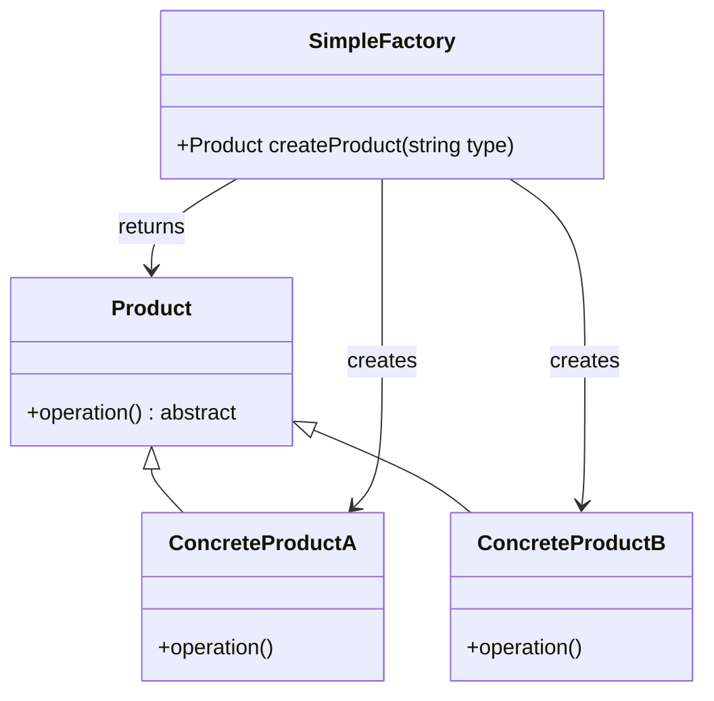

##### C++代码示例

```cpp
#include <iostream>
#include <memory>
#include <string>
#include <unordered_map>

// 抽象产品类
class Product {
public:
    virtual ~Product() = default;
    virtual void operation() const = 0;
};

// 具体产品A类
class ConcreteProductA : public Product {
public:
    void operation() const override {
        std::cout << "ConcreteProductA operation" << std::endl;
    }
};

// 具体产品B类
class ConcreteProductB : public Product {
public:
    void operation() const override {
        std::cout << "ConcreteProductB operation" << std::endl;
    }
};

// 简单工厂类
class SimpleFactory {
public:
    std::unique_ptr<Product> createProduct(const std::string& type) const {
        auto it = productMap.find(type);
        if (it != productMap.end()) {
            return it->second();
        } else {
            throw std::runtime_error("Unknown product type");
        }
    }

private:
    std::unordered_map<std::string, std::function<std::unique_ptr<Product>()>> productMap = {
        {"A", []() { return std::make_unique<ConcreteProductA>(); }},
        {"B", []() { return std::make_unique<ConcreteProductB>(); }}
    };
};

int main() {
    SimpleFactory factory;

    try {
        auto productA = factory.createProduct("A");
        productA->operation();

        auto productB = factory.createProduct("B");
        productB->operation();
    } catch (const std::exception& e) {
        std::cerr << "Error: " << e.what() << std::endl;
    }

    return 0;
}
```

##### 代码说明

1. **Product**：抽象产品类，声明了一个纯虚函数`operation`，具体产品类将实现它。
2. **ConcreteProductA** 和 **ConcreteProductB**：具体产品类，分别实现了`operation`方法。
3. **SimpleFactory**：简单工厂类，包含一个`productMap`来存储产品类型的映射，使用`std::function`和`std::unique_ptr`来动态创建产品对象。
4. **main**：测试代码，通过工厂类创建产品对象并调用它们的`operation`方法。

在这个示例中，客户端代码（`main`函数）通过简单工厂类`SimpleFactory`来创建产品对象，而无需知道具体产品类的实现细节。这有助于降低客户端代码与具体产品类之间的耦合度。

#### 3 工厂方法模式

工厂方法模式是一种创建型设计模式，它定义了一个创建对象的接口，但由子类决定要实例化的类是哪一个。这种模式的关键在于，它允许系统在不修改工厂角色的情况下引进新产品。以下是工厂方法模式的Mermaid类图和C++代码示例。

##### Mermaid类图
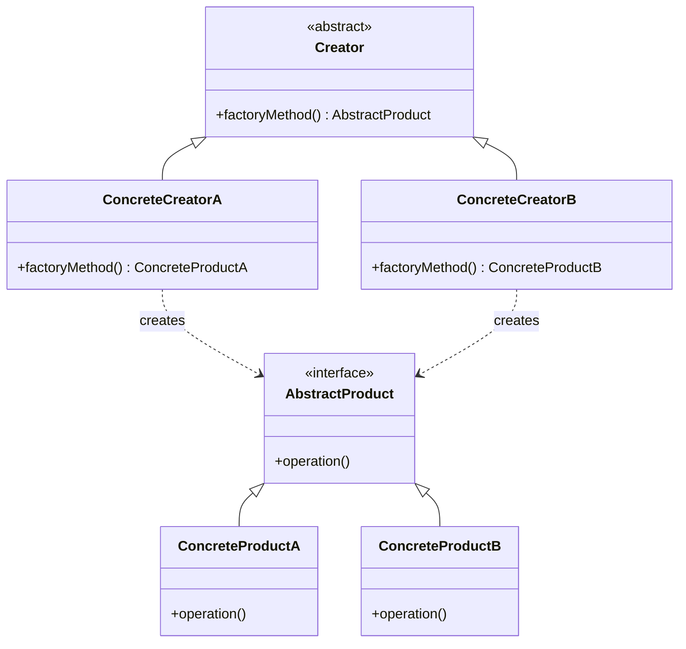

##### C++代码示例
以下是一个简单的工厂方法模式的C++实现，其中包括了抽象产品、具体产品、抽象工厂和具体工厂的代码。

```cpp
#include <iostream>
#include <memory>

// 抽象产品
class Product {
public:
    virtual ~Product() {}
    virtual void Use() = 0;
};

// 具体产品A
class ConcreteProductA : public Product {
public:
    void Use() override {
        std::cout << "Using product A" << std::endl;
    }
};

// 具体产品B
class ConcreteProductB : public Product {
public:
    void Use() override {
        std::cout << "Using product B" << std::endl;
    }
};

// 抽象工厂
class Factory {
public:
    virtual ~Factory() {}
    virtual std::unique_ptr<Product> CreateProduct() = 0;
};

// 具体工厂A
class ConcreteFactoryA : public Factory {
public:
    std::unique_ptr<Product> CreateProduct() override {
        return std::make_unique<ConcreteProductA>();
    }
};

// 具体工厂B
class ConcreteFactoryB : public Factory {
public:
    std::unique_ptr<Product> CreateProduct() override {
        return std::make_unique<ConcreteProductB>();
    }
};

int main() {
    // 客户端代码
    std::unique_ptr<Factory> factoryA = std::make_unique<ConcreteFactoryA>();
    factoryA->CreateProduct()->Use(); // 使用产品A

    std::unique_ptr<Factory> factoryB = std::make_unique<ConcreteFactoryB>();
    factoryB->CreateProduct()->Use(); // 使用产品B

    return 0;
}
```

在这个例子中，`Product`是抽象产品，`ConcreteProductA`和`ConcreteProductB`是具体产品。`Factory`是抽象工厂，`ConcreteFactoryA`和`ConcreteFactoryB`是具体工厂。客户端代码通过具体工厂创建具体产品，并使用它们。这种模式允许在不修改客户端代码的情况下引入新产品，只需添加相应的具体产品和工厂类即可。

#### 4 抽象工厂模式（Abstract Factory Pattern）

抽象工厂模式（Abstract Factory Pattern）是一种创建型设计模式，它提供了一种方式，允许通过用户选择一系列相关或相互依赖的对象，而无需指定它们具体的类。这种模式通常用于系统的产品结构非常稳定，但因产品的创建而被频繁使用的场景。

##### Mermaid类图
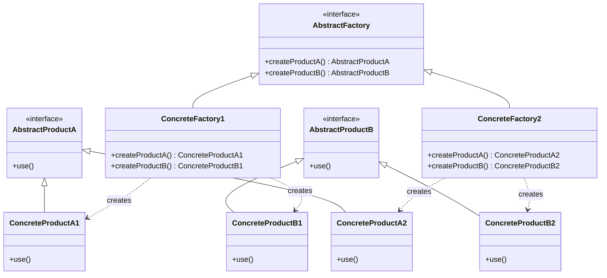

##### C++代码示例
以下是一个抽象工厂模式的C++实现，其中包括了抽象产品、具体产品和抽象工厂以及具体工厂的代码。

```cpp
#include <iostream>
#include <memory>

// 抽象产品A
class AbstractProductA {
public:
    virtual ~AbstractProductA() {}
    virtual void Use() const = 0;
};

// 抽象产品B
class AbstractProductB {
public:
    virtual ~AbstractProductB() {}
    virtual void Use() const = 0;
};

// 具体产品A1
class ConcreteProductA1 : public AbstractProductA {
public:
    void Use() const override {
        std::cout << "Using Product A1" << std::endl;
    }
};

// 具体产品B1
class ConcreteProductB1 : public AbstractProductB {
public:
    void Use() const override {
        std::cout << "Using Product B1" << std::endl;
    }
};

// 具体产品A2
class ConcreteProductA2 : public AbstractProductA {
public:
    void Use() const override {
        std::cout << "Using Product A2" << std::endl;
    }
};

// 具体产品B2
class ConcreteProductB2 : public AbstractProductB {
public:
    void Use() const override {
        std::cout << "Using Product B2" << std::endl;
    }
};

// 抽象工厂
class AbstractFactory {
public:
    virtual ~AbstractFactory() {}
    virtual std::unique_ptr<AbstractProductA> CreateProductA() = 0;
    virtual std::unique_ptr<AbstractProductB> CreateProductB() = 0;
};

// 具体工厂1
class ConcreteFactory1 : public AbstractFactory {
public:
    std::unique_ptr<AbstractProductA> CreateProductA() override {
        return std::make_unique<ConcreteProductA1>();
    }
    std::unique_ptr<AbstractProductB> CreateProductB() override {
        return std::make_unique<ConcreteProductB1>();
    }
};

// 具体工厂2
class ConcreteFactory2 : public AbstractFactory {
public:
    std::unique_ptr<AbstractProductA> CreateProductA() override {
        return std::make_unique<ConcreteProductA2>();
    }
    std::unique_ptr<AbstractProductB> CreateProductB() override {
        return std::make_unique<ConcreteProductB2>();
    }
};

int main() {
    // 客户端代码
    std::unique_ptr<AbstractFactory> factory1 = std::make_unique<ConcreteFactory1>();
    factory1->CreateProductA()->Use(); // 使用产品A1
    factory1->CreateProductB()->Use(); // 使用产品B1

    std::unique_ptr<AbstractFactory> factory2 = std::make_unique<ConcreteFactory2>();
    factory2->CreateProductA()->Use(); // 使用产品A2
    factory2->CreateProductB()->Use(); // 使用产品B2

    return 0;
}
```

在这个例子中，`AbstractProductA`和`AbstractProductB`是抽象产品，`ConcreteProductA1`、`ConcreteProductB1`、`ConcreteProductA2`和`ConcreteProductB2`是具体产品。`AbstractFactory`是抽象工厂，`ConcreteFactory1`和`ConcreteFactory2`是具体工厂。客户端代码通过具体工厂创建一系列相关产品，并使用它们。这种模式允许在不修改客户端代码的情况下引入新的产品系列，只需添加相应的具体产品和工厂类即可。

#### 5 建造者模式（Builder Pattern）

建造者模式（Builder Pattern）是一种创建型设计模式，它将一个复杂对象的构建与其表示分离，使得同样的构建过程可以创建不同的表示。这种模式通常用于创建一些复杂的对象，这些对象的创建过程可能涉及到多个步骤，并且这些步骤可能会变化。

##### Mermaid类图
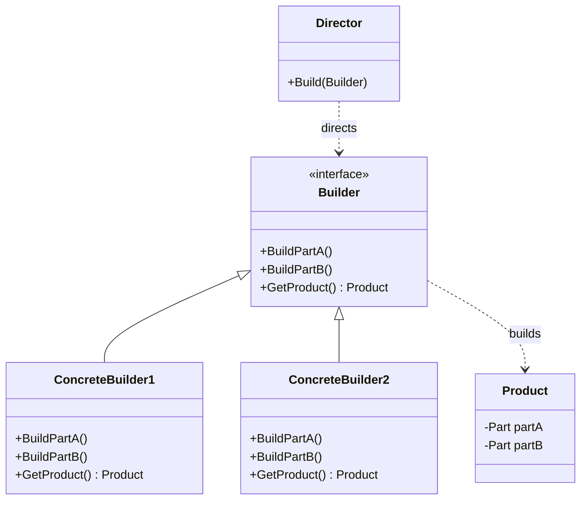

##### C++代码示例
以下是一个建造者模式的C++实现，其中包括了抽象建造者、具体建造者、导演类和产品类的代码。

```cpp
#include <iostream>
#include <memory>

// 产品类
class Product {
public:
    void Add(std::string part) {
        parts.push_back(part);
    }

    void Show() {
        std::cout << "Product Parts: ";
        for (const auto& part : parts) {
            std::cout << part << " ";
        }
        std::cout << std::endl;
    }

private:
    std::vector<std::string> parts;
};

// 抽象建造者
class Builder {
public:
    virtual ~Builder() {}
    virtual void BuildPartA() = 0;
    virtual void BuildPartB() = 0;
    virtual std::shared_ptr<Product> GetProduct() = 0;
};

// 具体建造者1
class ConcreteBuilder1 : public Builder {
private:
    std::shared_ptr<Product> product = std::make_shared<Product>();

public:
    void BuildPartA() override {
        product->Add("PartA1");
    }

    void BuildPartB() override {
        product->Add("PartB1");
    }

    std::shared_ptr<Product> GetProduct() override {
        return product;
    }
};

// 具体建造者2
class ConcreteBuilder2 : public Builder {
private:
    std::shared_ptr<Product> product = std::make_shared<Product>();

public:
    void BuildPartA() override {
        product->Add("PartA2");
    }

    void BuildPartB() override {
        product->Add("PartB2");
    }

    std::shared_ptr<Product> GetProduct() override {
        return product;
    }
};

// 导演类
class Director {
public:
    void Construct(Builder* builder) {
        builder->BuildPartA();
        builder->BuildPartB();
    }
};

int main() {
    // 客户端代码
    Director director;
    Builder* builder1 = new ConcreteBuilder1();
    director.Construct(builder1);
    builder1->GetProduct()->Show();

    Builder* builder2 = new ConcreteBuilder2();
    director.Construct(builder2);
    builder2->GetProduct()->Show();

    delete builder1;
    delete builder2;

    return 0;
}
```

在这个例子中，`Product`是产品类，`Builder`是抽象建造者，它定义了构建产品的接口。`ConcreteBuilder1`和`ConcreteBuilder2`是具体建造者，它们实现了建造产品的步骤。`Director`是导演类，它负责指挥建造过程。客户端代码通过导演类和建造者来构建产品，并展示产品信息。

请注意，由于C++的多态特性，这里使用了虚函数和动态多态来实现建造者模式。此外，这里使用了智能指针来管理对象的生命周期，以避免内存泄漏。

### 结构型

#### 6 适配器

在设计模式中，适配器模式是一种常用的结构型模式，用于使原本不兼容的接口能够一起工作。以下是适配器模式的Mermaid类图和C++代码示例。

##### Mermaid类图
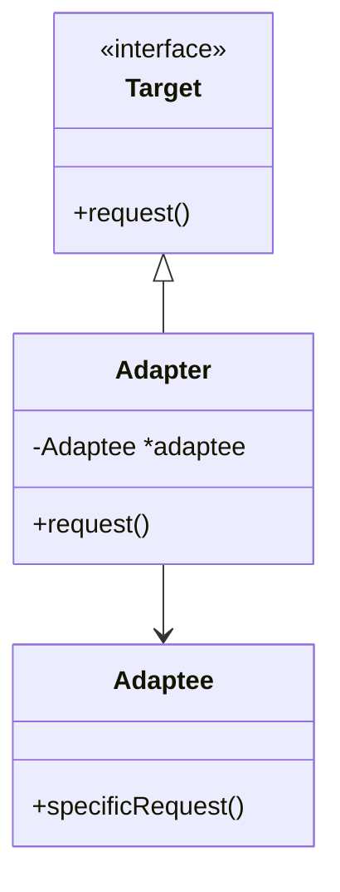

##### C++代码示例
以下是一个简单的适配器模式的C++实现，其中`Target`是客户端期望的接口，`Adaptee`是需要适配的类，`Adapter`是适配器类，它实现了`Target`接口，并在内部持有一个`Adaptee`对象，在`request`方法中将调用转发给`Adaptee`的`specificRequest`方法。

```cpp
#include <iostream>

// 目标接口
class Target {
public:
    virtual void request() = 0;
};

// 适配者类
class Adaptee {
public:
    void specificRequest() {
        std::cout << "Adaptee's specific request" << std::endl;
    }
};

// 适配器类
class Adapter : public Target {
private:
    Adaptee *adaptee;
public:
    Adapter(Adaptee *a) : adaptee(a) {}
    void request() override {
        std::cout << "Adapter's request" << std::endl;
        adaptee->specificRequest();
    }
};

int main() {
    Adaptee adaptee;
    Adapter adapter(&adaptee);
    adapter.request();
    return 0;
}
```

在这个示例中，`Target`定义了客户端期望的接口，`Adaptee`提供了一个特定的请求方法`specificRequest`，但是它与`Target`接口不兼容。`Adapter`类继承自`Target`并持有`Adaptee`的实例，通过`request`方法将`Adaptee`的接口适配为`Target`接口的形式。这样，客户端代码就可以通过`Adapter`类来使用`Adaptee`的功能了。

以上代码示例和Mermaid类图展示了适配器模式的基本结构和实现方式。这种模式在处理接口兼容性问题时非常有用，允许开发者在不修改现有代码的情况下重用旧的类或接口。

#### 7 桥接

桥接模式（Bridge Pattern）是一种结构型设计模式，它将抽象部分与它的实现部分分离，使它们可以独立地变化。这种模式主要用于解决那些在多个维度上可能发生变化的问题，使得在任何一个维度上的变化都不会影响到另一个维度。

##### Mermaid 类图

以下是使用 Mermaid 绘制的桥接模式的类图：

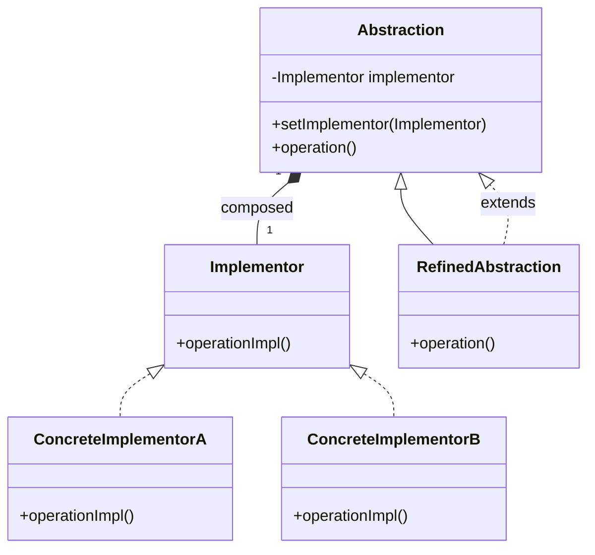

##### C++ 代码示例

以下是桥接模式的 C++ 实现示例：

```cpp
#include <iostream>

// 实现化角色接口
class Implementor {
public:
    virtual ~Implementor() {}
    virtual void operationImpl() = 0;
};

// 具体实现化角色A
class ConcreteImplementorA : public Implementor {
public:
    void operationImpl() override {
        std::cout << "ConcreteImplementorA 的 operationImpl()" << std::endl;
    }
};

// 具体实现化角色B
class ConcreteImplementorB : public Implementor {
public:
    void operationImpl() override {
        std::cout << "ConcreteImplementorB 的 operationImpl()" << std::endl;
    }
};

// 抽象化角色
class Abstraction {
protected:
    Implementor* implementor;
public:
    Abstraction(Implementor* impl) : implementor(impl) {}
    virtual ~Abstraction() {}
    virtual void operation() {
        implementor->operationImpl();
    }
    void setImplementor(Implementor* impl) {
        implementor = impl;
    }
};

// 具体抽象化角色
class RefinedAbstraction : public Abstraction {
public:
    RefinedAbstraction(Implementor* impl) : Abstraction(impl) {}
    void operation() override {
        std::cout << "RefinedAbstraction 调用 operation..." << std::endl;
        Abstraction::operation();
    }
};

int main() {
    Implementor* implA = new ConcreteImplementorA();
    Implementor* implB = new ConcreteImplementorB();

    Abstraction* absA = new RefinedAbstraction(implA);
    Abstraction* absB = new RefinedAbstraction(implB);

    absA->operation();
    absB->operation();

    // 动态改变实现
    absA->setImplementor(implB);
    absA->operation();

    delete implA;
    delete implB;
    delete absA;
    delete absB;

    return 0;
}
```

在这个示例中：

- `Implementor` 是实现化角色的接口，定义了实现化角色需要实现的方法 `operationImpl()`。
- `ConcreteImplementorA` 和 `ConcreteImplementorB` 是具体实现化角色，实现了 `operationImpl()` 方法。
- `Abstraction` 是抽象化角色，持有一个 `Implementor` 类型的成员变量，并定义了 `operation()` 方法，该方法委托给实现化角色。
- `RefinedAbstraction` 是具体抽象化角色，继承自 `Abstraction` 并可以扩展 `operation()` 方法。
- 在 `main()` 函数中，我们创建了不同的实现化角色和抽象化角色的实例，并展示了如何动态地改变实现化角色。

#### 8 组合

组合模式（Composite Pattern）是一种结构型设计模式，它允许你将对象组合成树状结构来表现“整体/部分”层次关系。组合模式使得客户端可以统一地对待单个对象和组合对象。

##### Mermaid 类图

以下是使用 Mermaid 绘制的组合模式的类图：

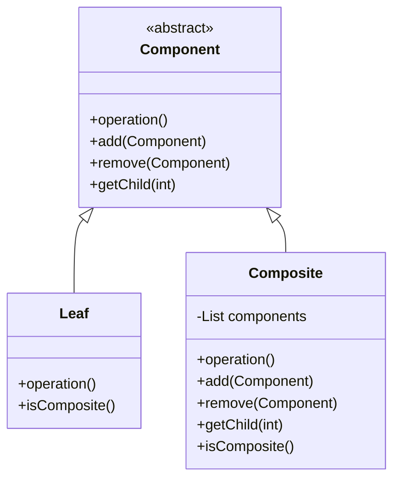

##### C++ 代码示例

以下是组合模式的 C++ 实现示例：

```cpp
#include <iostream>
#include <vector>
#include <memory>

// 抽象组件类
class Component {
public:
    virtual ~Component() {}
    virtual void operation() = 0;
    virtual void add(std::shared_ptr<Component> component) = 0;
    virtual void remove(std::shared_ptr<Component> component) = 0;
    virtual std::shared_ptr<Component> getChild(int index) = 0;
};

// 叶子组件类
class Leaf : public Component {
public:
    void operation() override {
        std::cout << "Leaf is doing something" << std::endl;
    }

    void add(std::shared_ptr<Component> component) override {
        std::cout << "Leaf cannot add a component" << std::endl;
    }

    void remove(std::shared_ptr<Component> component) override {
        std::cout << "Leaf cannot remove a component" << std::endl;
    }

    std::shared_ptr<Component> getChild(int index) override {
        std::cout << "Leaf does not have children" << std::endl;
        return nullptr;
    }
};

// 复合组件类
class Composite : public Component {
private:
    std::vector<std::shared_ptr<Component>> children;
public:
    void operation() override {
        std::cout << "Composite is doing something" << std::endl;
    }

    void add(std::shared_ptr<Component> component) override {
        children.push_back(component);
    }

    void remove(std::shared_ptr<Component> component) override {
        children.erase(std::remove(children.begin(), children.end(), component), children.end());
    }

    std::shared_ptr<Component> getChild(int index) override {
        if (index < 0 || index >= static_cast<int>(children.size())) {
            std::cout << "Index is out of bounds" << std::endl;
            return nullptr;
        }
        return children[index];
    }
};

int main() {
    std::shared_ptr<Composite> root = std::make_shared<Composite>();
    std::shared_ptr<Composite> branch1 = std::make_shared<Composite>();
    std::shared_ptr<Composite> branch2 = std::make_shared<Composite>();
    std::shared_ptr<Leaf> leaf1 = std::make_shared<Leaf>();
    std::shared_ptr<Leaf> leaf2 = std::make_shared<Leaf>();

    root->add(branch1);
    root->add(branch2);
    branch1->add(leaf1);
    branch2->add(leaf2);

    // 客户端代码调用
    root->operation();
    root->getChild(0)->operation();
    root->getChild(0)->getChild(0)->operation();

    return 0;
}
```

在这个示例中：

- `Component` 是抽象组件类，定义了 `operation()`、`add()`、`remove()` 和 `getChild()` 方法。
- `Leaf` 是叶子组件类，实现了 `operation()` 方法，并且不实现 `add()`、`remove()` 和 `getChild()` 方法，因为叶子节点没有子节点。
- `Composite` 是复合组件类，实现了 `operation()` 方法，并且可以管理子组件，包括添加、移除和获取子组件。
- 在 `main()` 函数中，我们创建了一个树状结构，其中 `root` 是根节点，`branch1` 和 `branch2` 是分支节点，`leaf1` 和 `leaf2` 是叶子节点。然后，我们展示了如何调用 `operation()` 方法，以及如何通过树状结构访问子组件。

#### 9 装饰

##### Mermaid 类图

以下是使用 Mermaid 绘制的装饰模式的类图：

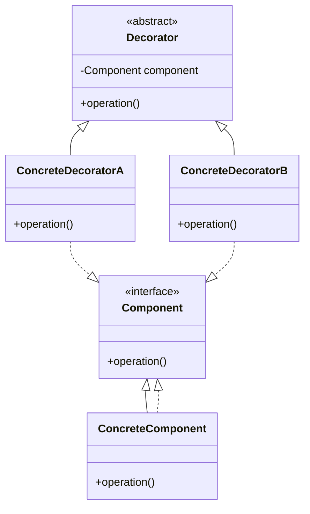

##### C++ 代码示例

以下是装饰模式的 C++ 实现示例：

```cpp
#include <iostream>
#include <string>

// 抽象构件角色
class Component {
public:
    virtual ~Component() {}
    virtual std::string operation() const = 0;
};

// 具体构件角色
class ConcreteComponent : public Component {
public:
    std::string operation() const override {
        return "ConcreteComponent";
    }
};

// 装饰角色
class Decorator : public Component {
protected:
    Component* component;
public:
    Decorator(Component* component) : component(component) {}
    std::string operation() const override {
        return component->operation();
    }
};

// 具体装饰角色
class ConcreteDecoratorA : public Decorator {
public:
    ConcreteDecoratorA(Component* component) : Decorator(component) {}
    std::string operation() const override {
        return "ConcreteDecoratorA(" + Decorator::operation() + ")";
    }
};

// 具体装饰角色
class ConcreteDecoratorB : public Decorator {
public:
    ConcreteDecoratorB(Component* component) : Decorator(component) {}
    std::string operation() const override {
        return "ConcreteDecoratorB(" + Decorator::operation() + ")";
    }
};

// 客户端代码
void ClientCode(Component* component) {
    std::cout << "RESULT: " << component->operation() << std::endl;
}

int main() {
    Component* simple = new ConcreteComponent();
    std::cout << "Client: I've got a simple component:\n";
    ClientCode(simple);
    std::cout << "\n\n";

    Component* decorator1 = new ConcreteDecoratorA(simple);
    Component* decorator2 = new ConcreteDecoratorB(decorator1);
    std::cout << "Client: Now I've got a decorated component:\n";
    ClientCode(decorator2);
    std::cout << "\n";

    delete simple;
    delete decorator1;
    delete decorator2;
    return 0;
}
```

在这个示例中：

- `Component` 是抽象构件角色，定义了对象的接口。
- `ConcreteComponent` 是具体构件角色，实现了 `Component` 接口。
- `Decorator` 是装饰角色，持有一个 `Component` 类型的成员变量，并实现了 `Component` 接口。
- `ConcreteDecoratorA` 和 `ConcreteDecoratorB` 是具体装饰角色，它们继承自 `Decorator` 并重写了 `operation` 方法。
- `ClientCode` 函数展示了如何使用 `Component` 接口来操作对象，这使得客户端代码可以透明地使用装饰前后的对象。

这个模式的关键优势在于可以在运行时动态地添加功能，而不需要修改原有的类结构，从而提供了更大的灵活性和可扩展性。

#### 10 外观

##### Mermaid 类图

以下是使用 Mermaid 绘制的外观模式的类图：

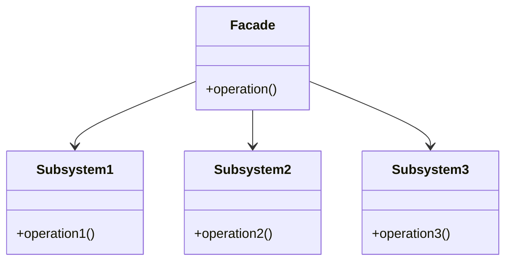

##### C++ 代码示例

以下是外观模式的 C++ 实现示例：

```cpp
#include <iostream>
#include <string>

// 子系统类1
class Subsystem1 {
public:
    void operation1() const {
        std::cout << "Subsystem1: Ready!" << std::endl;
    }
};

// 子系统类2
class Subsystem2 {
public:
    void operation2() const {
        std::cout << "Subsystem2: Get ready!" << std::endl;
    }
};

// 子系统类3
class Subsystem3 {
public:
    void operation3() const {
        std::cout << "Subsystem3: Fire!" << std::endl;
    }
};

// 外观类
class Facade {
private:
    Subsystem1 subsystem1_;
    Subsystem2 subsystem2_;
    Subsystem3 subsystem3_;
public:
    void operation() {
        std::cout << "Facade initializes subsystems:" << std::endl;
        subsystem1_.operation1();
        subsystem2_.operation2();
        std::cout << "Facade orders subsystems to perform the action:" << std::endl;
        subsystem1_.operation1();
        subsystem3_.operation3();
    }
};

// 客户端代码
void ClientCode() {
    Facade facade;
    std::cout << facade.operation();
}

int main() {
    ClientCode();
    return 0;
}
```

在这个示例中：

- `Subsystem1`、`Subsystem2` 和 `Subsystem3` 是子系统类，它们实现了各自的操作。
- `Facade` 是外观类，它提供了一个简化的接口 `operation()`，客户端可以通过这个接口来访问子系统的功能，而不需要直接与子系统交互。
- `ClientCode` 函数展示了如何使用外观类来简化客户端代码，客户端只需要调用外观类的 `operation()` 方法即可完成一系列操作。

这个模式的主要优点是简化了客户端与复杂子系统之间的交互，隐藏了子系统的复杂性，使得客户端代码更加简洁和易于维护。

#### 11 享元

##### Mermaid 类图

以下是使用 Mermaid 绘制的享元模式的类图：

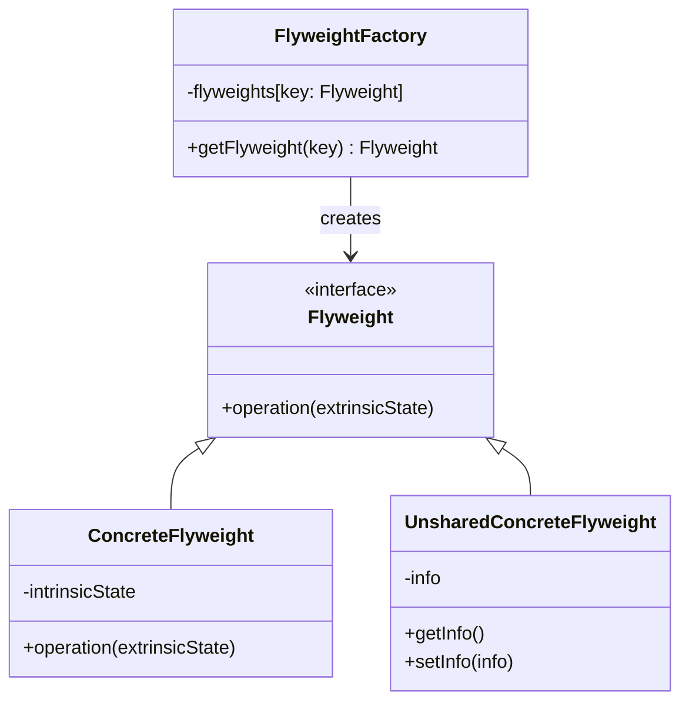

##### C++ 代码示例

以下是享元模式的 C++ 实现示例：

```cpp
#include <iostream>
#include <map>
#include <memory>
#include <string>

// 抽象享元角色
class IFlyweight {
public:
    virtual ~IFlyweight() {}
    virtual void operation(const std::string& extrinsicState) const = 0;
};

// 具体享元角色
class ConcreteFlyweight : public IFlyweight {
private:
    std::string intrinsicState; // 内部状态
public:
    ConcreteFlyweight(const std::string& state) : intrinsicState(state) {}
    void operation(const std::string& extrinsicState) const override {
        std::cout << "ConcreteFlyweight: Internal State = " << intrinsicState
                  << ", Extrinsic State = " << extrinsicState << std::endl;
    }
};

// 非享元角色
class UnsharedConcreteFlyweight {
private:
    std::string info;
public:
    UnsharedConcreteFlyweight(const std::string& info) : info(info) {}
    std::string getInfo() const {
        return info;
    }
};

// 享元工厂角色
class FlyweightFactory {
private:
    std::map<std::string, std::shared_ptr<IFlyweight>> flyweights;
public:
    std::shared_ptr<IFlyweight> getFlyweight(const std::string& key) {
        if (flyweights.find(key) == flyweights.end()) {
            flyweights[key] = std::make_shared<ConcreteFlyweight>(key);
        }
        return flyweights[key];
    }
};

int main() {
    FlyweightFactory factory;
    std::shared_ptr<IFlyweight> flyweight1 = factory.getFlyweight("A");
    flyweight1->operation("operation1");
    std::shared_ptr<IFlyweight> flyweight2 = factory.getFlyweight("B");
    flyweight2->operation("operation2");
    std::shared_ptr<IFlyweight> flyweight3 = factory.getFlyweight("A");
    flyweight3->operation("operation3");
    return 0;
}
```

在这个例子中，我们创建了一个名为 `IFlyweight` 的抽象享元类，它具有一个名为 `operation` 的虚拟方法。然后，我们创建了一个名为 `ConcreteFlyweight` 的具体享元类，它继承自 `IFlyweight` 类。`ConcreteFlyweight` 类包含一个名为 `intrinsicState_` 的内部状态，它在构造函数中初始化。

还创建了一个名为 `FlyweightFactory` 的享元工厂类，它负责创建和管理享元对象。`getFlyweight` 方法接受一个键作为参数，并返回一个与该键关联的享元对象。如果该键的享元对象尚不存在，工厂将创建一个新的 `ConcreteFlyweight` 实例，并将它加入到维护队列中。

在 `main` 函数中，我们演示了如何使用享元工厂来获取享元对象，并通过设置外部状态来操作享元对象。这样，多个带有不同外部状态的对象就可以共享同一个具有固定内部状态的具体享元对象，从而节约内存。

#### 12 代理

##### Mermaid 类图

以下是使用 Mermaid 绘制的代理模式的类图：

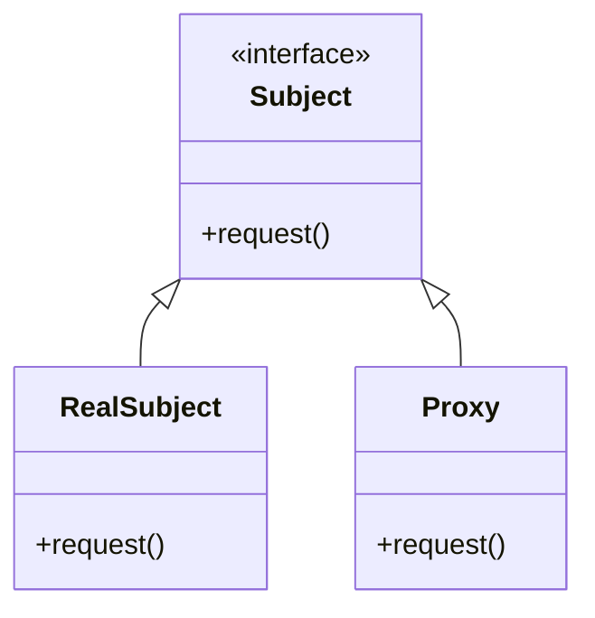

##### C++ 代码示例

以下是代理模式的 C++ 实现示例，其中包括了抽象主题、真实主题和代理类：

```cpp
#include <iostream>

// 抽象主题
class Subject {
public:
    virtual ~Subject() {}
    virtual void request() const = 0;
};

// 真实主题
class RealSubject : public Subject {
public:
    void request() const override {
        std::cout << "RealSubject: Handling request.\n";
    }
};

// 代理类
class Proxy : public Subject {
private:
    RealSubject* realSubject_;
    bool CheckAccess() const {
        std::cout << "Proxy: Checking access prior to firing a real request.\n";
        return true;
    }
    void LogAccess() const {
        std::cout << "Proxy: Logging the time of request.\n";
    }
public:
    Proxy() : realSubject_(nullptr) {}
    ~Proxy() {
        delete realSubject_;
    }
    void request() const override {
        if (CheckAccess()) {
            if (realSubject_ == nullptr) {
                realSubject_ = new RealSubject();
            }
            LogAccess();
            realSubject_->request();
        }
    }
};

int main() {
    Proxy proxy;
    proxy.request();
    return 0;
}
```

在这个示例中，`Subject` 是一个抽象主题接口，它声明了 `request` 方法。`RealSubject` 是实现 `Subject` 接口的真实主题类，它包含了实际的业务逻辑。`Proxy` 类也实现了 `Subject` 接口，并包含了对 `RealSubject` 的引用。在 `Proxy` 的 `request` 方法中，我们首先检查访问权限，然后记录访问时间，并最终调用 `RealSubject` 的 `request` 方法来处理请求。

这个代理模式的实现允许我们在不修改 `RealSubject` 的情况下，通过 `Proxy` 类来控制对 `RealSubject` 的访问，并添加额外的功能，如访问控制和日志记录。

### 行为型

#### 13 责任链

#### 14 命令

#### 15 解释器

#### 16 迭代器

#### 17 中介者

#### 18 备忘录

#### 19 观察者

#### 20 状态

#### 21 策略

#### 22 模板方法

#### 23 访问者

## reference

[时序图 | Mermaid 中文网 (nodejs.cn)](https://mermaid.nodejs.cn/syntax/sequenceDiagram.html)

[PlantUML_Language_Reference_Guide](https://pdf.plantuml.net/1.2019.9/PlantUML_Language_Reference_Guide_zh.pdf#:~:text=另外,你还能用<- 和<--,这不影响绘图,但可以提高可读性。.)
