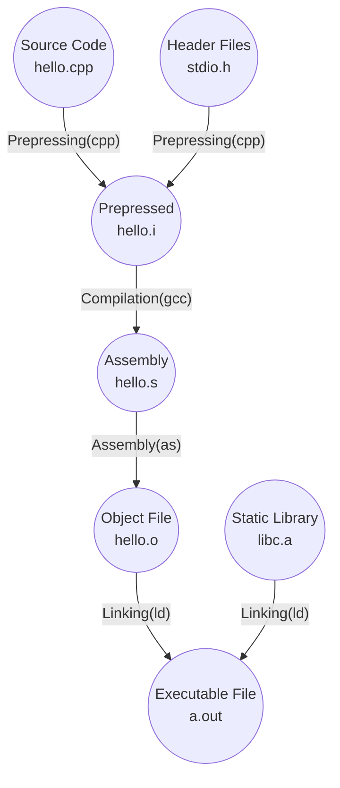

# 程序编译和链接

## 编译过程

编译一个 `hello.cpp`：**预处理**、**编译**、**汇编**、**链接**。



## 预编译（Prepressing）

源代码文件 `hello.cpp` 和相关的头文件，如 `stdio.h` 等被预编译器 `cpp` 预编译成一个 `.i` 文件。

```shell
gcc –E hello.cpp –o hello.i
```

预编译过程主要处理预编译指令：

- 删除 `#define`，并且展开所有的宏定义。
- 处理条件预编译指令（`#if`, `#ifdef`, `#elif`, `#else`, `#endif`）。
- 处理  `#include` 预编译指令。
- 删除所有的注释。
- 添加行号和文件名标识。
- 保留所有的  `#pragma` 编译器指令。

可以查看预编译后的文件来判断**宏定义**是否正确或**头文件**是否正确包含。

## 编译（Compilation）

预处理完的文件进行一系列处理：**扫描**、**词法分析**、**语法分析**、**语义分析**、**源代码优化**、**汇编代码生成**、**优化汇编代码**。

```shell
gcc –S hello.i –o hello.s
```

现在版本的 `GCC`  把预编译和编译两个步骤合并成一个步骤，使用一个叫 做 `cc1` 的程序来完成这两个步骤。

```shell
/usr/lib/gcc/i486-linux-gnu/4.1/cc1 hello.cpp
```

## 汇编（Assembly）

汇编代码转变成机器可以执行的指令。

```shell
gcc –c hello.cpp –o hello.o
```

程序 `as` 根据汇编指令和机器指令的对照表翻译。

```shell
as hello.s –o hello.o
```

## 链接（Linking）

程序 `ld` 产生一个能够正常运行 的 `HelloWorld` 程序：

```shell
ld -static -o HelloWorld /usr/lib/crt1.o /usr/lib/crti.o /usr/lib/gcc/i486-linux-gnu/4.1.3/crtbeginT.o hello.o -L/usr/lib/gcc/i486-linux-gnu/4.1.3 -L/usr/lib -L/lib --start-group -lgcc -lgcc_eh -lc --end-group /usr/lib/gcc/i486-linux-gnu/4.1.3/crtend.o /usr/lib/crtn.o
```

## 参考文献

《程序员的自我修养》