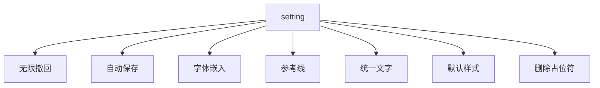

# PPT技巧

## 一 默认设置

1. 无限撤回  文件→更多→选项→高级→最多可取消150次
2. 自动保存   文件→更多→选项→保存→自动恢复保存时间
3. 字体嵌入  文件→更多→选项→保存→勾选 将字体嵌入文件→仅入...多格式导出 导出→更改类型
4. 参考线  视图→勾选 网格线 参考线
5. 统一文字  设计选项卡→变体→其他→字体→自定义字体
6. 默认样式  设置一个样式→点击右键→设置默认样式
7. 删除占位符  视图→母版幻灯片→删除占位符

## 二 常用快捷键

| 名称                 | 快捷键             |
| -------------------- | ------------------ |
| 水平/竖直移动图形    | shift➕鼠标移动     |
| 等比缩放图形         | shift➕拖拽         |
| 15度旋转             | shift➕鼠标拖拽旋转 |
| 快速放大画面         | ctrl➕滚轮          |
| 移动复制图形         | ctrl➕鼠标移动      |
| 快速复制图形和距离   | ctrl➕D             |
| 新建页面             | ctrl➕M             |
| 组合                 | ctrl➕G             |
| 取消组合             | ctrl➕shift➕G       |
| 等比中心缩放         | ctrl ➕ shift ➕ alt |
| 复制粘贴图形格式     | ctrl ➕ shift ➕ c/v |
| 文本框放大/缩小      | ctrl ➕ []          |
| 文本框加粗斜体下划线 | ctrl ➕ b/i/u       |
| 文本框居中左右对齐   | ctrl ➕ e/l/r       |
| 快速插入图片         | alt ➡ N X H        |
| 快速插入文字         | alt ➡ N P D        |

## 参考资料

[免费PPT制作教程](https://www.bilibili.com/video/BV1w54y1Q7cZ?spm_id_from=333.999.0.0)