# Mermaid从入门到入土

## 概述

### What

- Mermaid是基于Javascript的绘图工具，用户可以方便快捷地通过代码创建图表
- 项目地址：[mermaid](https://github.com/mermaid-js/mermaid)

### How

- 特定的Mermaid渲染器：[mermaid-live-editor](https://mermaid-js.github.io/mermaid-live-editor)
- 集成了Mermaid渲染功能的Markdown编辑器：`Typora`

- Mermaid图类型

  | **类型** | **关键字**      |
  | -------- | --------------- |
  | 饼状图   | pie             |
  | 流程图   | graph           |
  | 序列图   | sequenceDiagram |
  | 甘特图   | gantt           |
  | 类图     | classDiagram    |
  | 状态图   | stateDiagram    |
  | 旅程图   | journey         |

## 饼状图

### 语法

- 从`pie`关键字开始图表
- 然后使用`title`关键字及其在字符串中的值，为饼图赋予标题。（可选）
- 数据部分
  - 在`" "`内写上分区名
  - 分区名后使用`:`作为分隔符
  - 分隔符后写上数值，最多支持2位小数——数据会以百分比的形式展示

### 实例

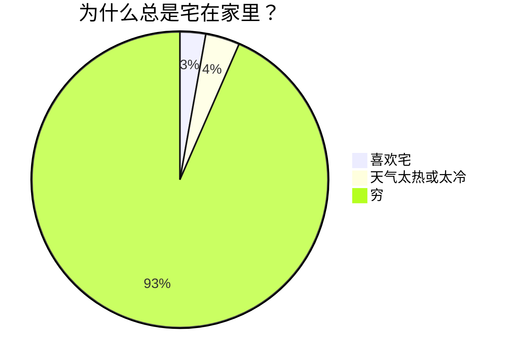

## 流程图

### 实例

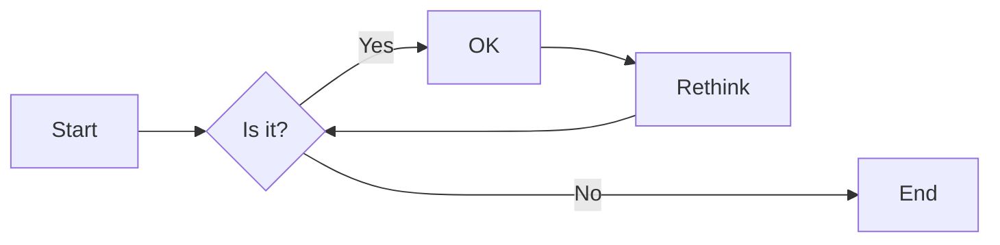

### 方向

| **方向** | **关键字**                      |
| -------- | ------------------------------- |
| 从上往下 | `graph`或`graph TB`或`graph TD` |
| 从下往上 | `graph BT`                      |
| 从左往右 | `graph LR`                      |
| 从右往左 | `graph RL`                      |

## 结点

- 无名字的结点：直接写内容，此时结点边框为方形；节点内容不能有空格
- 有名字的结点：节点名后书写内容，内容左右有特定符号，结点边框由符号决定；节点内容可以有空格

> 下面的实例中，没有为graph指定方向，因此默认是从上往下的。但是由于各个结点之前没有箭头，所以他们都处于同一排。

## 连线形式

- 直链

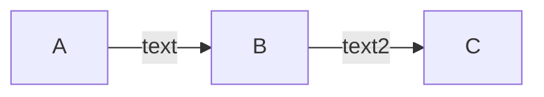

- 多重链：可以使用`&`字符，或单个描述

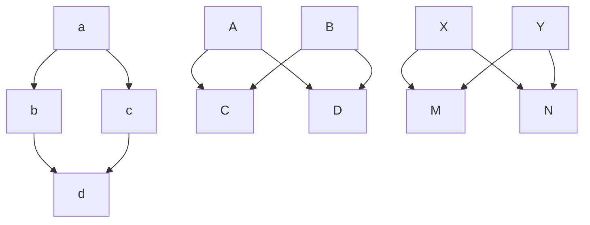

## 连线样式

- 实线箭头：分为无文本箭头和有文本箭头，有文本箭头有2种书写格式

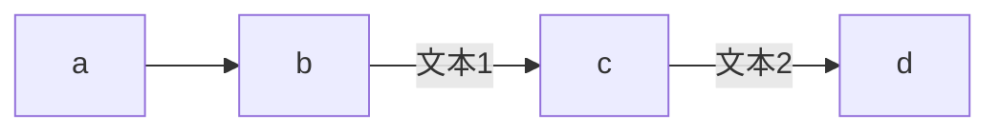

- 粗实线箭头：分为无文本箭头和有文本箭头

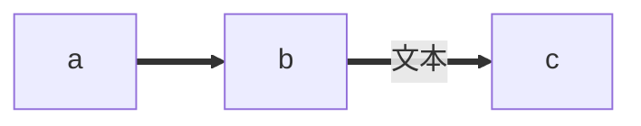

- 虚线箭头：分为无文本箭头和有文本箭头

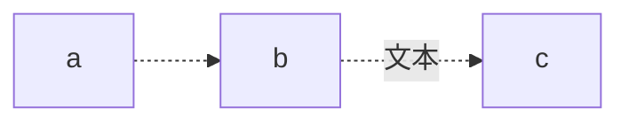

- 无箭头线：即以上三种连线去掉箭头后的形式

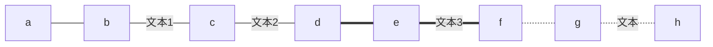

- 其他连线：需要将`graph`关键字改为`flowchart`，除了新增加的连线形式外，上面三种线的渲染效果也会不同

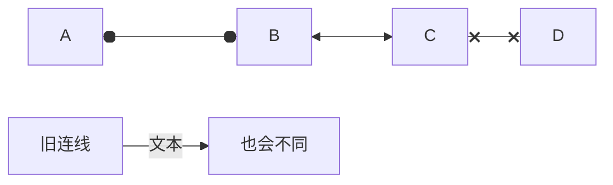

- 延长连线：增加相应字符即可，如下图中的B到E，连线中增加了一个`-`。字符可多次添加。

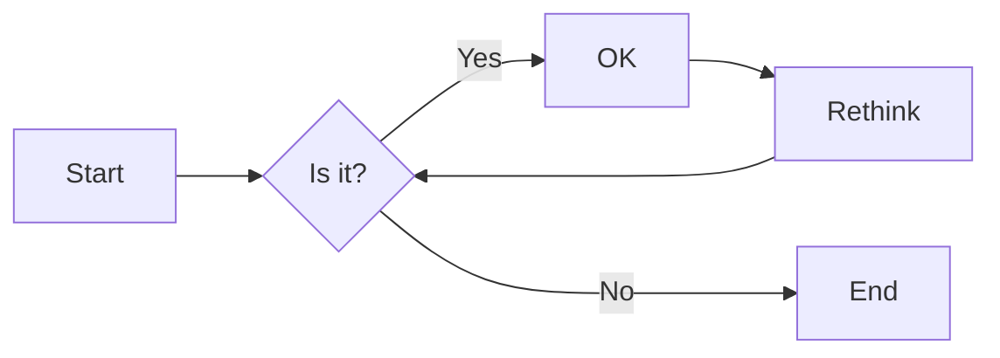

## 类图

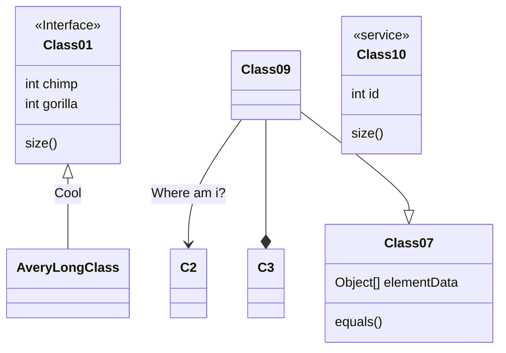

## 状态图

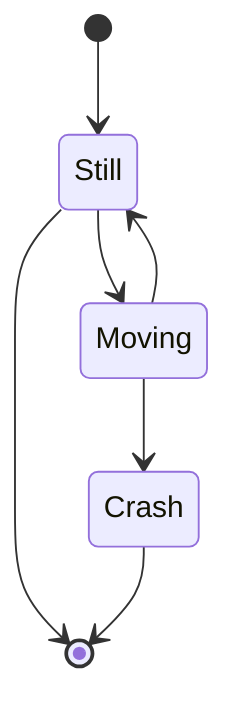

## Git图

## 序列图

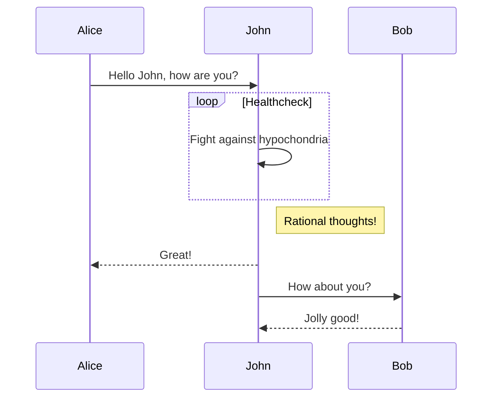

### 甘特图

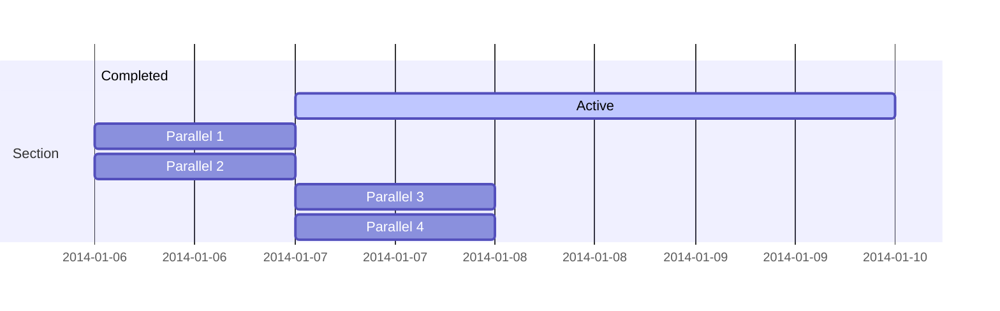

## 旅程图

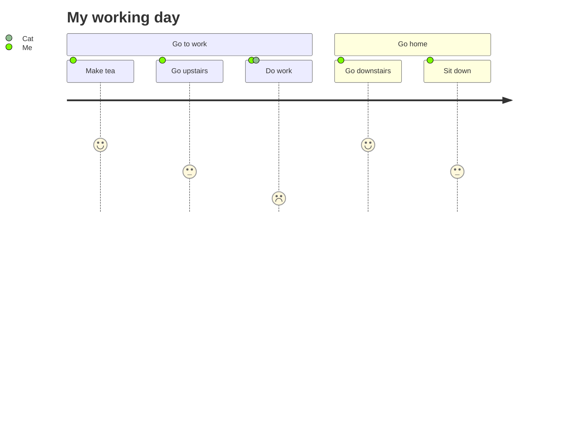

## 其他

- 子图：需要将`graph`关键字改为`flowchart`，在代码段的开始加入`subgraph`，尾部加入`end`

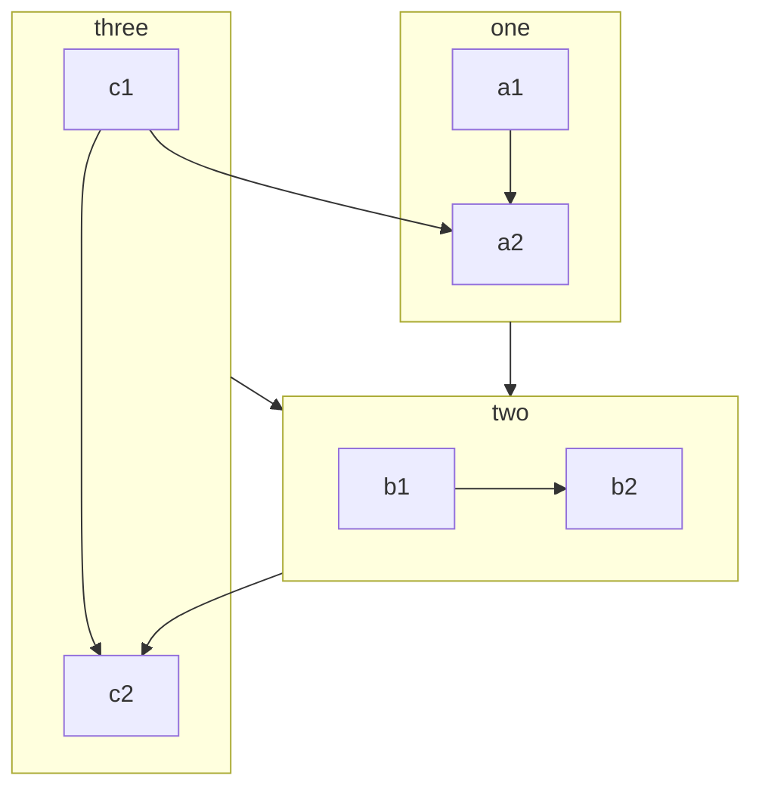

- 注释：在行首加入`%%`即可。

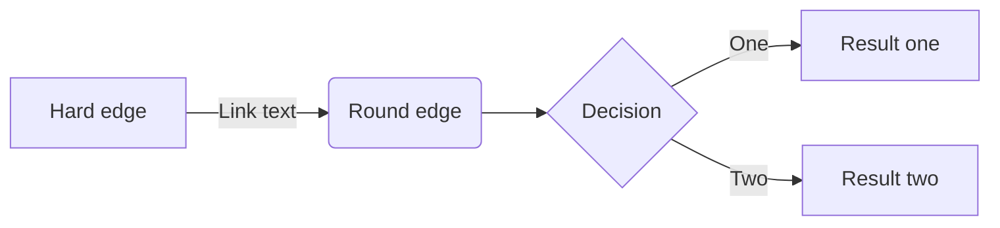

## 参考资料

[Mermaid从入门到入土](https://zhuanlan.zhihu.com/p/355997933)

[MiChuan/Mermaid：以类似于markdown的方式从文本生成图表和流程图 (github.com)](https://github.com/MiChuan/mermaid)