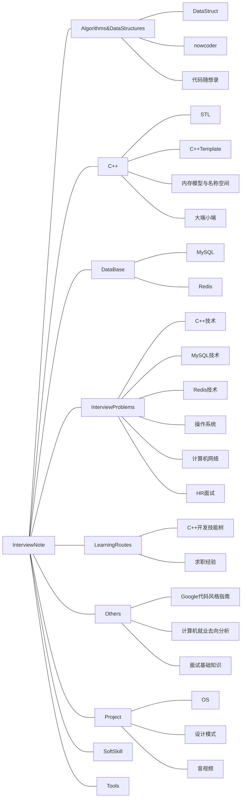

## C++开发工程师学习笔记

**author：Hu Han**

```mermaid
graph LR
InterviewNote --- Algorithms&DataStructures
	Algorithms&DataStructures --- DataStruct
	Algorithms&DataStructures --- nowcoder
	Algorithms&DataStructures --- 代码随想录
InterviewNote --- C++
	C++ --- STL
	C++ --- C++Template
	C++ --- 内存模型与名称空间
	C++ --- 大端小端
InterviewNote --- DataBase
	DataBase --- MySQL
	DataBase --- Redis
InterviewNote --- InterviewProblems
	InterviewProblems --- C++技术
	InterviewProblems --- MySQL技术
	InterviewProblems --- Redis技术
	InterviewProblems --- 操作系统
	InterviewProblems --- 计算机网络
	InterviewProblems --- HR面试
InterviewNote --- LearningRoutes
	LearningRoutes --- C++开发技能树
	LearningRoutes --- 求职经验
InterviewNote --- Others
	Others --- Google代码风格指南
	Others --- 计算机就业去向分析
	Others --- 面试基础知识
InterviewNote --- Project
	Project --- OS
	Project --- 设计模式
	Project --- 音视频
InterviewNote --- SoftSkill
InterviewNote --- Tools
```
